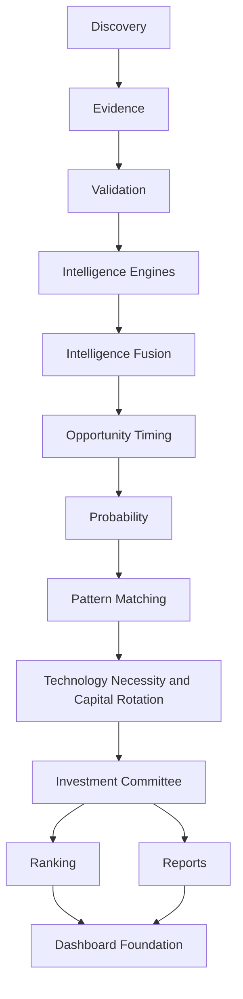

# Project Hunter

Project Hunter is a deterministic crypto research platform for discovering evidence-backed asymmetric opportunities before they become obvious to the market.

Current stable version: `v1.0.0`.

Project Hunter V1 is frozen. Future maintenance belongs on `release/v1`; future development continues on `main`.

## Architecture

Project Hunter V1 is organized as a layered analytical platform:



## Pipeline

The V1 pipeline validates the complete analytical flow:

Discovery -> Evidence -> Validation -> Scoring -> Valuation -> Mispricing -> Asymmetry -> Whales -> Macro -> Future Demand -> Opportunity Timing -> Probability -> Pattern Matching -> Technology Necessity -> Investment Committee -> Reports -> Ranking -> Dashboard.

All analytical records are deterministic, explainable, and persisted through repository contracts.

## Major Analytical Engines

- Macro Intelligence
- Whale Intelligence
- Developer Intelligence
- Protocol Intelligence
- News Intelligence
- Narrative Intelligence
- Social Intelligence
- On-chain Intelligence
- Intelligence Fusion
- Opportunity Timing
- Probability
- Pattern Matching
- Technology Necessity and Capital Rotation
- Investment Committee

## Platform Components

- Plugin Architecture
- Pipeline Orchestrator
- Deterministic Execution Identity
- Persistence Contracts
- SQL Repository Layer
- Operational Attempts and Run Lifecycle
- Automation and Scheduler
- Dashboard Foundation
- Ranking
- Reports
- Backtesting
- Alerts

## Installation

```bash
python3 -m venv .venv
.venv/bin/python -m pip install -e ".[dev]"
```

## Quick Start

Run quality checks:

```bash
.venv/bin/ruff check .
.venv/bin/black --check src tests config alembic
.venv/bin/mypy
.venv/bin/pytest
```

Use the CLI:

```bash
hunter analyze bitcoin
hunter discover
hunter validate ethereum
hunter whales bitcoin
hunter rank --sort committee
hunter committee champion
hunter dashboard build --sqlite-path hunter.sqlite
hunter automation status
```

## Repository Structure

- `src/hunter/automation/` - scheduler, jobs, lifecycle, locking, and runner.
- `src/hunter/committee/` - Investment Committee Engine and reports.
- `src/hunter/dashboard/` - Dashboard Foundation presentation layer.
- `src/hunter/execution/` - deterministic identity, clock, and run models.
- `src/hunter/intelligence/` - standardized intelligence contracts and engines.
- `src/hunter/necessity/` - Technology Necessity and Capital Rotation.
- `src/hunter/opportunity/` - Opportunity Timing Engine.
- `src/hunter/patterns/` - Pattern Matching Engine.
- `src/hunter/persistence/` - persistence contracts, integration, and SQL repositories.
- `src/hunter/probability/` - Probability Engine.
- `configs/` - V1 configuration files.
- `docs/` - architecture, component, and release documentation.
- `tests/` - deterministic regression and end-to-end validation tests.

## Configuration

Configuration is YAML-based and lives under `configs/`. V1 includes configuration for automation, dashboard, intelligence engines, fusion, opportunity timing, probability, pattern matching, technology necessity, capital rotation, persistence, plugins, and the Investment Committee.

## Documentation Index

- `docs/PROJECT_CONSTITUTION.md`
- `docs/PIPELINE_ORCHESTRATOR.md`
- `docs/PIPELINE_PERSISTENCE_INTEGRATION.md`
- `docs/DETERMINISTIC_EXECUTION_IDENTITY.md`
- `docs/INTELLIGENCE_LAYER.md`
- `docs/INTELLIGENCE_ENGINE_FRAMEWORK.md`
- `docs/INTELLIGENCE_FUSION_LAYER.md`
- `docs/OPPORTUNITY_TIMING_ENGINE.md`
- `docs/INVESTMENT_COMMITTEE_ENGINE.md`
- `docs/AUTOMATION_AND_SCHEDULER.md`
- `docs/DASHBOARD.md`
- `docs/releases/V1.0.0.md`

## Release Information

- Stable release: `v1.0.0`
- Release branch: `release/v1`
- V1 status: officially released and frozen
- Verification: Ruff, Black, mypy, pytest, and end-to-end runtime validation pass

## Known Limitations

- V1 is deterministic analysis, not investment advice.
- V1 does not execute trades, allocate portfolios, emit price targets, or call external AI systems.
- Dashboard Foundation is presentation-only; Dashboard Phase 2 is deferred.
- Distributed scheduling, external notification integrations, and REST API are deferred.

## Future Roadmap

Initial V2 roadmap:

- Technology Dependency Engine
- Economic Dependency Graph
- Scenario Simulation Engine
