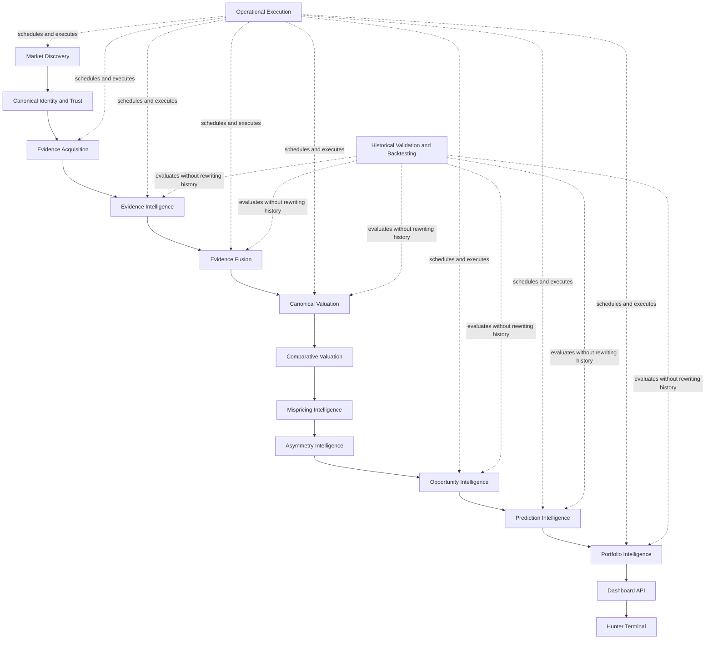

# Project Hunter Canonical Architecture Map

Status: Canonical navigation map

## Purpose

This document provides one concise map of Project Hunter's governing architecture, runtime flow, ownership boundaries, dependency rules, persistence authority, and migration state.

It does not create a competing architecture and does not override higher-order governance. If any statement in this map conflicts with a higher-order source, the canonical authority hierarchy below governs and this map must be corrected.

## Canonical Authority Hierarchy

1. `docs/PROJECT_CONSTITUTION.md`
2. `docs/PROJECT_PRINCIPLES.md`
3. Accepted ADRs in `docs/ADR/`
4. `docs/VISION.md`
5. `docs/HUNTER_ARCHITECTURE_MANIFEST.md`
6. `docs/HUNTER_ARCHITECTURE_SPEC.md`
7. `docs/HUNTER_ROADMAP.md`
8. `docs/CANONICAL_RUNTIME_ARCHITECTURE.md`
9. `docs/DEVELOPMENT_GOVERNANCE.md`
10. `docs/HUNTER_IMPLEMENTATION_CONTRACT.md`
11. `docs/AI_REVIEW_PROTOCOL.md`
12. `docs/SPRINTS/<version>.md`
13. `docs/CODEX_IMPLEMENTATION_GUIDE.md`

This map is a navigation and consistency document subordinate to that hierarchy.

## Mission

Project Hunter is a market-discovery-first, evidence-driven investment decision-support system for continuously discovering the crypto market, validating candidate identity and evidence, interpreting domain intelligence, identifying exceptional long-term opportunities before broad recognition, estimating uncertainty and outcome probability, and converting authoritative intelligence into explainable portfolio-level decisions.

Hunter is not primarily a dashboard, trading bot, portfolio tracker, or manually curated project analyzer. Presentation and automation are downstream consumers of authoritative persisted intelligence.

## Governing Principles

Hunter must remain:

- discovery-first;
- identity-before-valuation;
- trust-before-intelligence;
- evidence-first;
- deterministic and replay-safe;
- explicit about missing, conflicting, stale, and unavailable evidence;
- provider-independent at analytical authority boundaries;
- SQL-authoritative for canonical analytical records;
- explainable and provenance-preserving;
- additive and migration-safe;
- focused on measurable improvement to real investment decisions.

## Canonical Reasoning Pipeline

Operational Execution is not an analytical authority. Historical Validation and Backtesting are cross-cutting evaluation and learning capabilities; they may produce new versioned methodologies or calibration models but must not rewrite prior authoritative outputs.

## Layer Map

### 1. Market Discovery

**Purpose**

Continuously discover assets, protocols, networks, ecosystems, and emerging candidates before deciding what deserves deep analysis.

**Consumes**

- registered discovery sources;
- public market and ecosystem surfaces;
- source checkpoints and provider health state.

**Produces**

- typed discovery observations;
- candidate records;
- source coverage and discovery coverage;
- candidate lifecycle and eligibility state.

**Authority**

- candidate discovery;
- discovery provenance;
- market coverage state.

**Must not**

- produce investment recommendations;
- assign final opportunity scores;
- treat configured projects as the complete market universe.

### 2. Canonical Identity and Trust

**Purpose**

Establish what an economic entity and each of its representations actually are before analysis, valuation, or ranking.

**Consumes**

- discovery candidates;
- aliases, contracts, listings, chains, protocol records, official references;
- source reliability and conflict evidence.

**Produces**

- canonical entity identity;
- canonical representation identity;
- alias and relationship records;
- identity confidence, ambiguity, conflict, and lifecycle state.

**Authority**

- entity identity;
- representation identity;
- identity resolution and trust state.

**Must not**

- infer identity from ticker equality, popularity, or similar names alone;
- merge distinct representations implicitly;
- allow unresolved identity to become canonical valuation input.

### 3. Evidence Acquisition

**Purpose**

Retrieve, validate, normalize, checkpoint, and persist source observations without performing analytical interpretation.

**Consumes**

- registry-approved sources;
- canonical entity and representation scope;
- provider configuration, checkpoints, retries, and health policy.

**Produces**

- raw and normalized observations;
- acquisition provenance;
- source, parser, endpoint, and retrieval metadata;
- explicit unavailable and failed acquisition outcomes.

**Authority**

- raw and normalized source evidence;
- acquisition provenance and operational retrieval state.

**Must not**

- supply Hunter-owned analytical conclusions;
- silently substitute providers;
- fabricate or estimate missing evidence;
- become valuation, opportunity, probability, or ranking authority.

### 4. Evidence Intelligence

**Purpose**

Convert persisted evidence into domain-specific, deterministic, evidence-backed interpretation.

**Domains include**

- developer;
- protocol;
- technology;
- tokenomics, unlocks, holder concentration, and sell pressure;
- governance;
- security;
- on-chain behavior and capital flow;
- macro;
- whale behavior;
- adoption, revenue, competitive position, narrative, news, and social evidence where authoritative implementations exist.

**Consumes**

- persisted evidence only;
- canonical entity and representation identity;
- versioned methodology and configuration.

**Produces**

- typed findings, claims, domain assessments, risks, strengths, conflicts, missingness, and confidence components;
- immutable or correction-versioned domain records.

**Authority**

- interpretation inside each domain only.

**Must not**

- produce the final opportunity score;
- produce portfolio allocation;
- query presentation state;
- bypass evidence and trust boundaries.

### 5. Evidence Fusion

**Purpose**

Provide the single integration boundary between domain intelligence and decision intelligence.

**Consumes**

- authoritative typed outputs from Evidence Intelligence;
- authoritative sufficiency, freshness, conflict, and provenance inputs.

**Produces**

- versioned fused evidence snapshots per canonical representation and cutoff;
- conflict and disagreement state;
- evidence sufficiency;
- freshness and source diversity;
- cross-engine agreement and disagreement;
- provenance-preserving unified evidence views;
- known-by-Hunter replay state.

**Authority**

- cross-domain evidence composition;
- cross-domain confidence and sufficiency.

**Must not**

- erase disagreement through opaque averaging;
- overwrite source-level evidence;
- create opportunity, probability, or portfolio scores.

### 6. Canonical Valuation

**Purpose**

Transform observed valuation evidence into immutable, reproducible, methodology-versioned canonical valuation records.

**Consumes**

- canonical entity and representation identity;
- approved valuation observations and evidence;
- versioned Hunter-owned valuation methodologies;
- strict effective-time, recorded-time, and known-by-Hunter cutoffs.

**Produces**

- canonical valuation records;
- valuation observations, evidence links, methodology dependencies, confidence projections, lineage, lifecycle events, and corrections;
- explicit unavailable valuation outcomes where evidence is insufficient.

**Authority**

- canonical valuation only.

**Must not**

- implicitly merge representations;
- accept provider-supplied fair value, intrinsic value, undervaluation, or recommendation as authoritative;
- decide whether an asset is a good investment;
- own comparative valuation, mispricing, or asymmetry authority.

### 7. Comparative Valuation

**Purpose**

Compare canonical valuations across valid, point-in-time peer sets and equivalent valuation contexts.

**Consumes**

- canonical valuation records;
- canonical identity and representation scope;
- point-in-time peer-selection evidence;
- comparable methodology, units, horizons, and normalization context.

**Produces**

- authoritative comparative valuation records;
- peer-set provenance;
- relative valuation measures;
- explicit non-comparability and missingness state.

**Authority**

- comparative valuation only.

**Must not**

- use current project lists for historical peer selection;
- compare incompatible entities, representations, horizons, or methodologies without explicit treatment;
- become mispricing or opportunity authority.

### 8. Mispricing Intelligence

**Purpose**

Determine whether a defensible gap exists between observed market value and supported valuation evidence.

**Consumes**

- canonical valuation;
- comparative valuation;
- observed market value and liquidity context;
- valuation uncertainty, evidence sufficiency, and methodology state.

**Produces**

- authoritative mispricing records;
- direction, magnitude, uncertainty, supporting drivers, disconfirming evidence, and unavailable state.

**Authority**

- mispricing conclusion only.

**Must not**

- treat low price or historical drawdown as proof of undervaluation;
- convert missing valuation into neutral or zero mispricing;
- produce the final opportunity score.

### 9. Asymmetry Intelligence

**Purpose**

Evaluate the balance between supported upside, downside, uncertainty, catalysts, failure modes, and time horizon.

**Consumes**

- canonical and comparative valuation;
- mispricing intelligence;
- fused evidence;
- tokenomics, liquidity, concentration, unlock, macro, technical, security, governance, and adoption risks;
- scenario and horizon definitions.

**Produces**

- authoritative asymmetry records;
- upside and downside scenario structure;
- catalyst and failure-mode evidence;
- uncertainty, confidence, and explicit unavailable state.

**Authority**

- investment asymmetry only.

**Must not**

- collapse asymmetry into price-up probability;
- ignore downside, liquidity, dilution, or sell-pressure evidence;
- create portfolio allocation.

### 10. Opportunity Intelligence

**Purpose**

Answer whether a candidate is an exceptional investment opportunity relative to alternatives, based on authoritative evidence and valuation layers.

**Consumes**

- versioned fused evidence snapshots;
- canonical valuation;
- comparative valuation;
- mispricing;
- asymmetry;
- independent timing, risk, catalyst, and disconfirming evidence;
- explicit methodology and cutoff context.

**Produces**

- authoritative `OpportunityAssessment`;
- sole authoritative `opportunity_score`;
- opportunity drivers;
- disconfirming evidence;
- risks and catalysts;
- evidence sufficiency state;
- immutable methodology and provenance.

**Authority**

- opportunity assessment and opportunity score.

**Must not**

- use `TimingAssessment.entry_score`, Market Validation `hunter_score`, confidence, probability, or portfolio utility as substitutes for `opportunity_score`;
- acquire raw data directly;
- read Dashboard API or Terminal state;
- assemble arbitrary unversioned values from domain repositories outside approved inputs.

### 11. Prediction Intelligence

**Purpose**

Estimate scenario-conditioned outcome probability and evaluate predictions over time.

**Consumes**

- fused evidence;
- authoritative opportunity assessments;
- historical analogs, pattern evidence, scenario definitions, horizons, and outcome criteria.

**Produces**

- probability assessments;
- scenario-conditioned probabilities;
- historical similarity and pattern evidence;
- prediction hypotheses and lifecycle;
- closure, correctness, calibration, and accuracy records.

**Authority**

- probability and prediction lifecycle.

**Must not**

- redefine `opportunity_score`;
- mutate historical predictions after outcomes become known;
- use future evidence in historical replay.

### 12. Portfolio Intelligence

**Purpose**

Convert authoritative cross-asset intelligence into explainable, user-specific portfolio decision support.

**Consumes**

- authoritative opportunity assessments;
- prediction intelligence;
- timing, risk, liquidity, correlation, concentration, and shared-risk evidence;
- user goals, holdings, constraints, horizon, and capital availability.

**Produces**

- portfolio-context ranking;
- capital-allocation proposals;
- concentration and correlation analysis;
- replacement-opportunity analysis;
- entry sequencing;
- exit, invalidation, and review conditions;
- explainable Investment Committee decision composition.

**Authority**

- cross-asset portfolio utility, ranking, and advisory allocation.

**Must not**

- become automated trade execution;
- create competing opportunity or probability scores;
- hide policy decisions behind opaque committee voting.

### 13. Operational Execution

**Purpose**

Execute the architecture reliably and continuously.

**Consumes**

- approved workflow plans;
- job configuration;
- service contracts;
- retry, timeout, locking, cancellation, and schedule policy.

**Produces**

- automation jobs and runs;
- execution attempts;
- checkpoints;
- scheduler and provider health;
- operational logs and corpus.

**Authority**

- operational execution and health only.

**Must not**

- contain business logic, analytical formulas, ranking rules, or report semantics;
- substitute operational records for analytical authority.

### 14. Dashboard API

**Purpose**

Provide the sole read interface between authoritative runtime state and presentation.

**Consumes**

- persisted authoritative analytical and operational records;
- explicit unavailable and error states.

**Produces**

- stable, versioned, read-only presentation contracts.

**Authority**

- presentation API contracts only.

**Must not**

- calculate analytical scores;
- fuse evidence;
- rank assets;
- infer missing values;
- convert null or unavailable into zero;
- use operational corpus as an analytical fallback.

### 15. Hunter Terminal

**Purpose**

Visualize and interact with Hunter's authoritative outputs.

**Consumes**

- Dashboard API only.

**Produces**

- UI state and user interactions.

**Authority**

- UI state only.

**Must not**

- access runtime repositories directly;
- calculate intelligence;
- become a second analytical authority.

## Architectural Ownership Matrix

| Concept | Sole architectural owner |
| --- | --- |
| Market-wide candidate discovery | Market Discovery |
| Candidate lifecycle and discovery coverage | Market Discovery |
| Canonical economic entity | Canonical Identity and Trust |
| Canonical asset representation | Canonical Identity and Trust |
| Raw and normalized source evidence | Evidence Acquisition |
| Acquisition provenance and source health | Evidence Acquisition |
| Domain interpretation | Corresponding Evidence Intelligence engine |
| Cross-domain confidence and sufficiency | Evidence Fusion |
| Canonical valuation | Canonical Valuation |
| Comparative valuation | Comparative Valuation |
| Mispricing | Mispricing Intelligence |
| Asymmetry | Asymmetry Intelligence |
| Opportunity assessment and `opportunity_score` | Opportunity Intelligence |
| Timing signal and entry timing | Opportunity Timing module as independent evidence |
| Probability and prediction lifecycle | Prediction Intelligence |
| Historical pattern interpretation | Prediction Intelligence |
| Portfolio-context ranking and allocation | Portfolio Intelligence |
| Investment Committee policy composition | Portfolio Intelligence |
| Operational execution and health | Operational Execution |
| Presentation contracts | Dashboard API |
| UI state | Hunter Terminal |

No subsystem may create a second authority for any concept in this matrix.

## Dependency Rules

### Allowed forward dependencies

| Consumer | Approved upstream authorities |
| --- | --- |
| Canonical Identity and Trust | Market Discovery, persisted source evidence |
| Evidence Acquisition | Canonical identity scope, source registries, provider configuration |
| Evidence Intelligence | Persisted evidence, canonical identity, versioned methodology |
| Evidence Fusion | Authoritative Evidence Intelligence outputs |
| Canonical Valuation | Canonical identity, approved valuation evidence, versioned valuation methodology |
| Comparative Valuation | Canonical Valuation, identity, point-in-time peer evidence |
| Mispricing Intelligence | Canonical Valuation, Comparative Valuation, observed market evidence |
| Asymmetry Intelligence | Fusion, valuation, comparative valuation, mispricing, risk evidence |
| Opportunity Intelligence | Fusion, valuation, comparative valuation, mispricing, asymmetry, independent timing and risk evidence |
| Prediction Intelligence | Fusion, Opportunity Intelligence, historical and pattern evidence |
| Portfolio Intelligence | Opportunity Intelligence, Prediction Intelligence, timing, risk, correlation, liquidity, user context |
| Dashboard API | Persisted authoritative outputs and operational state |
| Hunter Terminal | Dashboard API |

### Prohibited dependency directions

- analytical engines must not depend on Dashboard API or Hunter Terminal;
- repositories must not perform acquisition, interpretation, scoring, or orchestration;
- providers must not write analytical authority directly;
- Dashboard API and Terminal must not query providers for analytical completion;
- Operational Execution must not own analytical formulas or methodology;
- later layers must not silently rewrite upstream records;
- historical replay must not use evidence recorded after the requested cutoff;
- no layer may infer unavailable evidence as zero or neutral without an explicit, versioned methodology.

## Persistence Authority

Every authoritative analytical record must be:

- typed;
- schema-versioned;
- methodology-versioned where applicable;
- immutable or correction-versioned;
- idempotently persisted;
- effective-time aware;
- recorded-time aware;
- known-by-Hunter aware;
- provenance-preserving;
- replayable;
- explicitly unavailable when required inputs are insufficient.

SQL is the canonical persistence authority for production analytical records. JSONL, process logs, caches, operational corpus summaries, reports, and UI state may support operations or presentation but cannot substitute for authoritative analytical persistence.

Current state must be reconstructed from immutable records and append-only lifecycle or correction history. Destructive historical overwrites are prohibited.

## Bitemporal and Replay Rules

Every authoritative point-in-time analytical decision must distinguish:

- evidence effective at the requested cutoff;
- evidence recorded by Hunter by the requested cutoff;
- evidence effective earlier but recorded later;
- reconstructed or backfilled knowledge versus knowledge actually available at the time.

Strict replay may use only evidence both effective and known by Hunter at the cutoff. Reconstruction mode must be explicitly labeled and must never be presented as strict historical knowledge.

Methodology improvements create new versioned methodologies and outputs. They do not rewrite prior historical results.

## Provider, Service, Repository, and Persistence Boundaries

- **Provider/adapter:** retrieves and parses registered source data; no analytical authority.
- **Service/engine:** validates approved inputs, applies domain methodology, creates authoritative typed outputs, and coordinates persistence.
- **Repository:** stores and retrieves domain records; no acquisition, interpretation, orchestration, or silent repair.
- **Persistence layer:** enforces schema, identity, immutability, idempotency, normalized relationships, lifecycle, correction, and replay constraints.
- **Orchestrator:** invokes services according to declared workflow dependencies; no domain business logic.
- **Scheduler:** triggers workflows and records operational execution; no analytical authority.
- **Dashboard API:** reads persisted authority; no analytical computation.
- **Terminal:** renders Dashboard API contracts; no runtime repository access.

## Legacy-to-Target Migration Map

Project Hunter V1 remains a released and frozen historical baseline. Future development on `main` migrates incrementally toward the target reasoning architecture without a repository-wide rewrite.

| Legacy or existing concept | Target architectural treatment |
| --- | --- |
| Existing Discovery and Candidate Registry | Preserve and evolve under Market Discovery and Canonical Identity authority |
| Existing intelligence engines | Preserve as domain modules under Evidence Intelligence |
| Existing Intelligence Fusion | Harden as the sole Evidence Fusion boundary |
| Existing Valuation, Mispricing, and Asymmetry pipeline behavior | Treat as legacy/noncanonical until replaced by independently authoritative record families governed by accepted ADRs and implementation sprints |
| Opportunity Timing | Preserve as independent timing evidence; never use `entry_score` as `opportunity_score` |
| Existing Probability and Pattern Matching | Consolidate under Prediction Intelligence while preserving internal modularity and historical compatibility |
| Existing Investment Committee | Move to explainable policy composition inside Portfolio Intelligence; no competing authority |
| Existing Ranking | Distinguish context-free analytical ordering from portfolio-context ranking; portfolio ranking belongs to Portfolio Intelligence |
| Existing Dashboard Foundation and operational console | Preserve presentation behavior while migrating reads to authoritative Dashboard API contracts |
| Existing automation and scheduler | Preserve as Operational Execution; never promote operational records into analytical authority |

Compatibility paths may remain temporarily only when their status is explicit, their outputs are not misrepresented as new canonical authority, and migration tests protect historical behavior.

## Current Implementation Sequence

1. Align governance indexes and documentation with the canonical source-of-truth hierarchy.
2. Freeze architectural ownership and score semantics through accepted ADRs.
3. Maintain and harden Evidence Fusion as the sole decision-intelligence integration boundary.
4. Implement Canonical Valuation as an additive, SQL-authoritative, replay-safe foundation.
5. Implement independent Comparative Valuation, Mispricing, and Asymmetry authorities.
6. Implement durable Opportunity Intelligence with `OpportunityAssessment.opportunity_score` as sole authority.
7. Consolidate durable Prediction Intelligence and calibration lifecycle.
8. Implement Portfolio Intelligence and move Committee policy composition into it.
9. Expose only authoritative persisted outputs through Dashboard API.
10. Complete Hunter Terminal as a presentation-only consumer.
11. Validate every decision layer through strict historical replay, backtesting, prediction closure, calibration, and tracked real-user decision outcomes.

## Prohibited Shortcuts

The following are forbidden:

- using a manually curated list as the complete market universe;
- using ticker equality as canonical identity;
- allowing providers to supply authoritative valuation or investment conclusions;
- querying external APIs from scoring or analytical methodology;
- using `TimingAssessment.entry_score` or Market Validation `hunter_score` as `opportunity_score`;
- treating confidence as probability;
- treating mispricing as opportunity;
- treating asymmetry as price-up probability;
- using current peer lists in historical comparative valuation;
- converting missing or unavailable evidence to zero or neutral defaults;
- using operational corpus, reports, cache, Dashboard, or Terminal state as analytical authority;
- allowing multiple owners for confidence, valuation, mispricing, asymmetry, opportunity, probability, risk, ranking, or allocation;
- implementing portfolio ranking before authoritative opportunity and prediction persistence;
- recomputing historical outputs with future knowledge;
- silently rewriting historical records after methodology or evidence corrections.

## Architectural Completion Criteria

Hunter reaches its intended evidence-driven decision-support architecture when:

- the market is continuously discovered beyond a fixed project list;
- every candidate has deterministic canonical identity and representation scope;
- trusted, typed evidence can be traced to registered sources and acquisition provenance;
- every domain engine produces durable evidence-backed interpretation;
- Evidence Fusion provides a unified but disagreement-preserving snapshot;
- Canonical Valuation, Comparative Valuation, Mispricing, and Asymmetry each have independent authoritative records;
- Opportunity Intelligence explains and persists why an asset is or is not exceptional;
- Prediction Intelligence estimates, closes, and calibrates scenario-conditioned probabilities;
- Portfolio Intelligence compares opportunities under the user's actual constraints and goals;
- Dashboard API and Hunter Terminal expose authority without creating it;
- every decision can be reconstructed using only information known by Hunter at the historical cutoff;
- tracked real-world use demonstrates materially better investment decisions than prior Hunter versions.

## Maintenance Rule

This map must be updated whenever an accepted ADR changes ownership, dependency direction, authoritative record families, runtime layering, replay semantics, or migration state.

A sprint may specialize implementation scope but must not silently change this map. If a sprint reveals a conflict with higher-order governance, implementation must stop until the governing documents and this map are reconciled.