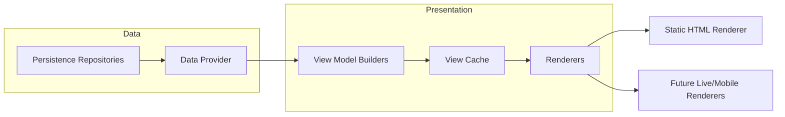
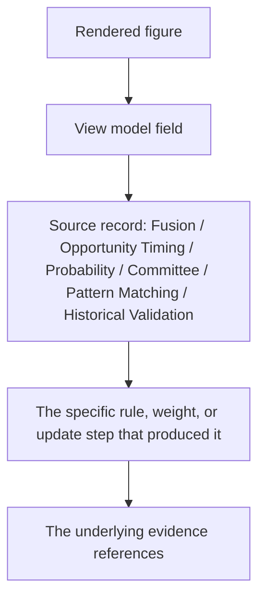
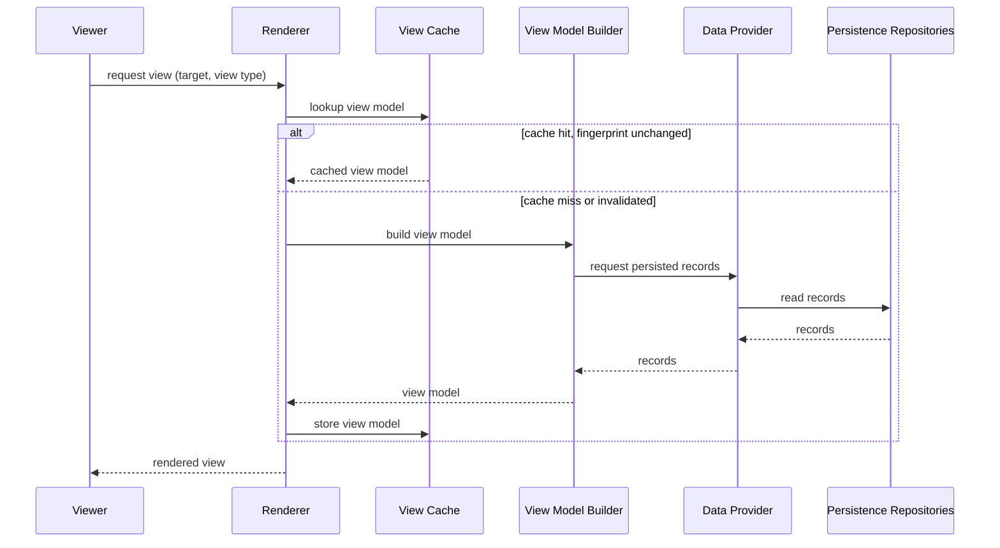
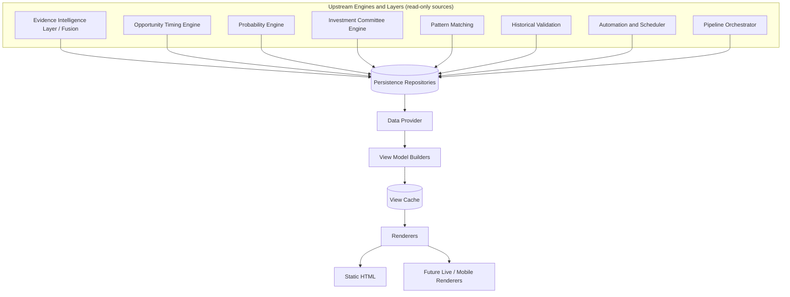
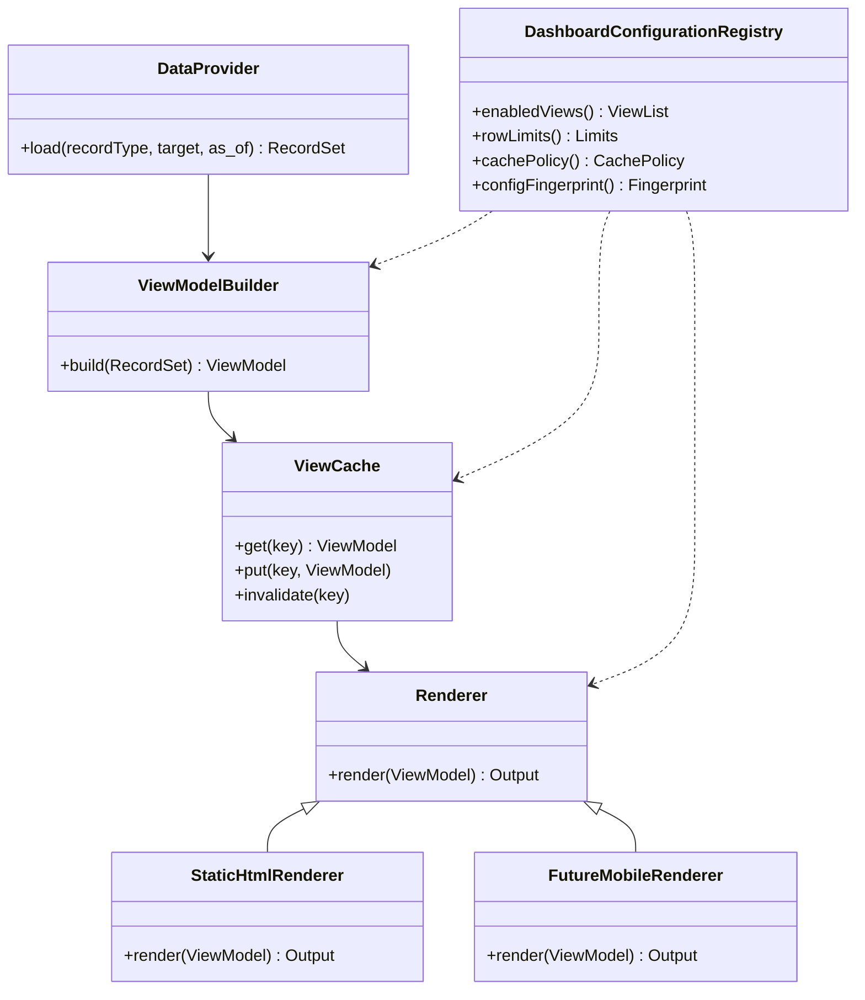
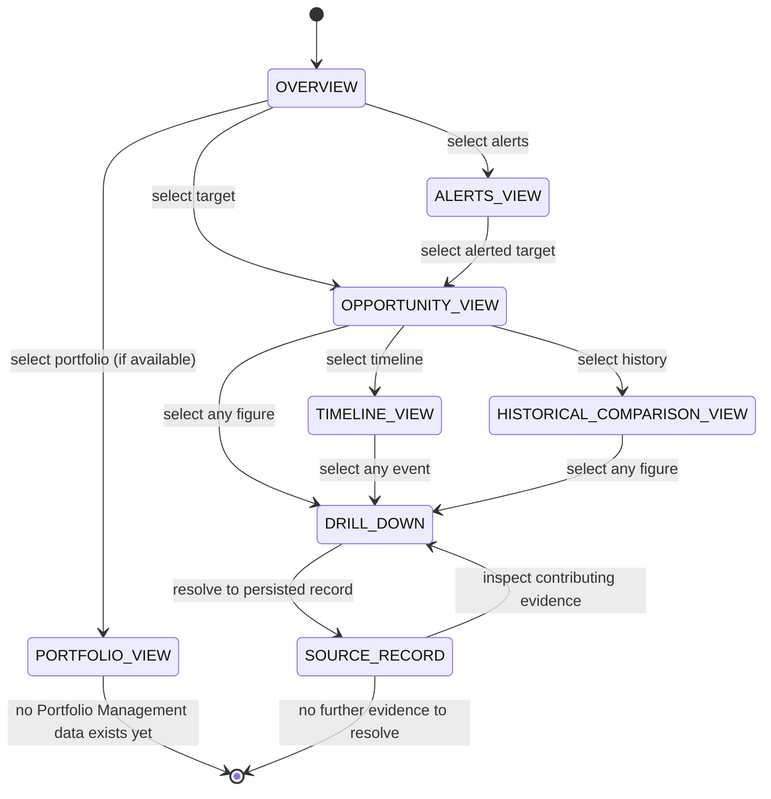

# Dashboard — Architecture Specification

Status: Target architecture for Hunter's presentation layer. This document is a design specification, not an implementation record. It does not describe code that exists today.

## Relationship To Existing Documents

`docs/DASHBOARD.md` documents the current Dashboard Foundation (Phase 1): a static HTML renderer that reads `PipelineRun`, `OperationalAttempt`, `AutomationRun`, `FusedIntelligence`, and `OpportunityTimingAssessment` records through repository contracts and writes one deterministic HTML file. Its boundaries — no mutation, no triggered execution, no scoring, no recommendations, no external calls — are adopted here exactly, and extended, never loosened, to cover the full set of persisted records this document describes.

`docs/CANONICAL_RUNTIME_ARCHITECTURE.md` governs what is production versus experimental in this repository today. The records this document reads from the Fusion/Timing/Probability/Committee family (`FusedIntelligenceRecord`, `OpportunityTimingAssessmentRecord`, and the target `OpportunityAssessmentRecord`, `ProbabilityAssessmentRecord`, `InvestmentCommitteeAssessmentRecord`/`CommitteeVoteRecord`/`CycleChampionSnapshotRecord`) all belong to the experimental Fusion/pipeline path, not the v2.1.x production `EvidenceBackedProjectExecutor` runtime — exactly as the existing `docs/DASHBOARD.md` already reads experimental-path records today. This document does not change that; it specifies how the Dashboard presents a larger set of records from the same experimental path as it grows, and it does not read from, mutate, or depend on the production Market Validation runtime's internal state.

`docs/OPPORTUNITY_TIMING_ENGINE_ARCHITECTURE.md`, `docs/PROBABILITY_ENGINE_ARCHITECTURE.md`, and `docs/INVESTMENT_COMMITTEE_ENGINE_ARCHITECTURE.md` are upstream analytical engines. The Dashboard consumes their persisted assessments as read-only data; it does not recompute, reinterpret, or second-guess any score, probability, vote, or eligibility state they produce.

`docs/AUTOMATION_AND_SCHEDULER.md` is a peer operational layer. The Dashboard reads persisted `AutomationJobRecord` and `AutomationRunRecord` state; it does not schedule, trigger, cancel, or otherwise control automation.

`docs/PERSISTENCE_CONTRACTS.md` defines the repository interfaces and base record contract every data source in this document is read through.

`docs/PROJECT_ROADMAP.md` lists a separate, deferred "Alert Engine" milestone. This document's Alerts view (Section 13) is presentation-only over already-computed, already-persisted alert-relevant evidence; it does not evaluate alert conditions, decide when to notify, or send notifications — that responsibility belongs to the future Alert Engine and Automation's notification jobs, not to the Dashboard.

`docs/DEVELOPMENT_GOVERNANCE.md` is the engineering process this document was produced under.

## 1. Purpose

The Dashboard answers one question for a human reader:

> Given everything Hunter has already computed and persisted, what does it look like — and how do I get from a summary view down to the exact evidence behind any number I'm looking at?

It renders. It does not decide, does not compute, and does not analyze. Every value on every view traces back to a persisted record produced by an upstream engine; the Dashboard's only job is to fetch that record, shape it into a view model, and present it legibly.

## 2. Responsibilities

- Render deterministic, read-only views of persisted Hunter state: pipeline and automation operational history, Fusion output, and Opportunity Timing, Probability, Pattern Matching, Historical Validation, and Investment Committee assessments.
- Provide evidence navigation and drill-down from any summary figure down to its full contributing-evidence chain, without re-deriving any part of that chain.
- Provide historical comparison views over a target's persisted assessment history.
- Provide an Opportunity view (per-target evidence and analytical state) and a Portfolio view (a read-only slot for future Portfolio Management persisted state).
- Provide a Timeline view of phase, window, eligibility, and champion transitions over time.
- Provide an Alerts view that surfaces already-persisted alert-relevant states (invalidation conditions, risk escalation, conflict, eligibility changes) without evaluating or triggering anything.
- Present every figure alongside its confidence, missing-evidence state, and source record references, never as a bare number.
- Remain renderer-agnostic at the view-model layer so new presentation surfaces (static HTML today, a future live view, a future mobile client) share one data layer rather than duplicating it.

## 3. Non-Responsibilities

- Does not run Intelligence Engines, Fusion, Opportunity Timing, Probability, Pattern Matching, Historical Validation, Investment Committee, or Automation. It reads their persisted output only.
- Does not calculate, adjust, or re-derive any score, probability, vote, consensus, conflict figure, or eligibility state. A figure shown on a view is the same value already persisted upstream, not a presentation-layer recomputation.
- Does not generate recommendations, price targets, or Buy/Sell/Hold signals of any kind, and does not predict price.
- Does not trigger pipeline execution, automation jobs, or any write to analytical state. The Dashboard has no write path to analytical records.
- Does not evaluate alert conditions or decide when to notify a user; it only displays already-computed alert-relevant state (Section 13).
- Does not implement Portfolio Management. The Portfolio view (Section 10) is a presentation slot over future Portfolio Management records; this document does not define what those records are.
- Does not call external providers or live APIs of any kind.
- Does not use undisclosed machine learning or any opaque step between a persisted record and its rendered representation.

## 4. Inputs

All inputs are persisted records read through the repository interfaces in `docs/PERSISTENCE_CONTRACTS.md`. The Dashboard makes no live calls and holds no independent state beyond view caching (Section 16).

**Already-implemented data sources** (per the current `docs/DASHBOARD.md`):
- `PipelineRunRecord`, `OperationalAttemptRecord`.
- `AutomationJobRecord`, `AutomationRunRecord`.
- `FusedIntelligenceRecord`.
- `OpportunityTimingAssessmentRecord`, `OpportunityTimingSnapshotRecord`.

**Target data sources** (from the three architecture documents this Dashboard is extended to present):
- `OpportunityAssessmentRecord` and `ScenarioAnalysisRecord` (Opportunity Timing Engine).
- `ProbabilityAssessmentRecord`, `BayesianUpdateChainRecord`, and `CalibrationBinRecord` (Probability Engine).
- `InvestmentCommitteeAssessmentRecord`, `CommitteeVoteRecord`, and `CycleChampionSnapshotRecord` (Investment Committee Engine).
- Pattern Matching and Historical Validation persisted case and outcome records.

**Configuration**
- Dashboard configuration (enabled views, output target, row limits, cache policy, security/permission settings per Sections 15–18).
- No model or scoring configuration of any kind belongs here; every threshold, weight, or fingerprint referenced by a rendered figure belongs to the engine that produced it, and the Dashboard only displays it.

## 5. Outputs

The Dashboard produces rendered views, never persisted analytical records. Each view is deterministic given the same persisted inputs and the same Dashboard configuration:

- **Summary/Overview view** — operational health (pipeline runs, automation runs) alongside top-level analytical state per target.
- **Opportunity view** (Section 11) — one target's full evidence and analytical state.
- **Portfolio view** (Section 10) — a read-only slot over future Portfolio Management state; empty/not-applicable until that state exists.
- **Timeline view** (Section 12) — phase/window/eligibility/champion transitions over time.
- **Historical Comparison view** (Section 9) — a target's assessment history side by side.
- **Alerts view** (Section 13) — already-persisted alert-relevant states across targets.
- **Drill-down views** (Section 8) — the full evidence chain behind any rendered figure.

Every view carries, for every figure it shows: the value, its confidence, its missing-evidence state (if any), and a reference to the exact source record it came from.

## 6. UI Architecture

- **Data Provider** — the only component that talks to persistence repositories; returns raw persisted records, never partially computed values.
- **View Model Builders** — pure, deterministic transformations from persisted records to immutable view models (Section 7). They reshape and label data; they never compute a new analytical value.
- **View Cache** — caches view models keyed by source record identity (Section 16), not by wall-clock time.
- **Renderers** — consume view models and produce a presentation surface. The current renderer is static HTML; Section 19 covers how a future mobile renderer plugs into the same layer without touching the Data Provider or View Model Builders.

This layering is intentionally strict: a renderer can never reach past the View Model layer back to raw repositories, which is what keeps every renderer — today's static HTML, a future live view, a future mobile client — guaranteed to show the same numbers from the same source.

## 7. View Models

A view model is an immutable, deterministic projection of one or more persisted records into exactly the shape a view needs to render — never a recomputation. Every view model:

- Names its source record(s) by ID, so Section 8 drill-down can always resolve back to them.
- Carries confidence and missing-evidence fields forward from the source record rather than omitting or flattening them.
- Is itself pure data (no behavior), so the same view model can be serialized to static HTML today or to any future transport without change.
- Is versioned alongside the Dashboard configuration fingerprint (Section 22), so a view model shape change is explicit and never silently mixed with an older shape in the same render.

View model builders never read two engines' records and blend them into a single computed figure; where a view shows several engines' output together (e.g., the Opportunity view), each figure remains individually attributed to its own source record.

## 8. Evidence Navigation And Drill-Down

Every rendered figure is a link, not a dead end. Drill-down follows the same evidence-traceability chain each upstream architecture document already defines:

Navigation is always downward (summary to detail) or backward (detail to the record it came from); the Dashboard never fabricates an intermediate explanation that isn't already present in the source record's own explainability payload. If a source record's explainability payload is incomplete, the drill-down view shows exactly that gap rather than filling it in.

## 9. Historical Comparison

The Historical Comparison view reads a target's full persisted assessment history (Opportunity Timing, Probability, and Committee snapshots) and presents it side by side or as a trend, using each engine's own persisted stability/drift fields (Probability Stability and Drift, phase/window history, consensus/conflict history) rather than computing a new trend statistic in the presentation layer. Any trend line, delta, or "then versus now" figure shown must already exist as a persisted field on the source records; the Dashboard does not introduce its own comparison arithmetic beyond simple side-by-side or delta display of already-persisted values.

## 10. Portfolio View

The Portfolio view is a presentation slot for future Portfolio Management persisted records. `docs/PROJECT_CONSTITUTION.md` lists Portfolio Management among future extensibility targets; no such engine or record type is specified by this document or exists in the repository today.

Until that data exists, the Portfolio view renders an explicit empty/not-yet-available state — never a fabricated or estimated position, holding, or allocation. When a future Portfolio Management architecture defines its own persisted records, this document's only required change is adding those records as a new data source (Section 4) and a corresponding view model (Section 7); the Dashboard's boundaries (Section 3) already forbid it from computing portfolio logic itself, so no boundary change is needed.

## 11. Opportunity View

The Opportunity view is the single-target detail page: every persisted analytical record for one target, laid out together.

- Discovery and identity context from the Dynamic Asset Registry.
- Opportunity Timing Engine's phase, window, momentum, risk, conviction, and scenario buckets.
- Probability Engine's outcome probabilities, confidence intervals, and stability/drift.
- Investment Committee Engine's eligibility, votes (including minority opinions), consensus, conflict, and champion status if applicable.
- Historical Validation and Pattern Matching context feeding the above.

Each section is attributed to its own source record; the view never merges two engines' figures into one displayed number. Missing evidence for any engine is shown as an explicit gap in that engine's section, not hidden by omitting the section.

## 12. Timeline

The Timeline view renders the ordered sequence of persisted state transitions for a target: Opportunity Timing phase/window changes, Investment Committee eligibility changes, and champion selection/loss events, using each engine's own persisted snapshot and lifecycle-state history (the Opportunity Timing Engine's phase/window lifecycle, the Investment Committee's eligibility state history). The Dashboard orders and labels these events; it does not infer a transition that isn't already represented by a persisted snapshot.

## 13. Alerts

The Alerts view surfaces already-persisted, already-computed states that a human would want to notice: triggered invalidation conditions (Opportunity Timing Engine), elevated Probability of Risk Escalation or Structural Deterioration with material Probability Drift (Probability Engine), and new conflict, lost eligibility, or a lost champion (Investment Committee Engine).

This view does not evaluate a threshold to decide whether something is alert-worthy in real time, does not maintain notification state, does not send a notification through any channel, and does not run on its own schedule. Those responsibilities belong to the separate, deferred Alert Engine milestone and to Automation's notification jobs (`docs/PROJECT_ROADMAP.md`). The Alerts view is a filtered read of conditions those upstream engines already flagged in their own persisted output — the same non-computation discipline as every other view in this document, applied specifically to the case most likely to be mistaken for live analysis.

## 14. Explainability

Every view is explainable from its own rendered content plus one drill-down step, without relying on memory of how a number was produced:

- Every figure shows its value, confidence, and missing-evidence state together, never a bare number.
- Every figure's drill-down (Section 8) resolves to a specific source record and rule.
- Every empty or not-yet-available state (Portfolio view, an engine section with no persisted assessment yet) is labeled as such, never left blank without explanation.

## 15. Performance

- Views are built from bounded, paginated repository reads (the existing `max_rows`-style configuration extended to every new data source), never an unbounded scan.
- View model construction avoids repeated per-field repository round-trips for the same source record; a view model is built from one batched read per record type per render.
- Rendering remains a static, deterministic pass over already-built view models — no per-request recomputation beyond formatting.
- Historical Comparison and Timeline views bound their query range explicitly (a configured lookback window or explicit date range) rather than loading a target's entire history by default.

## 16. Caching

- View models are cached keyed by the identity and fingerprint of their source record(s), never by wall-clock time-to-live, since persisted analytical records are immutable once written (`docs/PERSISTENCE_CONTRACTS.md`).
- A cache entry is invalidated only when a newer record with a different identity or fingerprint is persisted for the same target — never by an arbitrary expiry that could show stale data past a real update or discard fresh data before its expiry.
- "Latest" queries (e.g., "the current phase for target X") are the only cache entries with a short, explicitly configured freshness window, because "latest" is a moving pointer, not an immutable value; every other cached entry is cached indefinitely once written, since it can never change.
- Caching never becomes a second source of truth: if the cache and the repository disagree, the repository wins and the cache entry is invalidated, never the reverse.

## 17. Security

- In the current static-HTML generation mode, security is a generation-time and file-system concern: the renderer escapes all text values (already established in `docs/DASHBOARD.md`) and executes no scripts; output file placement and read access are an operational/deployment concern outside this document's scope, not a Dashboard runtime feature.
- No secret, credential, API key, or raw external-provider payload is ever rendered; only already-persisted, already-sanitized analytical records reach a view model.
- If a future live or served presentation surface is built, it must authenticate and authorize requests before serving any view (Section 18); this document does not specify that server's implementation, since it does not exist today, but no future serving mode may skip authentication merely because the current static mode has none.

## 18. Permissions

- The current static-HTML mode has no per-user permission model; it produces one file, and controlling who can read that file is a deployment concern.
- A future live or multi-user presentation surface must gate access per view at minimum by whether the requester may see a given target's data at all (e.g., a portfolio-scoped view once Portfolio Management exists); this document reserves that requirement without designing the identity/authorization system itself, which is out of scope until that surface is actually built.
- No permission model, present or future, may be used to show a different number for the same figure to different users. Permissions gate visibility of a view, never the value shown within a view a user is permitted to see.

## 19. Future Mobile Support

Because the UI Architecture (Section 6) strictly separates the Data Provider and View Model layers from renderers, a future mobile client is a new renderer consuming the same view models — it requires no change to the Data Provider, View Model Builders, or any upstream engine. Mobile-specific concerns (layout, offline caching of already-fetched view models, push delivery of Alerts-view content) are renderer-level concerns layered on top of the existing view-model contract, not a parallel data or analytical path.

## 20. CLI Surface

The current `docs/DASHBOARD.md` exposes exactly one command, `hunter dashboard build --sqlite-path PATH --output dashboard.html`, which opens the configured persistence store, builds a dashboard view from repositories, renders static HTML, and writes the output path. This document extends that same command's data sources (Section 4) without changing its shape: the command remains a single, deterministic, read-only build step, never a server process.

As new views are added (Sections 9–13), the CLI gains corresponding view-selection flags rather than new commands, keeping one build entry point for the static-HTML renderer. A future live or mobile renderer (Sections 17–19) would expose its own start/serve command outside this build command's scope; this document does not specify that command, since the surface it would serve does not exist today.

## 21. Failure Handling

- Every failure mode in this section is raised as a named, dashboard-specific exception type — the same convention the current `docs/DASHBOARD.md` package already establishes — never a generic or swallowed error.
- A missing persisted record for a requested view produces an explicit empty/not-available state for that section, never a fabricated placeholder value.
- A repository read failure aborts rendering of the affected section with a visible error state; it does not silently omit the section or render a partial, unlabeled view.
- Configuration is validated at startup (enabled views, row limits, cache policy, security settings); an invalid configuration prevents the Dashboard from rendering rather than rendering with silently substituted defaults.
- The Dashboard has no write path, so no failure in this layer can corrupt or alter any persisted analytical record.

## 22. Auditability

- Every rendered figure traces to a specific persisted record and, from there, to that record's own audit trail (already required by every upstream architecture document in this family).
- The Dashboard's own configuration (enabled views, row limits, cache policy) is versioned as part of the view model fingerprint (Section 7), so a rendered view can always be checked against "what configuration produced this render."
- Because the Dashboard performs no computation, there is no separate presentation-layer logic that could drift from the audited upstream value — the whole point of Section 2's rendering-only responsibility.

## 23. Replay And Historical Fidelity

The Dashboard does not replay anything itself; replay is an upstream engine concern (`docs/DETERMINISTIC_EXECUTION_IDENTITY.md`, and each engine's own Replay Requirements section). The Dashboard's obligation is narrower but still exact: given a persisted replay or backtest assessment (an `as_of`-bounded record produced by a `replay` or `backtest` run type per `docs/AUTOMATION_AND_SCHEDULER.md`), the Dashboard must render it faithfully as the historical assessment it is, correctly labeled with its `as_of` boundary and run type, never conflated with a current-state assessment for the same target.

## 24. Testing Strategy

- **Determinism tests** — the same persisted inputs and the same Dashboard configuration must produce byte-identical view models and rendered output, run repeatedly.
- **Non-computation tests** — fixtures assert that no view model field differs from its source record's own persisted value; any divergence is a defect (a hidden computation), not a rendering choice.
- **Missing-data tests** — a target with a missing or stale upstream record must render an explicit empty/not-available state for that section, never a fabricated value.
- **Drill-down tests** — every figure type must resolve, through drill-down, to its named source record; any figure that cannot be traced is a defect.
- **Cache-invalidation tests** — a new persisted record with a different fingerprint for the same target must invalidate the correct cache entries; an unchanged record must not.
- **Boundary tests** — the Dashboard's read-only guarantee is tested by asserting no code path in this layer calls a persistence write, pipeline execution, or automation-trigger interface.
- **Alerts-view tests** — verify the Alerts view only ever surfaces already-persisted alert-relevant fields and never computes a new threshold evaluation.

## 25. Future Extensibility

- New data sources (a future engine's persisted records) are added as a new Section 4 input and a corresponding view model, without changing the UI Architecture's layering.
- New views are added as new view model builders and renderers over existing or new data sources, without granting any view a write path.
- Portfolio Management, once specified, plugs into the existing Portfolio view slot (Section 10) as a new data source.
- The future Alert Engine, once specified, is expected to read the same persisted alert-relevant fields the Alerts view already surfaces; this document's Alerts view can remain unchanged even after that engine exists, since it was never responsible for the evaluation Alert Engine will own.
- Any extension must preserve: zero computation in the presentation layer, full evidence traceability and drill-down, and the strict non-responsibility boundary (no recommendations, no price prediction, no write path) established in Sections 2–3.

## 26. Sequence Diagram

## 27. Data Flow Diagram

## 28. Class/Module Diagram

## 29. Navigation / Drill-Down State Diagram

## Summary Of Guarantees

- The Dashboard performs zero analysis; every rendered figure is the same value already persisted by an upstream engine.
- Every figure is explainable in one drill-down step to a named source record.
- Missing evidence and empty states are always shown explicitly, never fabricated or silently omitted.
- Caching never becomes a second source of truth; the repository always wins over the cache.
- The Dashboard has no write path to any analytical record, pipeline, or automation trigger.
- The Alerts view surfaces already-computed state; it does not evaluate, threshold, or notify — that remains the future Alert Engine's responsibility.
- New renderers (mobile, future live views) reuse the same data and view-model layer; they never duplicate it.
