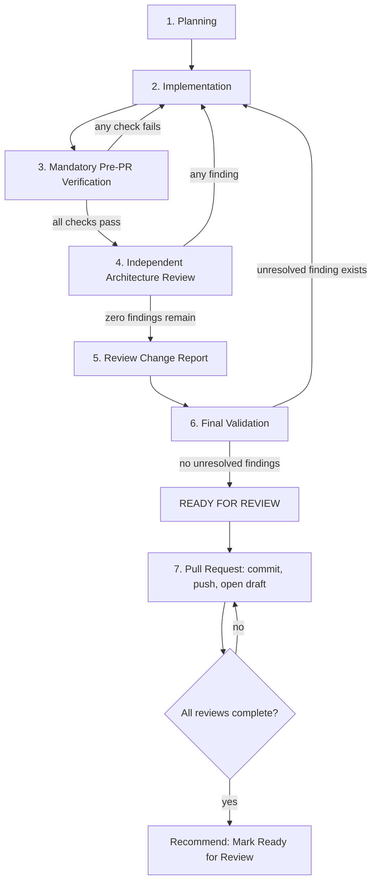

# Development Governance

Status: Permanent engineering governance for Project Hunter. Effective for every future contribution, from any contributor, of any size, starting immediately. This document replaces ad-hoc review practice. It does not expire, and it is not optional.

## Relationship To Existing Governance

`docs/PROJECT_CONSTITUTION.md` and `docs/PROJECT_PRINCIPLES.md` are Project Hunter's foundational governance documents. `PROJECT_CONSTITUTION.md` Section 16 declares itself the highest architectural authority; `PROJECT_PRINCIPLES.md` declares itself the permanent engineering constitution. This document does not compete with either and does not attempt to resolve any pre-existing relationship between them. This document is subordinate to both.

This document's role is narrower and more mechanical: it defines the mandatory *process* — the lifecycle, verification gates, review discipline, and reporting format — that every contribution must pass through to actually enforce the principles the Constitution and the Principles document already establish. Where any requirement in this document could be read as conflicting with the Constitution or the Principles document, those documents govern, and this document must be corrected through the amendment procedure in Section 8. This document must never be used to justify a lower bar than either already sets.

This document also governs the architecture specifications it sits alongside (for example `docs/OPPORTUNITY_TIMING_ENGINE_ARCHITECTURE.md`, `docs/PROBABILITY_ENGINE_ARCHITECTURE.md`, `docs/INVESTMENT_COMMITTEE_ENGINE.md`) and every future document or implementation like them. It does not restate or weaken any guarantee those documents already make.

## 1. Purpose

Project Hunter is an evidence-driven investment decision system maintained for the long term. Its value depends entirely on every score being reproducible, every conclusion being explainable, and every guarantee it has already made continuing to hold as the system grows. Ad-hoc review — reading a diff, forming an impression, approving it — cannot reliably protect those properties as the number of engines, documents, and contributors grows. This document exists to make protecting them mechanical rather than a matter of individual discipline or memory.

## 2. Scope and Applicability

This lifecycle applies to every change to this repository, without exception for size, urgency, author, or perceived triviality:

- Source code, configuration, and schema changes.
- Architecture and design documentation.
- Tests and test fixtures.
- Tooling, scripts, and automation.
- This document itself.

It binds every contributor: every human maintainer, and every AI agent operating on this repository, including Claude, Codex, and any future automated contributor. No contributor — human or AI — may claim an exemption from this lifecycle on the basis of role, authority, or confidence in the change.

A change is anything that will be committed. A change that will not be committed (pure research, a throwaway exploration, an answer to a question) is not subject to this lifecycle, because this lifecycle governs contributions, not conversation.

## 3. Proportionality

Every step defined in Section 4 is mandatory for every change. No step may be skipped, merged away, or silently assumed. What scales with the size and risk of the change is the *depth* of each step's output, not whether the step happens.

A one-line documentation correction still passes through Planning, Verification, Review, the Review Change Report, and Final Validation — but Planning may be one sentence, the Verification checklist may confirm most items as trivially satisfied, and the Review Change Report may consist of a single explicit statement that no issues were found. A change to scoring architecture, persistence contracts, or replay semantics requires each step to be worked in full, because the risk it carries is proportionally larger.

Proportionality authorizes brevity. It never authorizes omission. A step recorded as "not applicable" must state explicitly why it is not applicable; a step is never simply absent from the record.

## 4. The Mandatory Engineering Lifecycle

The lifecycle is a loop, not a checklist to satisfy once. A failure at Verification returns to Implementation. A finding at Review returns to Implementation. An unresolved finding at Final Validation blocks the "READY FOR REVIEW" statement entirely. The loop only exits forward when every gate has actually passed, not when a contributor judges it close enough.

### 4.1 Planning

Before writing any change, the contributor must establish, in writing, as part of the change record:

- What was actually requested, stated in the contributor's own words, not copied from the request.
- Which architecture is affected — which documents, which engines, which module boundaries.
- Which runtime behavior is affected, if any.
- Which persisted data or persistence contracts are affected, if any.
- Which replay or determinism guarantees are affected, if any.
- What compatibility impact exists for existing contributors, consumers, or persisted history.
- What architectural risks the change introduces or touches.

If a category has no impact, Planning must say so explicitly ("no persistence impact: this change touches only descriptive documentation") rather than omit the category.

### 4.2 Implementation

The contributor implements only what Planning identified. Specifically:

- No unrelated refactoring rides along with the requested change.
- No architecture is silently altered as a side effect of implementing something else.
- No existing guarantee, contract, or documented behavior is weakened without that weakening being the explicit, stated subject of the change.
- No placeholder, stub, or "finish later" content is introduced under any circumstance.

If, while implementing, the contributor discovers that the requested change cannot be done correctly without also touching something Planning did not identify, the contributor returns to Planning and extends it explicitly before continuing. Scope grows through revised Planning, never through silent expansion during Implementation.

### 4.3 Mandatory Pre-PR Verification

Verification is a gate, not a courtesy pass. If any check fails, the contributor must stop: no commit, no push, no pull request, until every check has been corrected and the entire checklist has been run again from the top. Passing 24 of 25 checks is not a passing verification.

Every check below applies to every change. When a check has no material subject in a given change (for example, a documentation-only change against "runtime consistency"), the record must state the check as not applicable and state why — it may never be left unaddressed.

1. **Modified-file content** — every file touched by the change contains its intended final content; no file was left mid-edit, half-written, or reverted to an intermediate state.
2. **Placeholder text** — no "lorem ipsum," bracketed placeholder ("[insert ...]"), or filler text exists anywhere in the change.
3. **TODO/FIXME markers** — no `TODO`, `FIXME`, or equivalent deferred-work marker exists anywhere in the change.
4. **Incomplete templates** — no section header, table, or structural template exists without the content it was created to hold.
5. **Duplicated sections** — no heading, module, record type, or rule is defined more than once with conflicting or redundant content.
6. **Accidental boilerplate** — no scaffolding, tool output, or generic template text was left in the change by mistake.
7. **Reasonable file sizes** — every changed file's size is consistent with its actual content; a suspiciously small file for its claimed scope, or a suspiciously large one for its actual content, is investigated before being accepted.
8. **Markdown structure** — heading levels are sequential with no gaps or duplicates, code fences are opened and closed in matching pairs, and lists and tables are well-formed.
9. **Internal document references** — every path or document referenced by the change actually exists in the repository at the referenced location.
10. **Mermaid syntax** — every diagram is syntactically valid for its declared diagram type, and every node, participant, or class referenced in a relationship or message was actually declared.
11. **Cross-document consistency** — terminology, record names, module names, and stated guarantees in the change match how the same concepts are described in every other document that already references them.
12. **Naming consistency** — the same concept is named identically everywhere it appears within the change and across the documents it touches; no silent renaming or near-duplicate naming is introduced.
13. **Architecture consistency** — the change does not contradict the responsibilities, boundaries, or data flow already established for the components it touches.
14. **Runtime consistency** — if the change has runtime behavior, that behavior matches what the change's own documentation and any referencing documentation claims it does.
15. **Persistence consistency** — if the change touches persisted data, the record shapes, immutability guarantees, and lineage fields match what is documented elsewhere for the same or related record types.
16. **Replay consistency** — if the change touches anything replay-sensitive, replay remains deterministic, point-in-time-safe, and free of any dependency on wall-clock time or non-deterministic ordering.
17. **Evidence traceability** — every claim, score, or conclusion the change introduces can be traced to a named, specific contributing source; nothing is asserted without a stated basis.
18. **Auditability** — every output the change introduces can be explained after the fact from what was persisted or documented, without relying on memory of how it was produced.
19. **Deterministic behavior** — given the same inputs, the change's described or implemented behavior produces the same output every time; no hidden randomness, hidden clock dependence, or hidden ordering dependence is introduced.
20. **No undocumented behavioral changes** — every change in behavior, however small, is stated explicitly somewhere in the change record; nothing shifts silently.
21. **No production guarantees weakened** — every guarantee an existing document or implementation already makes still holds after the change, unless weakening that specific guarantee is the explicit, stated subject of the change.
22. **No architectural responsibility leakage** — the change does not cause one component to duplicate, bypass, or quietly assume a responsibility that another, already-defined component owns.
23. **Implementation matches documentation** — where implementation code exists for what the change describes, that code actually does what the documentation says it does.
24. **Documentation matches implementation** — where implementation code exists, the documentation does not claim capabilities, guarantees, or behavior the code does not actually have.
25. **No dead references remain** — every cross-reference, section pointer, and named dependency introduced or touched by the change resolves to something that still exists; nothing points at a section, file, or concept that was renamed or removed elsewhere in the same change.

Checks 23 and 24 are satisfied vacuously, and must be recorded as such, for changes that are purely architectural specification with no corresponding implementation yet — but the moment implementation exists for a specified component, both checks become live and mandatory for every subsequent change to either side.

### 4.4 Independent Architecture Review

After Verification passes, the contributor performs a second, distinct pass: reviewing the change as an independent Principal Software Architect who did not write it and whose task is to find a reason to reject it, not to confirm it is acceptable. This step exists because a person or agent verifying their own checklist tends to see what they intended, not what they produced; adopting an adversarial posture toward one's own work is the only reliable way to catch what Verification's mechanical checks cannot.

The reviewer does not defend the implementation. Confirming "this looks fine" is not a review outcome; only a specific, named absence of a specific, named problem is. The reviewer examines the change against every category below:

- **Architectural flaws** — does the design solve the stated problem without introducing a structural weakness?
- **Responsibility leakage** — does any component do work that belongs to another, already-defined component?
- **Hidden assumptions** — does the change depend on something it never states plainly, especially about an upstream system's behavior or data shape?
- **Violation of Hunter philosophy** — does the change contradict evidence-first, deterministic, auditable, non-black-box operation as established in the Constitution and Principles?
- **Black-box behavior** — can every output be explained by a named rule and named contributing evidence, with no opaque or unenumerable step?
- **Determinism violations** — could the same inputs ever produce different outputs?
- **Replay violations** — could a past result become unreproducible, or could future information leak into a past assessment?
- **Persistence inconsistencies** — do record shapes, immutability, and lineage actually match what is claimed and what sibling records already do?
- **Evidence traceability issues** — is there any claim in the change that cannot be walked back to a specific source?
- **Auditability issues** — is there any output that could not be explained after the fact without relying on someone's memory?
- **Historical validation issues** — does anything in the change risk leaking future information into a historical or point-in-time computation, or misrepresent what historical evidence actually supports?
- **Configuration issues** — is anything that should be configurable hardcoded, or is anything configuration-driven left without a documented, valid default and validation rule?
- **Scoring inconsistencies** — do any scores, probabilities, or ratings the change touches remain internally consistent with each other (for example, do partitions that must sum to a disclosed total actually do so)?
- **Naming inconsistencies** — does every name match its counterpart everywhere else it is used?
- **Maintainability issues** — will a future maintainer, unfamiliar with today's context, be able to understand and safely extend this change?
- **Future extensibility problems** — does the change foreclose reasonable future extension, or does it require rewriting itself to accommodate an already-foreseeable need?
- **Cross-document inconsistencies** — does any other document now disagree with this change, even if that document was not directly touched?
- **Pipeline inconsistencies** — does the change correctly fit the stage ordering, dependency declarations, and failure handling that the Pipeline Orchestrator already requires of every stage?
- **Module coupling problems** — does the change introduce a direct dependency between components that should only communicate through a shared contract?
- **Boundary violations** — does the change cross a responsibility boundary that Section 5 and Section 14 of `PROJECT_CONSTITUTION.md` already establish?

If any category surfaces a finding, the contributor returns to Implementation, fixes it, and repeats the entire Independent Architecture Review from the top — not only the category that failed. A review that stops at the first found issue and does not re-run in full is not a completed review.

### 4.5 Review Change Report

The Independent Architecture Review is not complete until its findings are recorded. For every issue found during review, the contributor must produce a report entry with exactly these ten fields:

1. **Issue** — what was wrong, stated as a fact about the change, not as a suggestion.
2. **Root Cause** — why it happened; what about the process, not just the content, allowed it through.
3. **Fix** — exactly what changed to resolve it.
4. **Architectural Impact** — why the architecture is now better, stated specifically, not generically.
5. **Runtime Impact** — whether and how the fix changes runtime behavior.
6. **Persistence Impact** — whether and how the fix changes stored data, record shape, or lineage.
7. **Replay Impact** — whether and how the fix changes replay determinism or point-in-time safety.
8. **Compatibility Impact** — whether the fix is backward compatible, and if not, what migration it requires.
9. **Risk** — whether the fix itself introduces any new risk, stated plainly even when the answer is none.
10. **Verification** — which specific check, from Section 4.3 or a manual re-read, confirms the fix actually resolved the issue.

If the review found no issues, the report must state exactly: "No issues were identified during independent review." A report may not be silent on this point; the absence of findings must be an explicit, positive statement, not an empty section.

### 4.6 Final Validation

Once every review finding has a completed report entry and every fix has been re-verified, the contributor produces a Final Validation record containing exactly these fields:

- Files changed.
- Architecture impact.
- Runtime impact.
- Persistence impact.
- Replay impact.
- Compatibility impact.
- Risk assessment.
- Verification completed (confirmation that Section 4.3 was run in full, and passed, as of the final state of the change).
- Self-review completed (confirmation that Section 4.4 was run in full, and reached zero unresolved findings).
- Review Change Report completed (confirmation that Section 4.5 was produced, whether it lists issues or states none were found).

Only when every field is populated and every field reflects a resolved, non-blocking state may the record close with the literal statement:

**READY FOR REVIEW**

This statement must never appear while any review finding remains unresolved, while any Verification check has not been re-run after a fix, or while any Final Validation field is missing or incomplete. A contributor who writes "READY FOR REVIEW" attests that every prior gate in this lifecycle actually passed, not that it is likely to pass.

### 4.7 Pull Request Rules

A commit, a push, or a pull request may only be created after Section 4.6 has produced "READY FOR REVIEW." Specifically:

- The pull request is opened as a draft.
- The draft remains a draft until every step in this lifecycle has been completed for the full, final state of the change — including after any fixes made in response to review comments or CI failures, which restart Verification and Review Change Report for whatever they touched.
- The contributor may recommend marking the pull request "Ready for Review" only after: Verification passed in full, the Independent Architecture Review reached zero unresolved findings, the Review Change Report was completed (including the explicit no-issues statement when applicable), and Final Validation states "READY FOR REVIEW."
- A pull request is never marked ready, and never merged, while a known, unresolved finding from this lifecycle exists anywhere in its history that has not been superseded by a documented fix.

## 5. Escalation And Ambiguity

Not every finding has an unambiguous fix. When a Verification check or an Independent Architecture Review finding can only be resolved by a judgment call that changes scope, architecture, or already-established behavior, the contributor stops and obtains explicit approval before proceeding. Guessing at the more conservative-sounding option and proceeding unilaterally is not an acceptable substitute for asking. This applies equally to human contributors deciding whether to escalate to another maintainer and to AI contributors deciding whether to escalate to the user.

An ambiguous finding is never resolved by weakening the check that surfaced it. If a check appears to conflict with a legitimate requirement of the change, the conflict is escalated, not silently decided in favor of shipping.

## 6. Hunter Engineering Principles

These principles are permanent. Every step of the lifecycle in Section 4 exists to enforce them, and no step may be satisfied in a way that violates one of them:

- Evidence before opinion.
- Determinism before convenience.
- Auditability before performance.
- Replay safety before optimization.
- Explainability before sophistication.
- Architecture before implementation.
- Immutability before mutation.
- Explicitness before hidden behavior.
- Every score reproducible.
- Every decision explainable.
- Every output evidence-backed.
- No black boxes.
- No price prediction.
- No Buy/Sell recommendations.

Where a proposed change would satisfy a Verification check or a review category only by violating one of these principles, the principle governs and the change must be redesigned, not merely reworded.

## 7. Non-Bypass Clause

This lifecycle may not be bypassed for any reason, including but not limited to: deadline pressure, the change being authored by a maintainer with broad repository authority, the change appearing trivial, the change having already been informally approved outside this process, or the requester explicitly asking for the process to be skipped. A request to skip this lifecycle is itself an ambiguous instruction under Section 5 and must be escalated, not honored.

The only way a specific step's depth may be reduced is through the proportionality rule in Section 3, which reduces documentation burden for low-risk changes — it never removes a step, and it never removes the Verification gate, the Review Change Report, or the Final Validation statement.

## 8. Amendment Procedure

This document may be amended. It is not exempt from its own lifecycle: any change to this document must itself pass through Planning, Implementation, Verification, Independent Architecture Review, a Review Change Report, and Final Validation before it is committed.

An amendment must not reduce any guarantee in `PROJECT_CONSTITUTION.md` or `PROJECT_PRINCIPLES.md`. An amendment that would do so is void regardless of whether it was merged, and the Constitution and Principles document govern until this document is corrected.

## 9. Applicability To Documentation-Only Changes

A change that is purely architectural specification — a new or revised document with no corresponding implementation — still passes through every step in Section 4. Runtime, persistence, and replay checks and review categories are recorded as not applicable with an explicit reason, per Section 3 and Section 4.3. Cross-document consistency, naming consistency, evidence traceability of claims the document itself makes, and architectural consistency with every other document remain fully live and mandatory regardless of whether implementation exists yet.

## 10. Relationship To Automated Tooling

This document defines a process obligation, not an implementation. It does not specify, require, or assume any particular CI pipeline, linter, or automated check. Automated tooling that mechanically enforces some of the checks in Section 4.3 may be built in the future as a separate, explicitly designed and documented system; if it is, that tooling assists this lifecycle and does not replace the contributor's own Planning, Independent Architecture Review, or judgment on escalation. A passing automated check is evidence toward a Verification item, not a substitute for the contributor's own accountability for the item.

## Summary Of Guarantees

- Every future change to this repository, of any size, passes through Planning, Implementation, Verification, Independent Architecture Review, a Review Change Report, and Final Validation before it is committed.
- No step is ever skipped; only its documented depth scales with the change's actual risk.
- "READY FOR REVIEW" is only ever written when every prior gate has actually passed.
- A pull request is never marked ready, and never merged, while a known finding remains unresolved.
- Ambiguous findings are escalated, never guessed at.
- This document is subordinate to `PROJECT_CONSTITUTION.md` and `PROJECT_PRINCIPLES.md` and can never be used to justify a lower bar than either sets.
- This document binds every contributor, human or AI, without exception.
