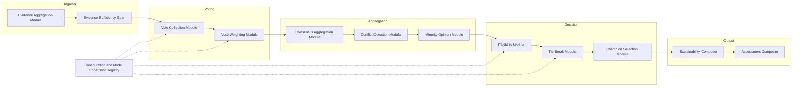
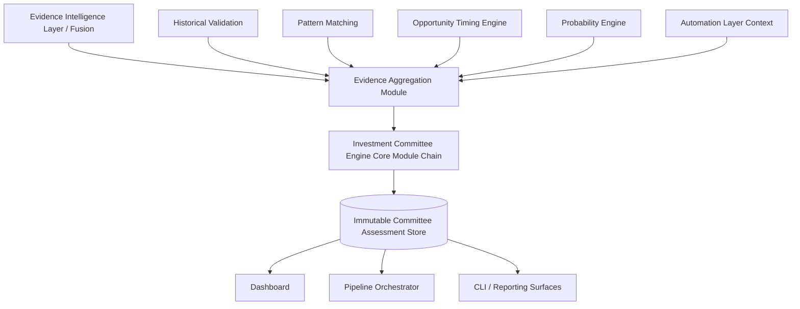
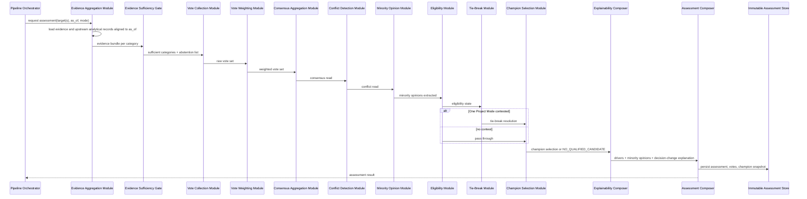
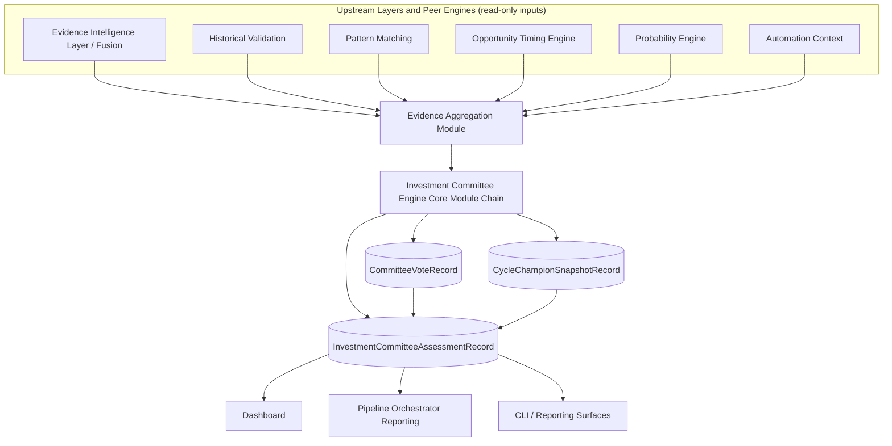
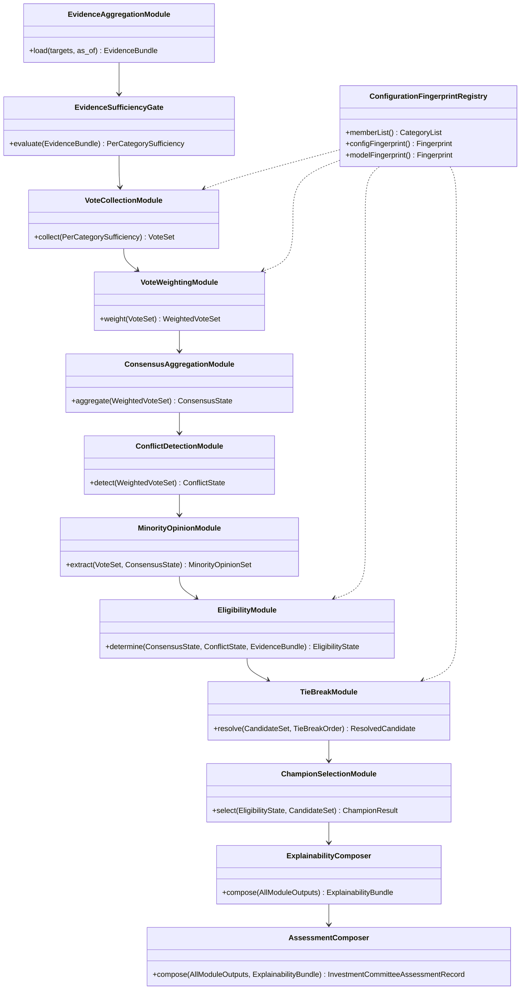
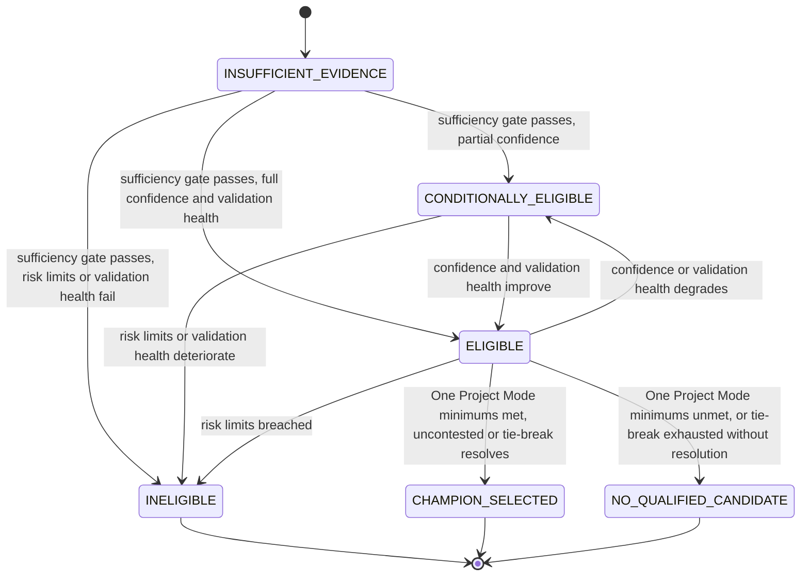

# Investment Committee Engine — Architecture Specification

Status: Target architecture for Hunter's final evidence-aggregation layer. This document is a design specification, not an implementation record. It does not describe code that exists today.

## Relationship To Existing Documents

`docs/INVESTMENT_COMMITTEE_ENGINE.md` documents the production v2.1.x committee model: `InvestmentCommitteeAssessment`, `CommitteeVote`, and `CycleChampionSnapshot` records; the eligibility states `ELIGIBLE`, `CONDITIONALLY_ELIGIBLE`, `INELIGIBLE`, `INSUFFICIENT_EVIDENCE`; the vote states `STRONG_APPROVE`, `APPROVE`, `NEUTRAL`, `OPPOSE`, `STRONG_OPPOSE`, `ABSTAIN_MISSING`, `ABSTAIN_STALE`, `ABSTAIN_LOW_CONFIDENCE`; One Project Mode; and `NO_QUALIFIED_CANDIDATE`. This document adopts every one of those contracts as-is and does not rename, replace, or weaken any of them. It formalizes the full architecture around them: how votes are produced, how conflict and minority positions are preserved, how ties are broken, how confidence is computed, and how the whole process replays deterministically.

`docs/OPPORTUNITY_TIMING_ENGINE_ARCHITECTURE.md` and `docs/PROBABILITY_ENGINE_ARCHITECTURE.md` are upstream peer engines. This engine consumes their persisted assessments as committee inputs; it does not recompute phase, window, momentum, risk, conviction, scenario probabilities, or any outcome probability that either engine already owns. Duplicating that computation here would be architectural responsibility leakage and is explicitly out of scope.

`docs/DEVELOPMENT_GOVERNANCE.md` is the engineering process this document was produced under. It is not the subject of this document. Section 24 below defines a different, narrower concept — *Committee Governance*, meaning how the committee's own voting rules, weights, and membership evolve over time — and that section states explicitly how it relates to, and remains subordinate to, `DEVELOPMENT_GOVERNANCE.md`.

## 1. Purpose

The Investment Committee Engine is Hunter's final persisted analytical layer. It answers one question:

> Given everything every upstream engine has already concluded about this target, what does the assembled evidence collectively support — and where does it disagree with itself?

It does not re-evaluate project quality (Intelligence Engines), timing (Opportunity Timing Engine), or outcome likelihood (Probability Engine). It takes their already-computed, already-persisted conclusions, plus its own category-level votes, and aggregates them into one transparent, evidence-backed committee record: an eligibility state, a set of individual votes with full reasoning, a consensus and conflict read, and — when requested in One Project Mode — a single cycle champion. The human decision maker reads this record. The engine never decides for them.

## 2. Responsibilities

- Consume persisted outputs from every upstream analytical engine and every configured evidence category for one target as of one boundary timestamp (`as_of`).
- Convert each category's persisted evidence into one normalized, deterministic vote using the existing production vote taxonomy.
- Aggregate votes into consensus, conflict, evidence robustness, and committee confidence without hiding disagreement behind an averaged score.
- Preserve every dissenting vote as a first-class, individually explainable minority opinion, never absorbed into a majority summary.
- Determine eligibility (`ELIGIBLE`, `CONDITIONALLY_ELIGIBLE`, `INELIGIBLE`, `INSUFFICIENT_EVIDENCE`) from evidence completeness, validation health, confidence, and risk limits.
- In One Project Mode, select at most one cycle champion using documented, deterministic tie-break rules, or explicitly report `NO_QUALIFIED_CANDIDATE` when no candidate qualifies.
- Persist every assessment, vote set, and champion snapshot immutably with full lineage back to source evidence, and support deterministic replay of any past assessment.
- Expose the assessment to the Pipeline Orchestrator, the Dashboard, and any CLI or reporting surface through the same persisted contract.

## 3. Non-Responsibilities

- Does not predict price, price paths, or price targets in any form.
- Does not produce Buy, Sell, Hold, Enter, or Exit signals or recommendations. Eligibility, votes, consensus, and champion selection are evidence-backed analytical states, not investment advice.
- Does not execute trades, place orders, or interact with any exchange or wallet.
- Does not override, reinterpret, or "correct" upstream evidence. A category's persisted evidence is read as-is; the committee may vote against it, but it may never silently discard it.
- Does not recompute anything an upstream engine already owns: not phase or window (Opportunity Timing Engine), not outcome probabilities (Probability Engine), not raw intelligence scores (Intelligence Engines). It consumes their conclusions as votes' inputs.
- Does not collect raw data or call external providers.
- Does not use undisclosed machine learning or any scoring step whose weights are not fully enumerable in the model fingerprint.
- Does not force a winner. `NO_QUALIFIED_CANDIDATE` is a legitimate, expected outcome, not a failure state.
- Does not suppress or dilute conflict. A severe, well-evidenced dissent remains visible in the final record regardless of how many other categories approve.

## 4. Inputs

All inputs are persisted, versioned, and aligned to a single `as_of` boundary. The engine consumes no live data and makes no external calls.

**Target identity and boundary**
- Canonical target identity (from the Dynamic Asset Registry).
- `as_of` timestamp (explicit for replay/backtest; latest aligned effective time for current-state execution).
- Run mode: single-target evaluation, ranking evaluation, or One Project Mode cycle evaluation.

**Evidence and analytical inputs** (each arriving as persisted, explainable, source-attributed records):
- Opportunity Timing Engine assessment (phase, window, momentum, conviction, risk, scenario buckets, invalidation conditions).
- Probability Engine assessment (outcome probabilities, expected reward/risk bands, evidence and distribution confidence, probability stability and drift).
- Pattern Matching output.
- Historical Validation output (point-in-time case records, backtesting summaries).
- Macro Intelligence, Whale Intelligence, Developer Intelligence, Protocol Intelligence, News Intelligence, Narrative/Social Intelligence, On-chain Intelligence, Technology Intelligence, Capital Rotation Intelligence.
- Tokenomics, Liquidity, and Market Structure evidence.
- Evidence Confidence Layer output (corroboration, contradiction, dependency, canonical evidence-group independence).
- Prior Investment Committee assessments for the same target (for consensus stability and champion continuity).
- Automation outputs (run context, requested stage options, cycle identity for One Project Mode).

**Configuration**
- Committee configuration: the member category list, per-category vote-mapping thresholds, evidence-weighting table, eligibility thresholds, One Project Mode minimums, conflict-ceiling and lead-margin rules, and tie-break order.
- Model fingerprint and configuration fingerprint of every upstream engine that contributed evidence, plus this engine's own fingerprint.

The engine treats every input as already evidence-graded upstream. It does not re-score raw signals; it converts already-scored, already-persisted conclusions into votes and aggregates them.

## 5. Outputs

Every output below is a field on one immutable `InvestmentCommitteeAssessmentRecord`, or on a `CommitteeVoteRecord` linked to it, or — in One Project Mode — on a `CycleChampionSnapshotRecord`. Every field carries its contributing evidence references and the model/configuration fingerprint that produced it.

- **Eligibility** — one of `ELIGIBLE`, `CONDITIONALLY_ELIGIBLE`, `INELIGIBLE`, `INSUFFICIENT_EVIDENCE`, with the specific completeness, validation, confidence, or risk-limit reasons behind it.
- **Committee Votes** — one `CommitteeVoteRecord` per member category, each carrying: the vote state (`STRONG_APPROVE` through `ABSTAIN_LOW_CONFIDENCE`), the source score and confidence that produced it, source timestamps and freshness state, supporting references, opposing references, missing fields, and a stated explanation.
- **Approval / Opposition** — the count and weighted share of votes on each side.
- **Consensus** — a deterministic read of how aligned the vote set is.
- **Conflict** — a deterministic read of how much the vote set disagrees, computed so that a single severe dissent remains visible rather than being averaged away.
- **Evidence Robustness** — how independently confirmed the vote set is, discounted by dependent or shared-lineage evidence groups.
- **Committee Confidence** — the engine's confidence in the assessment as a whole (Section 17).
- **Thesis Fragility** — how much the assessment would change if its single strongest supporting vote were removed or reversed.
- **Minority Opinions** — every dissenting vote, preserved individually with its full reasoning, never merged into the majority view (Section 14).
- **Positive Drivers** and **Negative Drivers** — the specific votes and evidence items that most increased or decreased approval.
- **Decision-Change Explanation** — when eligibility, consensus direction, or champion status differs from the target's prior assessment, the specific votes or evidence changes responsible.
- **Cycle Champion Selection** (One Project Mode only) — the selected champion, or an explicit `NO_QUALIFIED_CANDIDATE` state, with the tie-break path taken (Section 15) when applicable.
- **Source Record IDs** — every upstream Fusion, Opportunity Timing, Probability, Pattern Matching, and Historical Validation record ID that fed the assessment.

## 6. Internal Modules

- **Evidence Aggregation Module** — resolves and loads every persisted evidence and upstream-analytical record for the target, aligned strictly to `as_of`.
- **Evidence Sufficiency Gate** — evaluates category coverage against the configured committee member list; produces an explicit `INSUFFICIENT_EVIDENCE` eligibility state when required categories are missing or stale, short-circuiting voting for those categories rather than fabricating a vote.
- **Vote Collection Module** — maps each present, sufficient category's persisted score, confidence, and freshness onto the fixed vote taxonomy using named, versioned per-category threshold rules.
- **Vote Weighting Module** — applies the configured evidence-weighting table (Section 11) to each vote, producing a weighted contribution without discarding the vote's own unweighted state.
- **Consensus Aggregation Module** — computes approval, opposition, and consensus from the weighted vote set (Section 12).
- **Conflict Detection Module** — computes conflict severity from the same vote set using a non-netting rule, so a single severe dissent is never diluted by many mild agreements (Section 13).
- **Minority Opinion Module** — extracts and preserves every dissenting vote as an individually addressable record, independent of how consensus resolved (Section 14).
- **Eligibility Module** — determines the eligibility state from evidence completeness, validation health, committee confidence, and risk limits.
- **Tie-Break Module** — applies the configured, deterministic tie-break order when One Project Mode selection is contested (Section 15).
- **Champion Selection Module** — selects at most one cycle champion under One Project Mode's configured minimums, or emits `NO_QUALIFIED_CANDIDATE`.
- **Explainability Composer** — assembles positive/negative drivers, decision-change explanations, and minority opinions from every module's contributing-evidence output; performs no independent scoring.
- **Assessment Composer** — assembles the final `InvestmentCommitteeAssessmentRecord`, its `CommitteeVoteRecord`s, and any `CycleChampionSnapshotRecord`, attaches configuration/model fingerprints, and hands them to persistence.
- **Configuration & Model Fingerprint Registry** — the single source of the member category list, vote-mapping thresholds, evidence weights, eligibility thresholds, One Project Mode minimums, and tie-break order consumed by every module.

## 7. Evidence Flow

Evidence flows in one direction only. The committee reads persisted, explainable records from every upstream engine — including the Opportunity Timing Engine and Probability Engine, which are peers, not subordinates — and produces its own persisted, explainable record. Nothing flows back upstream.

## 8. Decision Flow

There is no trading decision in this engine — only vote composition and eligibility/champion determination, both fully derived from already-persisted evidence.

1. Align target + `as_of` and load all evidence and upstream-analytical records.
2. Apply the Evidence Sufficiency Gate per category. Categories below threshold are recorded as `ABSTAIN_MISSING` or `ABSTAIN_STALE`, never silently omitted.
3. Collect one vote per sufficient category using the fixed vote taxonomy.
4. Apply configured evidence weights to each vote.
5. Aggregate weighted votes into approval, opposition, and consensus.
6. Detect conflict severity using the non-netting rule.
7. Extract and preserve minority opinions.
8. Determine eligibility from completeness, validation health, committee confidence, and risk limits.
9. If running in One Project Mode: apply the configured minimums; if multiple candidates are contested, apply the Tie-Break Module; select a champion or emit `NO_QUALIFIED_CANDIDATE`.
10. Compose explainability (positive/negative drivers, decision-change explanation, minority opinions).
11. Persist the assessment, vote records, and any champion snapshot; emit to Pipeline Orchestrator, Dashboard, and CLI/reporting surfaces.

## 9. Voting Architecture

Voting reuses the production vote taxonomy exactly, without addition or renaming:

`STRONG_APPROVE`, `APPROVE`, `NEUTRAL`, `OPPOSE`, `STRONG_OPPOSE`, `ABSTAIN_MISSING`, `ABSTAIN_STALE`, `ABSTAIN_LOW_CONFIDENCE`.

Each category's vote is produced by a named, versioned mapping from that category's own persisted score, confidence, and freshness onto this taxonomy — never by free-form judgment and never by an opaque model. The three abstention states are structurally distinct from `NEUTRAL`: `NEUTRAL` means the category was evaluated and found balanced; the abstention states mean the category could not be evaluated at all, for a stated reason. Collapsing an abstention into `NEUTRAL` is a defect, not a simplification, because it would silently convert missing evidence into a report of balanced evidence.

Every `CommitteeVoteRecord` retains the category's source score, source confidence, source timestamp, freshness state, supporting references, opposing references, missing fields, and a plain-language explanation — the same discipline already established in `docs/INVESTMENT_COMMITTEE_ENGINE.md`.

Members that emit more than one score do not leave the vote-collection mapping ambiguous about which value to use. The Opportunity Timing Engine member votes from its Timing Score and Conviction Score jointly: Timing Score determines vote direction and strength, and Conviction Score determines whether that direction is expressed as a strong or a plain vote state, with the Timing Engine's own Risk Score and Evidence Confidence feeding this member's freshness/confidence fields rather than a second, parallel vote. The Probability Engine member votes from its Probability of Success/Outperformance partition (Section 9, `PROBABILITY_ENGINE_ARCHITECTURE.md`) for direction and strength, with its Distribution Confidence feeding this member's confidence field; the Probability Engine's other outcome probabilities (multiple-based, risk-escalation, etc.) remain available as supporting or opposing references on the vote but do not themselves determine vote direction. Any future multi-output member added under Section 24 must specify this same explicit primary-score-for-direction, primary-score-for-strength, and confidence-source mapping before it can be added to the member list.

## 10. Committee Members

A committee "member" is a canonical evidence category represented by its own persisted, already-scored upstream output — never a human, never a freeform AI opinion. The configured member list is the single source of which categories vote; it is read from the Configuration & Model Fingerprint Registry, not hardcoded in any module.

The default member set includes: Macro Intelligence, Whale Intelligence, Developer Intelligence, Protocol Intelligence, Technology Intelligence, Capital Rotation Intelligence, News Intelligence, Narrative/Social Intelligence, On-chain Intelligence, Tokenomics/Liquidity/Market Structure evidence, Pattern Matching, the Opportunity Timing Engine, and the Probability Engine. Historical Validation participates as an evidence source for other members' votes and for eligibility/champion validation rather than casting its own vote, since it supplies the ground truth those members are measured against.

Adding, removing, or redefining a member category is a configuration change; it produces a new model fingerprint and does not retroactively reinterpret a historical assessment made under the prior membership.

## 11. Evidence Weighting

Each member category carries a configured weight used by the Vote Weighting Module. Weights are:

- Explicit and versioned in the Configuration & Model Fingerprint Registry — never inferred, never learned.
- Applied only to the aggregation step (consensus, approval share); the unweighted vote state itself is always retained and reported, so a heavily downweighted `STRONG_OPPOSE` is still visible as `STRONG_OPPOSE`, not silently faded toward `NEUTRAL`.
- Never used to suppress conflict. Weighting changes how much a vote contributes to consensus; it never changes whether a severe dissent is surfaced by the Conflict Detection Module (Section 13), which operates on vote severity independent of weight.

Changing a weight changes the model fingerprint; historical assessments remain interpretable under the fingerprint that was active when they were produced.

## 12. Consensus Architecture

Consensus is computed from the weighted vote set as a deterministic function of approval share, opposition share, and vote-state distribution — never a bare average of numeric scores. Approval and opposition are reported explicitly and separately; consensus is a derived read of how aligned they are, not a substitute for showing both sides.

Consensus is always reported alongside Conflict (Section 13) and Evidence Robustness. A high consensus figure next to a high conflict figure is a valid, expected combination when a small number of very confident categories disagree sharply with a larger number of mildly confident ones — the architecture is required to make that combination visible, not to collapse it into one misleadingly smooth number.

## 13. Conflict Resolution

Conflict is detected, never resolved by suppression. The Conflict Detection Module computes conflict severity using the same non-netting discipline already established in the Opportunity Timing Engine's Risk Architecture and the Probability Engine's aggregation rules: the presence of one severe, well-evidenced dissenting vote is sufficient to register material conflict, regardless of how many other categories approve.

"Resolution" in this architecture means the conflict is surfaced, explained, and attributed to specific votes — not that it is averaged away or that one side is declared correct. The committee record always shows the specific dissenting vote(s), their supporting evidence, and why they disagree with the majority. A human reader can then judge the disagreement directly; the engine never judges it for them by hiding one side.

## 14. Minority Opinions

Every vote that disagrees with the majority direction, and every abstention, is preserved as an individually addressable Minority Opinion within the assessment — never merged into a summary "some categories disagreed" statement. Each Minority Opinion carries the same fields as any `CommitteeVoteRecord`: source score, confidence, supporting/opposing references, and explanation.

Minority Opinions are never dropped for being outvoted, never downweighted in how they are displayed (only in how they contribute to the numeric consensus figure, per Section 11), and never excluded from replay. A minority position from a highly independent, highly confident category is exactly the kind of signal Hunter's evidence-first philosophy exists to protect from being smoothed over by majority agreement.

## 15. Tie Handling

Ties can occur in two places: consensus direction (approval and opposition weighted shares are equal or within a configured epsilon) and One Project Mode champion selection (multiple candidates satisfy the configured minimums with no clear leader).

Both cases are resolved by a documented, deterministic tie-break order read from configuration — never by arbitrary selection, insertion order, or any non-deterministic tiebreak. The default order is: higher committee confidence, then higher evidence robustness, then lower conflict, then earlier canonical registry entry (as the final, fully deterministic tiebreak of last resort). If the tie-break order is exhausted without resolution, the engine reports an explicit tie state rather than guessing — for consensus direction this is reported as part of the consensus read; for champion selection this results in `NO_QUALIFIED_CANDIDATE` rather than an arbitrary pick.

## 16. Eligibility And Champion Selection

Eligibility (`ELIGIBLE`, `CONDITIONALLY_ELIGIBLE`, `INELIGIBLE`, `INSUFFICIENT_EVIDENCE`) is determined by the Eligibility Module from evidence completeness, committee confidence, critical alerts, and configured risk limits — reusing the exact model already established in `docs/INVESTMENT_COMMITTEE_ENGINE.md`.

One Project Mode selects at most one cycle champion. A candidate must satisfy configured minimums for committee confidence, consensus, evidence robustness, a conflict ceiling, and a lead margin over the next candidate before it can be selected; ties among qualifying candidates go through Section 15. If no candidate satisfies the minimums, or if the strongest candidate is not sufficiently evidence-backed, the engine reports `NO_QUALIFIED_CANDIDATE`. This is a correct, expected outcome, not an error state, and it is never converted into a forced selection under any configuration.

## 17. Confidence Calculation

Committee Confidence is computed from: the weighted vote set's internal agreement, evidence robustness (independent canonical evidence-group coverage across voting categories), freshness of the contributing votes anchored to `as_of`, and the confidence figures already carried forward from the Opportunity Timing Engine and Probability Engine assessments rather than re-derived.

Thesis Fragility is computed separately, as a measure of how much Committee Confidence and consensus direction would change if the single strongest supporting vote were removed or reversed — making visible when an apparently confident assessment actually rests on one category's evidence rather than broad, independent agreement.

Both figures are reported alongside the assessment, never folded silently into a single opaque score.

## 18. Persistence Requirements

- `InvestmentCommitteeAssessmentRecord` — the full assessment: eligibility, approval/opposition, consensus, conflict, evidence robustness, committee confidence, thesis fragility, positive/negative drivers, decision-change explanation, source record IDs, configuration fingerprint, model fingerprint, and `as_of`.
- `CommitteeVoteRecord` — one per member category per assessment: vote state, source score, source confidence, source timestamp, freshness state, supporting references, opposing references, missing fields, and explanation.
- `CycleChampionSnapshotRecord` — the selected champion (or `NO_QUALIFIED_CANDIDATE`), the tie-break path taken if any, and the qualifying candidate set considered.
- All records are immutable once written. A changed read produces a new record; nothing is updated in place. Repeated persistence of an identical analytical result is idempotent. Operational timestamps are excluded from analytical conflict semantics, per the existing production model.

## 19. Replay Requirements

- Given the same persisted inputs, the same `as_of`, and the same configuration/model fingerprint, the engine must produce byte-identical `InvestmentCommitteeAssessmentRecord`, `CommitteeVoteRecord`, and `CycleChampionSnapshotRecord` output.
- Changing the member list, vote-mapping thresholds, evidence weights, eligibility thresholds, One Project Mode minimums, or tie-break order produces a new fingerprint and a new assessment; it never silently reinterprets a historical record.
- Replays must not depend on wall-clock time, random seeds, or non-deterministic ordering. Tie-break order (Section 15) is the documented mechanism for every point where an ordering decision must be made.
- Batch replay (recomputing an entire historical range, or re-running a past One Project Mode cycle) is a repeated application of the single-checkpoint replay, not a separate code path with separate semantics.

## 20. Failure Handling

- A missing or stale category is recorded as `ABSTAIN_MISSING` or `ABSTAIN_STALE`, never defaulted to `NEUTRAL` and never silently excluded from the member list.
- If evidence coverage falls below the configured minimum for a valid assessment at all, the engine emits `INSUFFICIENT_EVIDENCE` rather than a confident-looking eligibility state built on a thin vote set.
- Unavailability of the Opportunity Timing Engine or Probability Engine assessment for the target/`as_of` is treated as missing evidence for the vote(s) that depend on it, not as an engine crash.
- Configuration is validated at startup (complete member list, complete vote-mapping thresholds, complete weight table, ordered tie-break rules, valid fingerprint composition); an invalid configuration prevents the engine from running.
- Any internal module failure aborts the assessment for that target rather than emitting a partially composed record; partial records are never persisted as if complete.
- All degraded or gated outcomes are logged with the specific reason (which category, which threshold, which module) to support operational diagnosis.

## 21. Auditability

- Every eligibility state, vote, consensus figure, conflict figure, and champion selection traces to the exact contributing evidence records and the exact rule/weight version that produced it.
- The configuration fingerprint and model fingerprint are stored on every record, so any historical assessment can be checked against "what would this look like under current rules" without ambiguity about which rules originally produced it.
- Nothing is overwritten. The full history of committee assessments and champion snapshots for a target or a cycle is a permanent, append-only ledger.
- Dashboard, CLI, and Orchestrator consumers all read the same persisted record — there is no separate presentation computation that could drift from the audited value.

## 22. Evidence Traceability

The full reference chain for any committee output field is:

`raw source observation → Intelligence Engine output → Evidence Intelligence Layer / Fusion record → (optionally) Historical Validation case record / Pattern Matching classification / Opportunity Timing Engine assessment / Probability Engine assessment → Committee vote-mapping rule → CommitteeVoteRecord → InvestmentCommitteeAssessmentRecord field`

Every hop is a persisted, addressable record. Positive Drivers, Negative Drivers, and Minority Opinions are themselves lists of chain endpoints — each entry is a pointer to a specific vote and the evidence behind it, not a free-text summary.

## 23. Explainability

Every assessment must be explainable in full from its persisted record alone, without relying on memory of how it was produced:

- Every vote states which category cast it, what evidence and confidence produced it, and why.
- Every consensus and conflict figure states which votes drove it.
- Every eligibility state states the specific completeness, validation, confidence, or risk-limit reason behind it.
- Every champion selection or `NO_QUALIFIED_CANDIDATE` states which candidates were considered, which minimums were or were not met, and which tie-break step (if any) decided the outcome.
- Every minority opinion remains individually visible, never summarized away.

## 24. Committee Governance

This section defines *Committee Governance*: how the committee's own voting rules evolve. It is distinct from, and fully subordinate to, `docs/DEVELOPMENT_GOVERNANCE.md`, which governs the engineering process used to produce any change to this document or its implementation. Committee Governance concerns only the content of the committee's configuration once that engineering process has approved a change.

- The member category list, vote-mapping thresholds, evidence weights, eligibility thresholds, One Project Mode minimums, and tie-break order are the complete set of committee-governance-controlled parameters. No other module may introduce an additional undocumented parameter.
- Every change to a committee-governance parameter changes the model fingerprint and is itself subject to `docs/DEVELOPMENT_GOVERNANCE.md`'s full lifecycle: it cannot bypass Planning, Verification, Independent Architecture Review, a Review Change Report, or Final Validation merely because it takes the form of a configuration value rather than code or documentation.
- Historical assessments are never reinterpreted under a changed configuration. They remain permanently interpretable under the fingerprint active when they were produced.

## 25. Testing Strategy

- **Determinism tests** — same inputs + same fingerprint must produce byte-identical vote records, consensus/conflict figures, eligibility state, and champion selection, run repeatedly and across process restarts.
- **Golden fixture tests** — frozen evidence bundles with known expected votes, consensus, conflict, eligibility, and champion outcomes, covering every vote state, every eligibility state, and `NO_QUALIFIED_CANDIDATE` at least once.
- **Abstention tests** — evidence bundles deliberately missing or stale for specific categories must produce the correct `ABSTAIN_MISSING` / `ABSTAIN_STALE` vote, never a silently omitted category and never a collapsed `NEUTRAL`.
- **Conflict non-netting tests** — a fixture with one severe dissent among many mild approvals must register material conflict, verifying the aggregation rule is not secretly averaging.
- **Minority opinion tests** — every dissenting or abstaining vote in a fixture must appear as an individually addressable Minority Opinion in the output, never merged away.
- **Tie-break tests** — fixtures engineered to tie at each stage of the configured tie-break order must resolve deterministically through that exact order, and an exhausted tie-break must produce the documented tie/`NO_QUALIFIED_CANDIDATE` state rather than an arbitrary pick.
- **Fingerprint-change tests** — a configuration change (member list, weights, thresholds, tie-break order) must change the model fingerprint and must not alter the interpretation of already-persisted historical assessments.
- **Regression/backtest suites** — running the full historical range for known targets and cycles must reproduce previously recorded assessments and champion snapshots unless configuration intentionally changed.
- **Cross-engine dependency tests** — unavailability of the Opportunity Timing Engine or Probability Engine assessment for a given target/`as_of` must be treated as missing evidence for the dependent vote(s), never as a crash or a silently substituted default.

## 26. Future Extensibility

- New member categories are added through Committee Governance (Section 24) by extending the configured member list and its vote-mapping rule, without changing the module chain's shape.
- New tie-break criteria may be appended to the end of the configured tie-break order without disturbing existing historical resolutions, since the order itself is fingerprinted.
- Multi-cycle or portfolio-level aggregation (comparing champions across cycles) can be added as a read-only layer over the persisted `CycleChampionSnapshotRecord` history without requiring any change to how a single cycle's champion is selected.
- Any extension must preserve: determinism, immutability of prior records, full evidence traceability, visible minority opinions, and the strict non-responsibility boundary (no price prediction, no buy/sell output, no forced winner) established in Sections 2–3.

## 27. Sequence Diagram

## 28. Data Flow Diagram

## 29. Class/Module Diagram

## 30. Eligibility And Champion State Diagram

Every node below except `CHAMPION_SELECTED` is one of the four production eligibility states from `docs/INVESTMENT_COMMITTEE_ENGINE.md` or the production `NO_QUALIFIED_CANDIDATE` value, in their exact persisted casing. `CHAMPION_SELECTED` is a descriptive terminal label for "a `CycleChampionSnapshotRecord` was written with a selected champion" — it is not itself a persisted enum member.

## Summary Of Guarantees

- Every vote, consensus figure, conflict figure, eligibility state, and champion selection is evidence-derived, never an instruction to buy, sell, hold, enter, or exit.
- Every output is deterministic, versioned, and reproducible from persisted inputs.
- Conflict is always surfaced, never diluted; minority opinions are always individually visible, never merged away.
- `NO_QUALIFIED_CANDIDATE` is a legitimate outcome; the engine never forces a winner.
- Every field traces to named upstream evidence, a named vote-mapping rule, and a named weight or threshold.
- Nothing is overwritten; the committee assessment and champion history is a permanent audit ledger.
