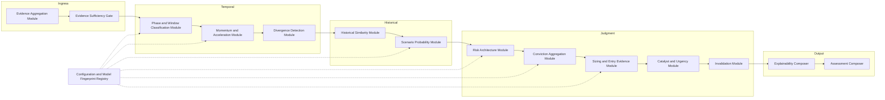
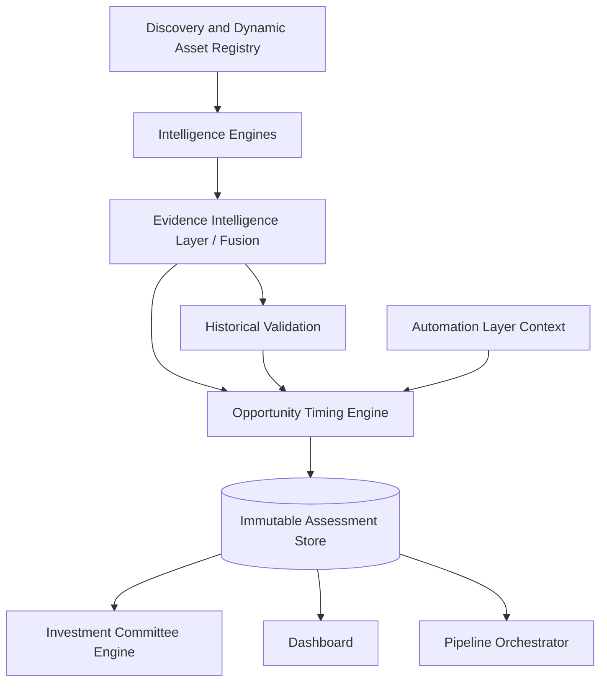
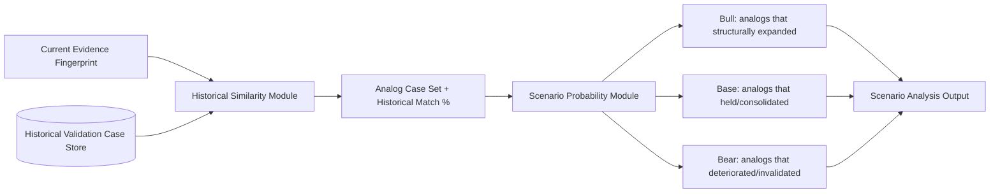
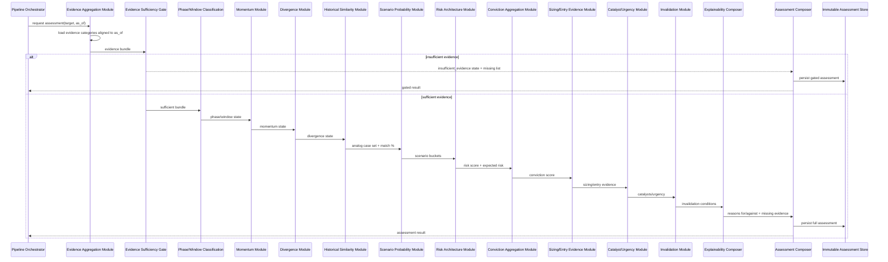
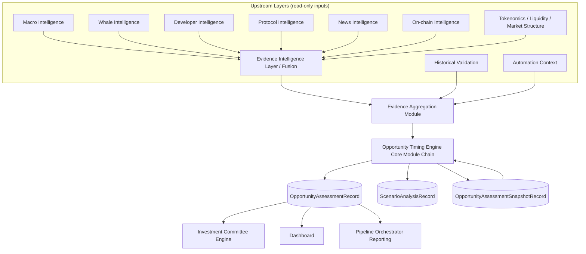
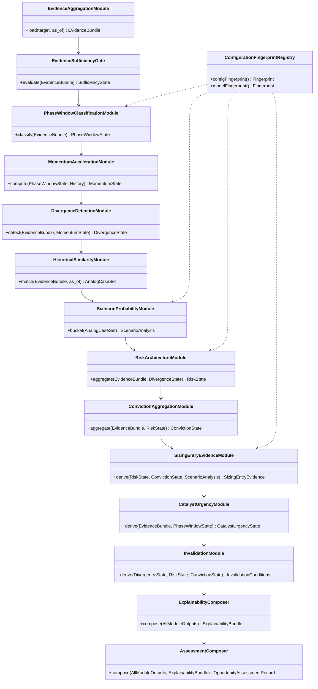
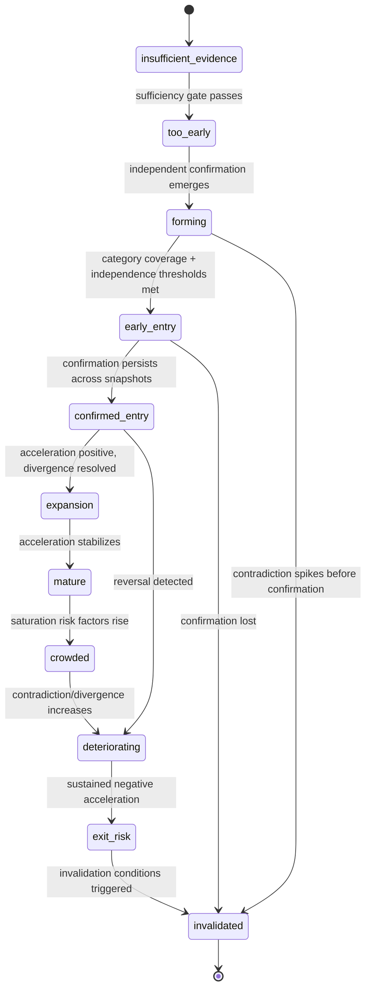

# Opportunity Timing Engine — Architecture Specification

Status: Target architecture for the Opportunity Decision Layer. This document is a design specification, not an implementation record. It does not describe code that exists today.

## Relationship To Existing Documents

`docs/OPPORTUNITY_TIMING_ENGINE.md` documents the existing **experimental** Fusion-backed phase/window classifier (`src/hunter/opportunity/`) — its own Status line says so explicitly, and it names `src/hunter/timing/` as the separate, simpler module that is actually production timing in v2.1.x. That experimental classifier is absorbed into this architecture as the **Phase & Window Classification Module** (Section 6). Everything that document guarantees — Fusion-only inputs, `as_of` replay discipline, deterministic scoring, configuration and model fingerprints — is a hard constraint on this larger engine, not a competing design.

`docs/CANONICAL_RUNTIME_ARCHITECTURE.md` is the governing document for what is production versus experimental in this repository today. It classifies `src/hunter/intelligence/fusion/` and `src/hunter/opportunity/` — the Fusion and Fusion-backed timing modules this entire document builds on — as **Experimental**, and states that v2.1.x production timing remains `src/hunter/timing/`, fed by the separate `EvidenceBackedProjectExecutor` runtime. This document specifies where the experimental Fusion/timing path evolves to; it does not describe, replace, or migrate the current production runtime, and its Migration Policy section governs any future decision to promote this path to production.

`docs/INVESTMENT_COMMITTEE_ENGINE.md` documents the downstream consumer. The Investment Committee Engine consumes this engine's output the same way it consumes Probability, Pattern Matching, and Technology/Capital Rotation output today: as one more persisted, explainable input to committee voting. This engine does not vote, does not decide eligibility, and does not select champions.

This document defines the layer that sits between them: the engine that turns "what is true about this asset" (Intelligence Engines, Evidence Intelligence Layer, Historical Validation) into "what does the evidence say about acting now" (Opportunity Decision Layer), without ever collapsing that into "act."

## 1. Purpose

The Opportunity Timing Engine answers one question, and only one question, for a single target at a single point in time:

> Given everything Hunter has already validated as evidence, what does that evidence say about the quality and timing of an entry right now?

It does not answer "is this a good project" — that question belongs to the Intelligence Engines, Evidence Intelligence Layer, and Historical Validation, all of which evaluate the asset independent of any clock. It does not answer "should I buy" — that question belongs to the Investment Committee Engine and, ultimately, to the human. The Opportunity Timing Engine answers only the timing-and-evidence question in between: whether the current moment is structurally early, confirmed, mature, or deteriorating relative to the evidence trail, and how strong, confident, and durable that read is.

Every output is evidence. Every output is reproducible from persisted inputs. Nothing this engine emits is an instruction.

## 2. Responsibilities

- Align and consume the full persisted evidence surface for one target as of one boundary timestamp (`as_of`).
- Determine evidence sufficiency before computing anything else; refuse to produce a confident read from a thin evidence base.
- Classify opportunity phase and opportunity window (inherited from the existing Timing Engine) as the temporal backbone of the assessment.
- Compute momentum and acceleration from ordered historical evidence, not from price.
- Detect divergence between evidence categories (e.g., attention without fundamentals, accumulation without adoption).
- Query Historical Validation for evidence-similar historical analogs and derive a Historical Match percentage and a distribution of what those analogs structurally did afterward.
- Compute five deterministic scores — Opportunity, Timing, Momentum, Risk, Conviction — each fully decomposable into contributing evidence.
- Compute Evidence Confidence for the assessment as a whole and for each score independently.
- Derive scenario evidence (Bull / Base / Bear probability) exclusively from the historical analog distribution, never from price modeling.
- Derive risk-adjusted sizing and entry-style **evidence bands** (not directives) from risk, confidence, liquidity structure, and historical analog dispersion.
- Derive invalidation conditions, opportunity lifetime, urgency, and catalysts as explicit, falsifiable evidence statements.
- Enumerate reasons supporting entry, reasons against entry, and missing evidence as first-class, structured output — not prose summaries.
- Persist every assessment immutably with full lineage back to source evidence, and support deterministic replay of any past assessment.
- Expose the assessment to the Pipeline Orchestrator, the Investment Committee Engine, and the Dashboard through the same persisted contract.

## 3. Non-Responsibilities

- Does not produce Buy, Sell, Hold, Enter, or Exit signals, labels, or recommendations of any kind.
- Does not predict price, price targets, or price paths. "Expected Reward" and "Expected Risk" are evidence-derived magnitude bands tied to historical analogs, never numeric price forecasts.
- Does not judge project quality, team quality, or technology merit. Those are settled upstream and consumed as-is.
- Does not decide committee eligibility, consensus, or champion selection. That is the Investment Committee Engine.
- Does not collect raw data, call external providers, or bypass Fusion / Evidence Intelligence Layer outputs.
- Does not execute trades, place orders, or interact with any exchange or wallet.
- Does not allocate portfolio capital across multiple assets; "Recommended Position Size" is a single-asset, risk-scaled evidence band, not a portfolio allocation decision.
- Does not use undisclosed machine-learning inference. Every score must be reproducible by re-running the same versioned rules against the same persisted inputs.
- Does not mutate, overwrite, or reinterpret upstream evidence records. It only reads them and produces new, separate, immutable output.
- Does not silently substitute defaults for missing evidence. Missing evidence is surfaced, not hidden.

## 4. Inputs

All inputs are persisted, versioned, and aligned to a single `as_of` boundary. The engine consumes no live data and makes no external calls.

**Target identity and boundary**
- Canonical target identity (from the Dynamic Asset Registry).
- `as_of` timestamp (explicit for replay/backtest; latest aligned effective time for current-state execution).
- Requested assessment horizon context, if any.

**Evidence categories** (each arriving as persisted, explainable, source-attributed records — never raw provider payloads):
- Macro Intelligence.
- Whale Intelligence.
- Developer Intelligence.
- Protocol Intelligence.
- News Intelligence.
- On-chain Intelligence (capital flow, holder structure).
- Tokenomics evidence (supply schedule, unlocks, incentive dependence).
- Liquidity and Market Structure evidence (depth, concentration, venue diversity).
- Discovery Signals (registry age, coverage, conflict state).
- Evidence Confidence Layer output (corroboration, contradiction, dependency, canonical evidence-group independence).
- Historical Validation output (point-in-time historical case records, leakage-checked).
- Automation outputs (run context, requested stage options, prior scheduled assessments).
- Prior Opportunity Timing snapshots for the same target (phase/window history).
- Fusion explainability payloads underlying every category above: source Fusion IDs, source run IDs, unified signal, contradiction and missing-evidence payloads.

**Configuration**
- Opportunity Timing configuration (thresholds, weights, category requirements).
- Model fingerprint and configuration fingerprint of every upstream engine that contributed evidence.

The engine treats every input as already evidence-graded by the Evidence Intelligence Layer. It does not re-score raw signals; it composes already-scored evidence into a timing read.

## 5. Outputs

Every output below is a field on one immutable `OpportunityAssessmentRecord`. Every field carries: the value, its own confidence, the list of contributing evidence references (by canonical evidence group and source record ID), and the model/configuration fingerprint that produced it.

- **Opportunity Score** — evidence-weighted read of how much unrealized structural opportunity the evidence trail supports, independent of timing.
- **Timing Score** — inherited phase/window read: how early, confirmed, mature, or deteriorating the current moment is.
- **Momentum Score** — direction and rate of change of the evidence trail (acceleration, deceleration, reversal, stall).
- **Risk Score** — aggregated categorical risk (never netted against upside).
- **Conviction Score** — breadth, independence, and durability of confirmation across categories, discounted by contradiction and missing evidence.
- **Evidence Confidence** — engine-level and per-score confidence in the assessment itself.
- **Historical Match %** — similarity of the current evidence fingerprint to a set of historical analog cases, with sample size disclosed.
- **Expected Risk** — magnitude band (not a number) drawn from the dispersion of historical analog drawdowns/deteriorations, labeled with sample size.
- **Expected Reward** — magnitude band drawn from the dispersion of historical analog structural gains, labeled with sample size. Never a price target.
- **Scenario Analysis** — Bull / Base / Bear structural outcome buckets with probability weights derived from analog frequency, each carrying its own evidence trail.
- **Bull Probability / Base Probability / Bear Probability** — the three weights above, always summing to a disclosed total (with an explicit "insufficient analog" residual when applicable).
- **Recommended Position Size** — a risk-and-confidence-scaled band (e.g., relative to a configured baseline unit), never an absolute directive, always paired with the risk factors that produced it.
- **Recommended Entry Style** — an evidence-derived characterization (e.g., single entry vs. staged) driven by liquidity structure, volatility evidence, and historical analog dispersion — not a trading instruction.
- **Scale-in Strategy** — structural evidence about how historical analogs with similar liquidity/volatility profiles were durably accumulated, expressed as a pattern, not a schedule to execute.
- **Invalidation Conditions** — explicit, falsifiable conditions that would void the current assessment (e.g., loss of independent confirmation, contradiction escalation, divergence resolution against the thesis).
- **Opportunity Lifetime** — a deterministic horizon band (same banded model as the existing Timing Engine's horizons: days, weeks, 1-3 months, etc.), never an exact date.
- **Urgency** — evidence-derived read of how quickly the current window is closing (from window trajectory and acceleration), expressed as a banded state, not a countdown.
- **Catalysts** — enumerated upcoming or in-progress evidence events (protocol milestones, unlock schedules, macro events) already present in upstream evidence, surfaced, not predicted.
- **Missing Evidence** — explicit list of categories or independent groups absent, stale, or below confidence threshold.
- **Reasons Supporting Entry** — structured list of the specific evidence items that increased Opportunity/Timing/Conviction.
- **Reasons Against Entry** — structured list of the specific evidence items that increased Risk or decreased Conviction.

## 6. Internal Modules

- **Evidence Aggregation Module** — resolves and loads every persisted evidence category for the target, aligned strictly to `as_of`; excludes anything with an effective time later than the boundary.
- **Evidence Sufficiency Gate** — evaluates category coverage and independent canonical evidence-group count against configuration; produces an explicit `insufficient_evidence` state when thresholds are unmet, and this state short-circuits downstream scoring rather than being overridden by partial data.
- **Phase & Window Classification Module** — the existing production Timing Engine logic (phase, window, confirmation, acceleration inputs it already computes) reused as-is; it remains the sole owner of phase/window semantics.
- **Momentum & Acceleration Module** — extends acceleration classification into a standalone Momentum Score using ordered historical Fusion confidence and category-level trend deltas.
- **Divergence Detection Module** — reuses the existing divergence rule set and extends it with cross-category evidence pairs relevant to entry timing (e.g., liquidity deterioration despite rising attention).
- **Historical Similarity Module** — queries Historical Validation for point-in-time analog cases matching the current evidence fingerprint (category coverage pattern, phase/window, risk profile); computes Historical Match % and retains the analog case set.
- **Scenario Probability Module** — buckets analog case outcomes into structural Bull/Base/Bear categories (expanded, held, deteriorated) and expresses them as frequency-derived probabilities, never as price simulation.
- **Risk Architecture Module** — aggregates categorical risk factors (the existing Timing Engine's risk taxonomy, extended) into the Risk Score and the Expected Risk band; risk factors are combined by a documented, non-netting aggregation so risk is never diluted by unrelated upside evidence.
- **Conviction Aggregation Module** — combines confirmation breadth/independence, contradiction severity, missing evidence, and persistence into the Conviction Score.
- **Sizing & Entry Evidence Module** — deterministically maps Risk Score, Conviction Score, liquidity structure, and analog dispersion onto a position-size band and entry-style/scale-in characterization; this module never sees or infers a price.
- **Catalyst & Urgency Module** — extracts already-persisted upcoming evidence events and window-trajectory data into Catalysts and Urgency.
- **Invalidation Module** — derives falsifiable invalidation conditions from the same rule families used by confirmation, divergence, and risk (so an invalidation condition is always the mirror image of a rule that once supported the assessment).
- **Explainability Composer** — assembles Reasons Supporting Entry, Reasons Against Entry, and Missing Evidence from every module's contributing-evidence output; performs no independent scoring.
- **Assessment Composer** — assembles the final `OpportunityAssessmentRecord`, attaches configuration/model fingerprints, and hands it to persistence.
- **Configuration & Model Fingerprint Registry** — the single source of every threshold, weight, and rule version consumed by any module; every module reads from it, none hardcodes a threshold.

## 7. Evidence Flow

Evidence flows in one direction only: upstream layers produce persisted, explainable records; this engine reads them; this engine produces its own persisted, explainable record; nothing flows back upstream.

At every stage, evidence carries its canonical evidence-group identity and its source Fusion/run IDs forward. The engine never "forgets" where a fact came from in order to simplify a score.

## 8. Decision Flow

There is no decision in this engine — only evidence composition. The flow below produces an assessment, not a choice.

1. Align target + `as_of` and load all evidence categories.
2. Apply the Evidence Sufficiency Gate. If it fails, emit an `insufficient_evidence` assessment with Missing Evidence populated and stop before scoring.
3. Classify phase and window.
4. Compute momentum/acceleration.
5. Detect divergence.
6. Query historical analogs; compute Historical Match % and analog outcome distribution.
7. Derive scenario probabilities from the analog distribution.
8. Aggregate risk factors into Risk Score and Expected Risk.
9. Aggregate confirmation/contradiction/persistence into Conviction Score.
10. Compose Opportunity Score and Timing Score from the above.
11. Derive sizing/entry-style/scale-in evidence bands from Risk, Conviction, and analog dispersion.
12. Derive catalysts, urgency, opportunity lifetime, invalidation conditions.
13. Compose explainability (reasons for/against, missing evidence).
14. Persist the assessment; emit it to Pipeline Orchestrator, Dashboard, and Investment Committee Engine.

## 9. Confidence Calculation

Evidence Confidence is computed once at the engine level and again per score, using the same factor family the existing Timing Engine already established, extended with historical-analog factors:

- historical depth (number and span of prior assessments for the target);
- source diversity (number of distinct categories present);
- category coverage against the configured required set;
- canonical evidence-group independence (dependent/shared-lineage groups discounted);
- persistence of the current read across recent assessments (a one-off spike scores lower than a sustained pattern);
- contradiction severity (unresolved contradictions reduce confidence, they are never averaged away);
- missing evidence (each missing required category or group reduces confidence explicitly);
- freshness (decayed deterministically past a configured grace period, anchored to `as_of`);
- target alignment (confirming the evidence set actually resolves to the requested canonical identity);
- upstream (Fusion) confidence, carried forward rather than re-derived;
- snapshot completeness;
- historical analog sample size (a Historical Match % backed by few analogs is flagged as low-confidence rather than suppressed).

Confidence is always reported alongside its score, never folded silently into the score's numeric value.

## 10. Scoring Architecture

All five scores are deterministic, weighted compositions of already-graded evidence, versioned by a model fingerprint. No score is produced by an opaque model; every score is a documented function of named, individually inspectable factors.

- **Opportunity Score** — composed from Conviction Score, Historical Match %, category-level structural-upside evidence (tokenomics, adoption, protocol), and divergence state, discounted by Risk Score. Answers "how much unrealized evidence-backed opportunity exists," independent of whether now is the right moment.
- **Timing Score** — inherited from the Phase & Window Classification Module: derived from phase, window, confirmation, acceleration, persistence, contradiction severity, missing evidence, and historical depth, exactly as documented in the existing production engine.
- **Momentum Score** — derived from the rate and direction of change across recent evidence snapshots (Fusion confidence deltas, category-level trend deltas), independent of absolute score level.
- **Risk Score** — an aggregation (Section 11) of categorical risk factors; higher is always worse and is never blended additively with upside factors.
- **Conviction Score** — derived from confirmation breadth and independence, contradiction severity, missing evidence, and persistence; represents how much the engine trusts the read, not how attractive the read is.

Each score's model fingerprint enumerates every rule, threshold, and weight version that fed it, matching the discipline already established for the Timing Score in production: phase thresholds, confirmation rules, divergence rules, contradiction penalties, missing-evidence penalties, risk weights, confidence weights, horizon rules, historical-depth rules, invalidation rules, freshness windows, schema identity version, and model version. Changing any weight changes the fingerprint, which changes the assessment's replay identity — old assessments remain reproducible under their original fingerprint even after configuration changes.

## 11. Risk Architecture

Risk is modeled as a taxonomy of independent categorical risk factors, each individually scored and never netted against unrelated upside evidence. The taxonomy extends the existing Timing Engine's risk set:

- narrative saturation;
- social manipulation signals;
- holder/supply concentration;
- liquidity deterioration or venue thinness;
- declining developer activity;
- protocol weakness or unresolved audits;
- negative on-chain capital flows;
– macro headwinds;
- incentive/emission dependence;
- evidence dependency (over-reliance on a small number of non-independent sources);
- insufficient historical confirmation;
- tokenomics unlock/dilution pressure;
- single-venue or single-whale dependency.

Aggregation rule: the Risk Score is driven by a documented combination that surfaces the most severe active risk factors rather than averaging all factors toward the middle — a single severe, well-evidenced risk (e.g., concentrated holder base plus thin liquidity) must remain visible in the final score, not diluted by five mild, unrelated positives. Expected Risk (Section 5) is the same factor set expressed as a historical-analog-backed magnitude band rather than a single number.

## 12. Scenario Architecture

Scenario Analysis is explicitly not price simulation. It is a frequency read of what evidence-similar historical situations structurally did afterward, produced entirely by the Historical Similarity Module and Scenario Probability Module.

Rules:
- Analog matching uses the same point-in-time discipline as Historical Validation: only evidence available as of each analog's own `as_of` boundary is used to classify that analog, and only evidence available as of the current `as_of` is used to match against it. No analog outcome is known to the matching step in advance of its own historical timestamp.
- Each bucket (Bull/Base/Bear) carries its analog case references, sample size, and the Historical Match % that produced it — never a bare percentage.
- When the analog sample size is below a configured minimum, the module emits an explicit "insufficient historical basis" residual rather than fabricating a confident split.
- Expected Risk and Expected Reward bands are derived from the dispersion within the Bear and Bull buckets respectively, not from a separate model.

## 13. Historical Replay Usage

The engine reuses Historical Validation's replay mechanics rather than reimplementing them:

- Every assessment — live or backtest — is executed against an explicit `as_of` boundary; live execution defaults to the latest aligned evidence effective time, backtest execution requires an explicit timestamp.
- All queries (evidence categories, prior snapshots, historical analogs) exclude any record with an effective time later than `as_of`. This is enforced at the Evidence Aggregation Module and Historical Similarity Module boundary, not left to individual rule implementations.
- Backtesting runs the full module chain (Section 8) once per historical `as_of` checkpoint per target, producing the same `OpportunityAssessmentRecord` shape as live execution, which is what makes backtest and production assessments directly comparable.
- Historical Match % computation for a backtest checkpoint only considers analog cases whose own `as_of` predates the checkpoint being evaluated, preventing leakage between the backtest suite and the case it is scoring.

## 14. Interaction With Pipeline Orchestrator

The Opportunity Timing Engine is an optional post-evidence stage, matching the existing engine's integration pattern:

- The Orchestrator invokes this stage after Fusion and Historical Validation have persisted their outputs for the requested target(s) and `as_of`.
- The stage receives typed run options (target set, `as_of`, backtest mode flag) and nothing else; it does not receive raw provider access.
- On success, the resulting assessment and any snapshot records are persisted in the same unit of work as the run that produced them, so a run either fully commits its evidence-to-assessment chain or fully rolls back.
- The stage reports its own coverage and failure state back to the Orchestrator (targets assessed, targets gated as insufficient, targets failed) so run-level reporting reflects timing-stage outcomes explicitly rather than silently.
- Automation-scheduled runs pass through the same stage contract; the engine has no separate scheduler-facing interface.

## 15. Interaction With Dashboard

- The Dashboard reads persisted `OpportunityAssessmentRecord`s only; it performs no scoring, aggregation, or scenario computation itself.
- The Dashboard renders phase/window history as a timeline, scores with their attached confidence, scenario probabilities as labeled bands with sample size (never as a single confident percentage without its basis), and sizing/entry-style output clearly labeled as evidence bands rather than instructions.
- Every rendered figure supports drill-down into its contributing evidence references, down to the source Fusion/run IDs — the Dashboard is a lens onto the audit trail (Sections 19–20), not a separate summary.
- The Dashboard never displays an assessment without its Evidence Confidence and Missing Evidence alongside it.

## 16. Persistence Requirements

Persisted records extend the existing Timing Engine persistence contracts:

- `OpportunityAssessmentRecord` — the full assessment: all five scores, Evidence Confidence, Historical Match %, Expected Risk/Reward bands, scenario probabilities, sizing/entry-style/scale-in evidence, catalysts, urgency, opportunity lifetime, invalidation conditions, reasons for/against, missing evidence, source Fusion IDs, source run IDs, canonical evidence-group references, configuration fingerprint, model fingerprint, and `as_of`.
- `ScenarioAnalysisRecord` — the analog case set and bucket assignment underlying a given assessment's scenario output, retained separately so analog membership itself is auditable.
- `OpportunityAssessmentSnapshotRecord` — a point-in-time snapshot used for temporal comparison (momentum, persistence, phase/window history) by later assessments.
- All records are immutable once written. A changed read produces a new record; nothing is updated in place. Repeated persistence of an identical analytical result is idempotent (no duplicate record for the same target/`as_of`/fingerprint).
- Every record carries enough lineage to be independently re-derived without querying anything except the persisted inputs it references.

## 17. Replay Requirements

- Given the same persisted inputs, the same `as_of`, and the same configuration/model fingerprint, the engine must produce a byte-identical `OpportunityAssessmentRecord`. This is the core reproducibility guarantee and the basis for all auditability claims.
- Changing configuration produces a new fingerprint and a new assessment; it never silently reinterprets a historical record.
- Replays must not depend on wall-clock time, random seeds, or any non-deterministic ordering. Where an aggregation must impose an order (e.g., ranking analog cases), the order is a documented, deterministic tiebreak, not an implementation artifact.
- Batch replay (backtesting an entire historical range for a target) is a repeated application of the single-checkpoint replay, not a separate code path with separate semantics.

## 18. Failure Handling

- Missing or stale evidence categories are surfaced as Missing Evidence, never defaulted to a neutral or optimistic value.
- If the Evidence Sufficiency Gate fails, the engine emits an explicit `insufficient_evidence` assessment (mirroring the existing engine's phase vocabulary) rather than a low-confidence guess dressed up as a full assessment.
- Upstream unavailability (a required upstream engine has no persisted output for the target/`as_of`) is treated as missing evidence for that category, not as an engine crash — the assessment proceeds in a visibly degraded state if the sufficiency gate still permits it.
- Configuration is validated at startup (ordered thresholds, complete weight sets, valid fingerprint composition); an invalid configuration prevents the engine from running rather than running with silently substituted defaults.
- Any internal module failure aborts the assessment for that target rather than emitting a partially composed record; partial records are never persisted as if complete.
- All degraded or gated outcomes are logged with the specific reason (which category, which threshold, which module) to support operational diagnosis.

## 19. Auditability

- Every score, band, and label on an assessment is traceable to the exact contributing evidence records and the exact rule/weight version that combined them — there is no field on the record that cannot be explained by walking its stored references.
- The configuration fingerprint and model fingerprint are stored on every record, so any historical assessment can be checked against "what would this look like under current rules" without ambiguity about which rules originally produced it.
- Nothing is overwritten. The full history of assessments for a target is a permanent, append-only ledger of evidence-to-read transformations.
- Committee, Dashboard, and Orchestrator consumers all read the same persisted record — there is no separate "presentation" computation that could drift from the audited value.

## 20. Evidence Traceability

The full reference chain for any output field is:

`raw source observation → Intelligence Engine output → Evidence Intelligence Layer / Fusion record (with canonical evidence group, corroboration/contradiction state) → (optionally) Historical Validation case record → Opportunity Timing Engine module output → OpportunityAssessmentRecord field`

Every hop in that chain is a persisted, addressable record. The engine's own outputs add exactly one more hop; they never compress or discard the chain that arrived from upstream. Reasons Supporting Entry and Reasons Against Entry are themselves lists of chain endpoints, not free-text summaries — each "reason" is a pointer to a specific piece of evidence and the rule that used it.

## 21. Testing Strategy

- **Determinism tests** — same inputs + same fingerprint must produce byte-identical output, run repeatedly and across process restarts.
- **Golden fixture tests** — frozen, hand-constructed evidence bundles with known expected scores/phases/scenarios, covering each phase, window, divergence pattern, and risk factor at least once.
- **Sufficiency gate tests** — evidence bundles deliberately missing categories/independent groups must produce `insufficient_evidence`, never a fabricated confident read.
- **Leakage tests** — historical analog matching and backtest replay must never have access to evidence with an effective time after the checkpoint `as_of`; tests assert this by injecting future-dated records and confirming exclusion.
- **Fingerprint-change tests** — a configuration change must change the model fingerprint and must not alter the interpretation of already-persisted historical assessments.
- **Regression/backtest suites** — running the full historical range for known targets must reproduce previously recorded assessments unless configuration intentionally changed (and then must reproduce them exactly under the old fingerprint).
- **Adversarial evidence tests** — contradictory or dependent (shared-lineage) evidence groups must be discounted as designed, verified against fixtures that would otherwise inflate Conviction.
- **Scenario sample-size tests** — analog sets below the configured minimum must trigger the "insufficient historical basis" residual rather than a confident split.
- **Contract tests** — persisted record shape, snapshot linkage, and Orchestrator/Dashboard/Committee read contracts must not silently break across changes.

## 22. Future Extensibility

- New evidence categories can be added by extending the Evidence Aggregation Module's category set and the sufficiency/coverage configuration, without changing the module chain's shape.
- New risk factors or scenario-bucket definitions are additive to their respective taxonomies and versioned through the model fingerprint, so old assessments remain interpretable under their original rule set.
- Multi-horizon assessments (e.g., separate short-horizon and long-horizon reads for the same target/`as_of`) can be added as parallel invocations of the same module chain with horizon-specific configuration, without new engine concepts.
- Per-asset-class configuration profiles (e.g., a different risk taxonomy weighting for a native L1 asset versus a low-cap token) are supported by the existing configuration/fingerprint mechanism and require no structural change.
- Cross-asset correlation or sector-relative evidence can be introduced as an additional input category to the existing Divergence Detection and Risk Architecture modules.
- Any extension must preserve: determinism, immutability of prior records, full evidence traceability, and the strict non-responsibility boundary (no price prediction, no buy/sell output) established in Sections 2–3.

## 23. Sequence Diagram

## 24. Data Flow Diagram

## 25. Class/Module Diagram

## 26. Phase/Window Lifecycle Diagram

Included because the timing backbone (Section 6, Phase & Window Classification Module) is a state machine, and its transition structure is central to Urgency, Opportunity Lifetime, and Invalidation.

## Summary Of Guarantees

- Every output is evidence, never an instruction.
- Every score is deterministic, versioned, and reproducible.
- Every field traces to named upstream evidence and a named rule.
- Missing evidence is always visible, never silently filled in.
- Historical, scenario, and risk output are always accompanied by their sample size and confidence, never presented as bare certainty.
- Nothing is overwritten; the assessment history is a permanent audit ledger.
