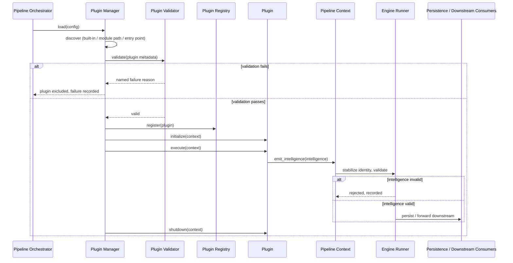
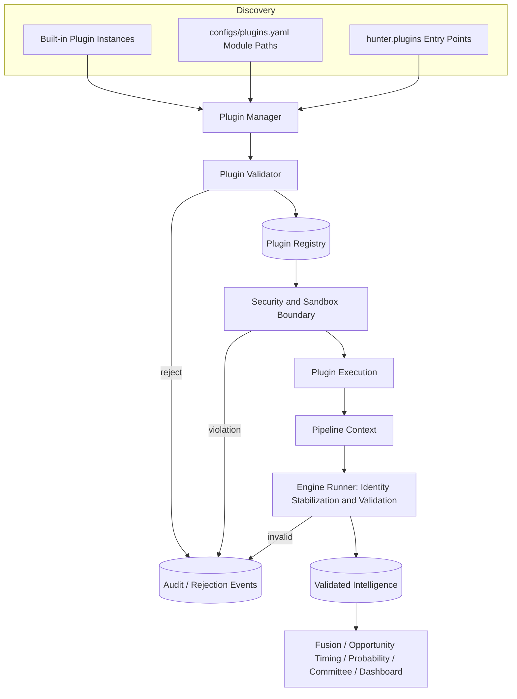
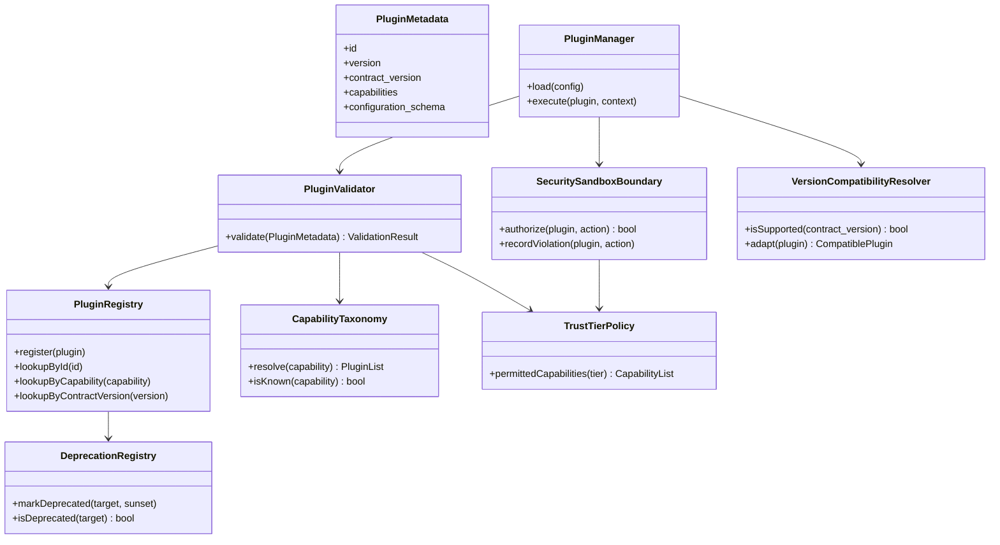
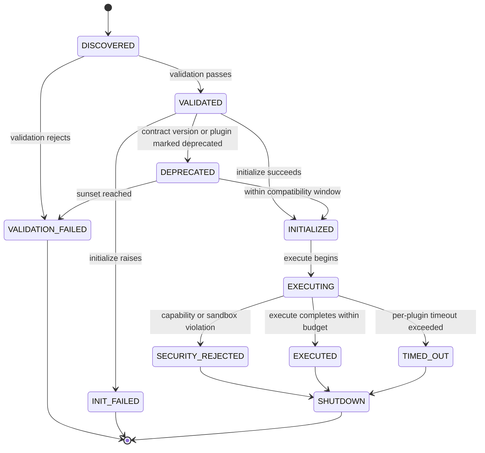

# Plugin SDK — Architecture Specification

Status: Target architecture for Hunter's long-term plugin extensibility layer. This document is a design specification, not an implementation record. It does not describe code that exists today.

## Relationship To Existing Documents

`docs/PLUGIN_ARCHITECTURE.md` documents the existing plugin contract, discovery, lifecycle, registration, and validation: `PluginMetadata` (id, name, version, author, description, category, dependencies, capabilities, configuration_schema, enabled), the `initialize`/`validate`/`execute`/`shutdown` lifecycle, discovery through built-in instances, `configs/plugins.yaml` module paths, and the `hunter.plugins` entry point group, and registry lookup by id, capability, category, version, and dependency. This document adopts all of it as-is and formalizes the surrounding SDK: versioning, capability discovery, security, sandboxing, evidence interfaces, testing, deprecation, compatibility, and migration.

`docs/PIPELINE_ORCHESTRATOR.md` is the runtime this SDK's contracts execute inside: `PluginManager` loads, validates, orders, and executes plugins; `EngineRunner` executes Intelligence Engines (which may be hosted inside a plugin) and stabilizes their emitted output; `PipelineContext` is the only channel plugins may use to exchange data. This document does not change that runtime; it specifies the SDK-level guarantees a plugin author can rely on and the SDK-level obligations a plugin must meet.

`docs/INTELLIGENCE_LAYER.md` defines the immutable `Signal`, `Evidence`, `Observation`, `Insight`, and `Intelligence` objects and states plainly: "Plugins may emit intelligence through `PipelineContext.emit_intelligence`." This is the *entire* evidence interface a plugin gets (Section 12). This document does not define a second, competing evidence model for plugins.

`docs/EVIDENCE_INTELLIGENCE_LAYER.md`'s Phase 4 Provider Boundary is a distinct, already-established precedent this document generalizes rather than duplicates: AI extraction providers receive only a minimal typed request object, never repository handles, tools, source-fetch capabilities, schema-mutation rights, or configuration-mutation rights; untrusted instructions are detected and rejected before the adapter runs; provider failure produces an explicit unavailable-state record, never silent nothing. Section 9 (Security) and Section 10 (Sandboxing) below apply this same discipline to plugins generally. This document does not grant plugins any interface into the `KnowledgeClaim`/document/conflict model that layer owns — a plugin that needs to contribute structured knowledge claims must do so only through that layer's own `AIExtractionProvider`-style boundary, never through a general plugin capability grant.

`docs/DETERMINISTIC_EXECUTION_IDENTITY.md` is the identity and stabilization mechanism every plugin-emitted `Intelligence` object flows through before persistence or validation.

`docs/CANONICAL_RUNTIME_ARCHITECTURE.md` classifies `PipelineOrchestrator` and plugin Intelligence Engines as Experimental, not the v2.1.x production runtime. This document does not change that classification; it specifies the long-term SDK for the experimental/pipeline path's extension mechanism.

`docs/DEVELOPMENT_GOVERNANCE.md` and `docs/PROJECT_CONSTITUTION.md` establish the engineering principles this SDK exists to make structurally unavoidable for plugin authors — including third-party and future authors who did not write, and may not have read, either document.

## 1. Purpose

The Plugin SDK answers one question for anyone extending Hunter:

> How do I add a new capability to Hunter — a new evidence source, a new analytical domain, a new integration — without being able to violate evidence-first, deterministic, auditable, non-black-box operation, even by accident?

Existing engines are built and reviewed by people who already know Hunter's principles. Plugins are the mechanism by which future contributors — internal or third-party, careful or careless — extend the system. The SDK's job is to make the safe path the only path: a plugin that follows the contract cannot fabricate evidence, cannot introduce hidden nondeterminism, cannot bypass the evidence interface, and cannot silently break another plugin or a future one.

## 2. Responsibilities

- Define the complete, versioned plugin contract: metadata shape, lifecycle methods, and the evidence interface a plugin may use to contribute analytical output.
- Define plugin lifecycle execution: load, validate, initialize, execute, shutdown, and reverse-order shutdown, exactly as already established.
- Define capability discovery: a structured, versioned taxonomy plugins declare against, and a deterministic resolution rule when multiple plugins declare the same capability.
- Define the security and sandboxing boundary every plugin executes inside, regardless of trust level.
- Define validation rules that reject a non-conforming plugin before it ever executes.
- Define the plugin contract's own versioning, compatibility, deprecation, and migration rules, independent of any individual plugin's version.
- Define the conformance testing a plugin must pass before being considered SDK-compliant.

## 3. Non-Responsibilities

- Does not define a second evidence model. Plugins use the existing `Signal`/`Evidence`/`Observation`/`Insight`/`Intelligence` contract from `docs/INTELLIGENCE_LAYER.md`, unmodified.
- Does not grant plugins a path into the Evidence Intelligence Layer's `KnowledgeClaim`/document/conflict model. That layer's own Provider Boundary is the only sanctioned path into it.
- Does not implement scoring, ranking, report rendering, scheduling, or orchestration. Those remain `PipelineOrchestrator`'s and downstream engines' responsibilities.
- Does not grant any plugin write access to persisted analytical records. The only sanctioned output path is `PipelineContext.emit_intelligence`, subject to `EngineRunner` stabilization and validation.
- Does not predict price, does not produce Buy/Sell/Hold recommendations, and does not permit a plugin to do so either — a plugin that attempted this would fail validation (Section 11) for producing Intelligence outside the confidence model's defined meaning.
- Does not mandate a specific sandboxing implementation (a container, a subprocess, a language-level sandbox). It mandates the behavioral guarantees any implementation must provide (Section 10).

## 4. Plugin Lifecycle

The lifecycle is the one already established in `docs/PLUGIN_ARCHITECTURE.md` and `docs/PIPELINE_ORCHESTRATOR.md`, formalized here as the SDK's contract:

1. **Discover** — built-in instance, configured module path, or `hunter.plugins` entry point.
2. **Validate** — metadata completeness, semantic version format, capability declarations, duplicate id detection, dependency resolution, cycle detection (Section 11).
3. **Initialize** — `initialize(context)`.
4. **Execute** — `execute(context)`, or, for a hosted Intelligence Engine, the `EngineRunner` sequence (`health_check`, `validate`, `collect`, `analyze`, `generate_intelligence`, identity stabilization, validation, emission).
5. **Shutdown** — `shutdown(context)`, in reverse execution order across all loaded plugins.

Lifecycle failures raise plugin-specific exceptions and preserve the original exception as cause, exactly as already established. This document adds one rule: a plugin's `execute` step may run under a bounded per-plugin timeout distinct from Automation's job-level timeout (`docs/AUTOMATION_AND_SCHEDULER.md`) — a job-level timeout bounds an entire scheduled run; a plugin-level timeout bounds one plugin's contribution to one run, so one slow or hung plugin cannot silently consume an entire job's time budget before the job-level timeout ever triggers.

## 5. Contracts

Every plugin exposes the existing `PluginMetadata` shape (id, name, version, author, description, category, dependencies, capabilities, configuration_schema, enabled) and the four lifecycle methods, unchanged.

This document adds one required metadata field: **contract_version** — the version of the plugin contract itself (Section 6) the plugin was built against, distinct from the plugin's own `version`. A plugin without a declared `contract_version` fails validation; the SDK never assumes a default contract version, since that would silently reinterpret an old plugin's compatibility guarantees.

A plugin's only sanctioned evidence interface is `PipelineContext.emit_intelligence(intelligence)`, where `intelligence` is a valid `Intelligence` object per `docs/INTELLIGENCE_LAYER.md` (Section 12). A plugin contract does not expose, and must not attempt to access, repository handles, database connections, or any other plugin's internal state.

## 6. Versioning

Two independent version numbers exist, and this document never conflates them:

- **Plugin version** — the individual plugin's own semantic version, already validated by the existing validator.
- **Contract version** — the version of the plugin SDK contract itself (this document's Sections 4–5, 8, 11–12): the shape of `PluginMetadata`, the lifecycle method signatures, and the evidence interface. Contract version follows semantic versioning: a breaking change to any required field or method signature increments the major contract version; an additive, backward-compatible change increments the minor version.

A plugin declares the contract version it targets (`contract_version`, Section 5). The `PluginManager` may run plugins built against the current major contract version and, during a defined compatibility window (Section 15), the immediately-prior major contract version. A plugin targeting an unsupported contract version fails validation with an explicit, named reason — never a generic failure.

## 7. Registration

The registry (already established) provides lookup by id, capability, category, version, and dependency. This document adds one more required lookup: by **contract version**, so the `PluginManager` can determine, for any loaded plugin, which compatibility rules (Sections 6, 15) apply to it. Duplicate plugin ids remain rejected, unchanged.

## 8. Capability Discovery

A capability is a structured, versioned entry in a fixed capability taxonomy (e.g., `evidence-source:macro`, `evidence-source:whale`, `analysis:pattern-matching`) — never a freeform string a plugin author invents ad hoc. The taxonomy is maintained centrally, alongside the Configuration & Model Fingerprint pattern already used by every analytical engine in this document family, so adding a new capability category is itself a versioned, auditable change.

Capability discovery resolves a requested capability (for example, "who provides `evidence-source:whale`?") against the registry's capability index to find qualifying, validated, enabled plugins. When more than one plugin declares the same capability, resolution uses a documented, deterministic order — configured priority, then plugin id — the same tie-break discipline already established for plugin execution ordering in `docs/PIPELINE_ORCHESTRATOR.md`, never an arbitrary or load-order-dependent pick.

A plugin may declare only capabilities from the fixed taxonomy; an undeclared or freeform capability string fails validation (Section 11).

## 9. Security

Every plugin, regardless of trust level, executes under the same security boundary, generalized from the Evidence Intelligence Layer's Provider Boundary (`docs/EVIDENCE_INTELLIGENCE_LAYER.md` Phase 4):

- A plugin receives only `PipelineContext` and its own declared configuration — never repository handles, database connections, raw source-fetch capability, schema-mutation rights, or configuration-mutation rights beyond its own `configuration_schema`.
- A plugin's declared capabilities (Section 8) are the complete, exhaustive list of what it is permitted to read or produce; a plugin attempting to act outside its declared capabilities is rejected at the security boundary before the attempted action executes, not merely logged afterward.
- Trust tiers gate what capabilities can be granted at all, and trust tier is assigned by authorship and review status, never by discovery mechanism. A first-party, Hunter-maintained plugin is fully trusted whether it is passed as a built-in instance or discovered through the `hunter.plugins` entry point group — exactly how the existing Macro, Whale, Developer, Protocol, News, Narrative, Social, and On-chain Intelligence Engines are already exposed (`docs/PIPELINE_ORCHESTRATOR.md`). Discovery mechanism only affects *how* a plugin is found; it never affects *how much* it is trusted. Three tiers exist: first-party (any taxonomy capability), reviewed third-party (capabilities explicitly allow-listed for third-party use), and unreviewed (the most restrictive default: read-only evidence-source capabilities, no write path beyond standard Intelligence emission) until explicitly promoted.
- Untrusted or externally-sourced input reaching a plugin (for example, a plugin that itself wraps an AI provider) must pass the same injection-detection discipline already established for `AIExtractionProvider`: detected untrusted instructions are rejected before the plugin's `execute` step runs, and the rejection is itself recorded, never silently dropped.
- Plugin failure — including a rejected security-boundary attempt — produces an explicit unavailable/rejected state, never silent nothing and never a fabricated substitute result.

## 10. Sandboxing

Sandboxing is a behavioral guarantee, not a specific mechanism; this document does not mandate a container, subprocess, or specific language-level isolation technology, since none exists in the current implementation. Whatever mechanism a future implementation chooses must guarantee:

- No direct filesystem access outside a declared working scope.
- No direct network access unless the plugin's declared capabilities explicitly include an acquisition/adapter capability, and even then, only through the existing Source Adapter Contract discipline, never an arbitrary outbound call.
- No ability to read or mutate another plugin's internal state, configuration, or emitted (but not yet validated) `Intelligence`.
- No ability to mutate `PipelineContext` fields outside the documented `get`/`set`/`config_for`/`record`/`emit_intelligence` surface.
- A bounded resource and time budget (Section 4) enforced independently of any other plugin's or the overall job's budget, so one plugin's misbehavior cannot exhaust shared resources before its own boundary is reached.

A sandboxing violation is treated exactly like a security-boundary violation (Section 9): rejected before effect, recorded explicitly, never silently tolerated.

## 11. Validation

Validation rejects a non-conforming plugin before it ever reaches `initialize`, extending the existing validator (`docs/PLUGIN_ARCHITECTURE.md`) with SDK-level checks:

- All existing checks unchanged: required metadata, semantic version format, declared capabilities, duplicate ids, missing dependencies, minimum dependency versions, cyclic dependencies.
- **Contract version present and supported** (Sections 5–6): a missing or unsupported `contract_version` fails validation with a named reason.
- **Capabilities drawn from the fixed taxonomy** (Section 8): an undeclared or freeform capability string fails validation.
- **Capability grant consistent with trust tier** (Section 9): a plugin requesting a capability its trust tier does not permit fails validation, not merely a runtime rejection later.
- **Evidence interface conformance** (Section 12): a plugin that emits anything other than a valid `Intelligence` object through the sanctioned path fails validation of that emission, and repeated non-conforming emission is treated as a validation failure of the plugin itself, not tolerated as noise.

Invalid plugins do not load into the registry, exactly as already established; this document only adds checks, it removes none.

## 12. Evidence Interfaces

A plugin's evidence interface is exactly the existing `Signal`/`Evidence`/`Observation`/`Insight`/`Intelligence` contract from `docs/INTELLIGENCE_LAYER.md`, emitted through `PipelineContext.emit_intelligence` and stabilized through `EngineRunner`'s deterministic identity path (`docs/DETERMINISTIC_EXECUTION_IDENTITY.md`) before validation and downstream consumption. This document does not add a second interface, a shortcut, or a plugin-specific evidence shape.

Concretely, this means:

- Every `Evidence` object a plugin produces must carry source, reliability, freshness, reference, raw data, and collection time, exactly as the existing contract requires — the SDK does not permit an optional or abbreviated evidence shape for plugins.
- Every `Intelligence` object a plugin emits carries the standard confidence model (score, completeness, evidence_quality, freshness, uncertainty); a plugin cannot substitute its own confidence semantics or assign a confidence score outside this model's defined meaning.
- A plugin cannot self-assign trust beyond what its own evidence discloses. Corroboration, contradiction, and independence weighting happen centrally, downstream of all Intelligence regardless of source, so a plugin cannot inflate its own influence by claiming certainty its evidence doesn't support.
- A plugin that needs to contribute structured knowledge claims (the Evidence Intelligence Layer's `KnowledgeClaim` model) cannot do so through this interface at all; that layer's own `AIExtractionProvider`-style Provider Boundary is the only sanctioned path, and it is out of scope for this document to grant or modify.

## 13. Testing

A plugin is not SDK-compliant until it passes a conformance suite, run identically for every plugin regardless of author:

- **Lifecycle-order tests** — validate, initialize, execute, shutdown occur in order; shutdown runs in reverse order across all loaded plugins; a lifecycle failure raises the correct plugin-specific exception with the original cause preserved.
- **Contract tests** — `PluginMetadata` is complete, `contract_version` is present and supported, declared capabilities are drawn from the fixed taxonomy and consistent with the plugin's trust tier.
- **Evidence-conformance tests** — every emitted `Intelligence` object is valid per `docs/INTELLIGENCE_LAYER.md`; no plugin emits anything through any path other than `PipelineContext.emit_intelligence`.
- **Security/sandbox-boundary tests** — a plugin fixture that deliberately attempts to exceed its declared capabilities, access another plugin's state, or exceed its resource/time budget must be rejected before effect, not merely logged.
- **Determinism tests** — the same inputs and configuration produce identical emitted Intelligence across repeated runs.
- **Compatibility tests** — a plugin built against the immediately-prior major contract version continues to load and execute correctly during the compatibility window (Section 15).
- **Deprecation tests** — a plugin or contract version marked deprecated (Section 14) continues to function but surfaces its deprecation status through the registry.

## 14. Deprecation

A plugin, a specific plugin capability, or an entire contract version may be marked deprecated with an explicit sunset window (a target date or target contract version after which it will no longer load). A deprecated plugin or contract version continues to run unchanged during the deprecation window; the only observable difference is a deprecation event emitted once per load and a deprecation flag surfaced through capability discovery (Section 8) and registry lookup (Section 7), so operators can find and plan around deprecated dependencies before removal.

Deprecation is never silent and never immediate. A plugin is never dropped from the registry the moment it is marked deprecated; it is dropped only when its declared sunset is reached, and reaching that point produces an explicit, named failure at validation (Section 11), not a silent disappearance.

## 15. Compatibility

- The plugin contract (Sections 5–6) guarantees that a plugin built against the current major contract version, or the immediately-prior major contract version, loads and executes correctly. This is the compatibility window; it closes only when the prior major version is formally deprecated and its sunset is reached (Section 14).
- Existing plugin behavior, discovery mechanisms (built-in, module path, entry point), and configuration shape (`configs/plugins.yaml`) must not change without an explicit, planned migration (Section 16) — matching `docs/PROJECT_CONSTITUTION.md`'s Production Stability principle.
- A capability taxonomy entry, once published, is never silently redefined to mean something else; a meaning change requires a new, distinctly named capability, leaving the old one to follow the ordinary deprecation path.

## 16. Migration

When the contract version changes in a breaking way, two migration paths are available, and neither requires an instantaneous mass rewrite:

- **Compatibility adapter (preferred)** — the `PluginManager` wraps an old-contract-version plugin in an adapter that presents the new contract's shape to the orchestrator while preserving the plugin's original behavior unmodified. This is the default path during the compatibility window (Section 15).
- **Explicit migration** — the plugin's own maintainer updates it to the new contract version before the compatibility window closes.

Migration never reinterprets a plugin's already-emitted historical `Intelligence` or Evidence records. Persisted analytical identity (`docs/DETERMINISTIC_EXECUTION_IDENTITY.md`) is derived from the content and context of what was emitted, not from which contract version emitted it, so a contract-version migration has no effect on historical replay or audit trails.

## 17. Failure Handling

- A plugin that fails validation never loads into the registry; the failure names the specific check that failed (missing metadata, unsupported contract version, undeclared capability, disallowed capability for its trust tier), never a generic rejection.
- A plugin that fails during `initialize`, `execute`, or `shutdown` raises a plugin-specific exception with the original cause preserved, exactly as already established; the orchestrator's existing `try`/`finally` shutdown discipline is unchanged by this document.
- A security or sandbox-boundary violation (Sections 9–10) is rejected before the attempted action takes effect and is recorded as an explicit event, never silently absorbed.
- A plugin exceeding its per-plugin timeout (Section 4) is treated as a failed execution for that plugin only; it does not abort other already-scheduled plugins in the same run unless a declared dependency required its output.

## 18. Auditability

- Every loaded plugin's identity, version, contract version, declared capabilities, and trust tier are recorded as part of the run's context, so any emitted Intelligence can be traced back to exactly which plugin, at which version, produced it.
- Every rejected validation, security-boundary violation, and sandbox-boundary violation is recorded as an explicit, named event — never a silent no-op — so an operator can audit not just what ran, but what was correctly prevented from running.
- Deprecation and migration state (Sections 14–16) are queryable per plugin and per contract version, so a historical run's plugin composition remains fully explainable even after the plugin landscape has moved on.

## 19. Future Extensibility

- New capability taxonomy entries are additive (Section 8) and versioned; existing plugins are unaffected until they explicitly declare the new capability.
- New trust tiers (for example, a signed-third-party tier between first-party and unreviewed) can be added without changing the security model's shape (Section 9) — only the mapping from tier to permitted capabilities changes.
- A future sandboxing implementation (Section 10) can be swapped in without changing this document, as long as it preserves the behavioral guarantees already specified.
- Future Intelligence Layer modules (Governance Intelligence, AI Intelligence, Portfolio Intelligence, per `docs/INTELLIGENCE_LAYER.md`'s own Future Extensions) plug into this SDK the same way every existing plugin does, through the same evidence interface (Section 12), with no SDK change required.
- Any extension must preserve: one evidence interface (never a second one), no plugin write path beyond sanctioned Intelligence emission, and the strict security/sandbox boundary established in Sections 9–10.

## 20. Sequence Diagram

## 21. Data Flow Diagram

## 22. Class/Module Diagram

## 23. Lifecycle State Diagram

## Summary Of Guarantees

- Plugins have exactly one evidence interface — the existing `Signal`/`Evidence`/`Observation`/`Insight`/`Intelligence` contract — never a second, competing one.
- Plugins have no write path to persisted analytical records beyond sanctioned Intelligence emission, stabilized and validated centrally.
- Every plugin, regardless of trust level, executes under the same security and sandbox boundary; violations are rejected before effect and recorded explicitly.
- Plugin contract versioning is independent of individual plugin versioning; compatibility and deprecation are explicit, windowed, and never silent.
- A plugin cannot self-assign trust or confidence beyond what its own disclosed evidence supports.
- Every loaded plugin, every rejection, and every deprecation/migration state is auditable after the fact.
- No plugin, at any trust tier, may produce a price prediction or a Buy/Sell/Hold recommendation.
