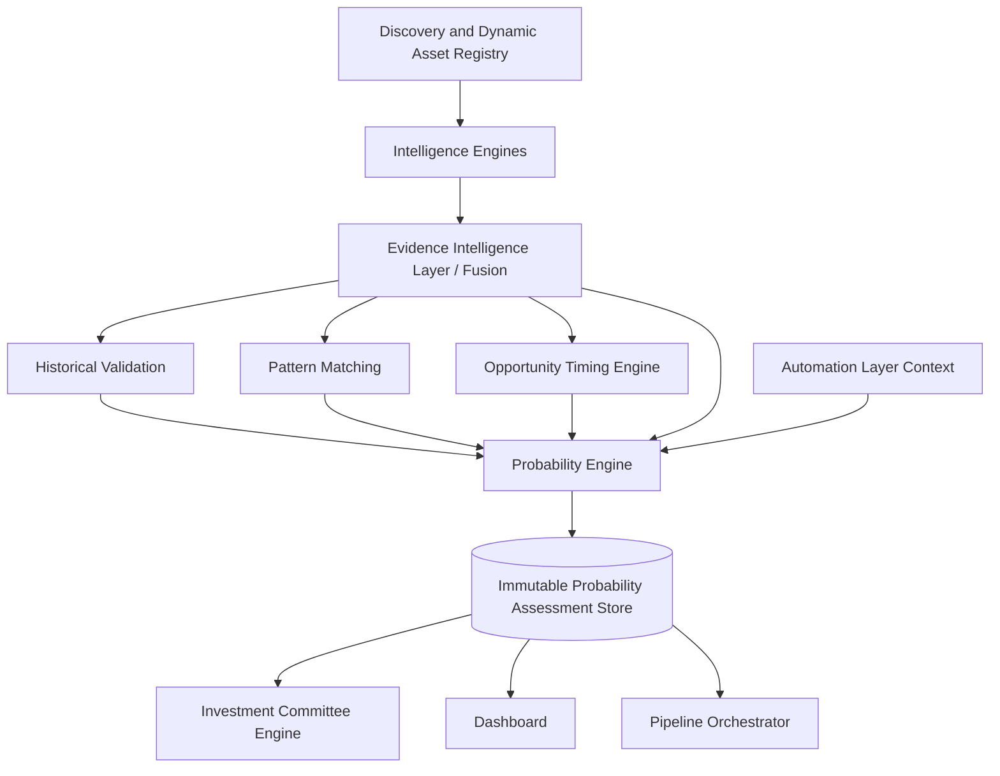
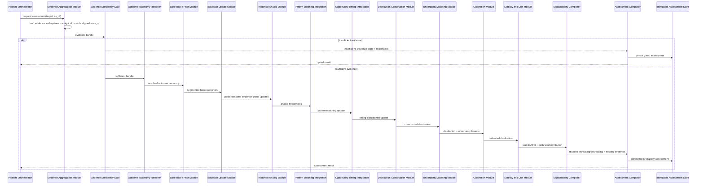
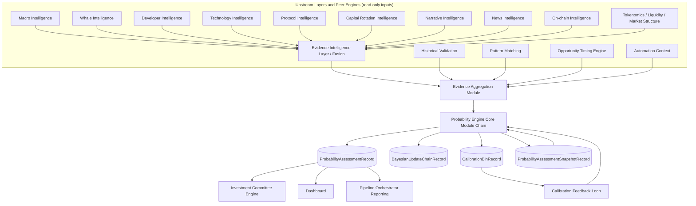
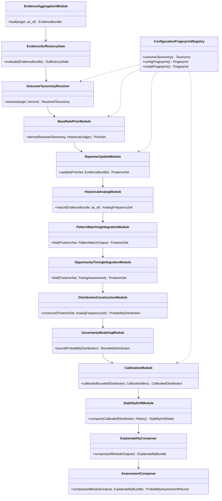
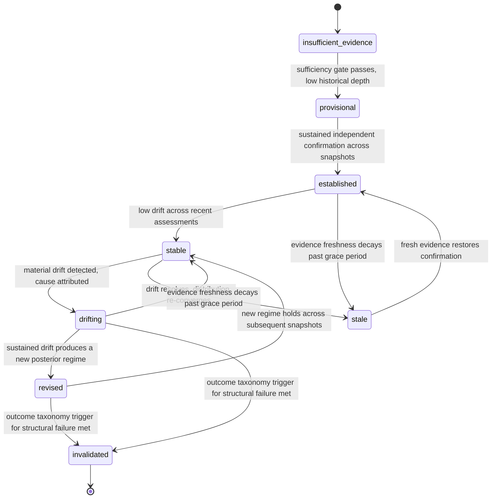
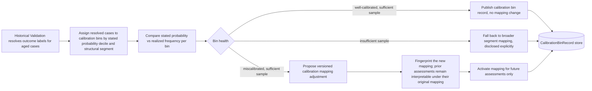

# Probability Engine — Architecture Specification

Status: Target architecture for the authoritative probability layer of the Opportunity Decision Layer. This document is a design specification, not an implementation record. It does not describe code that exists today.

## Relationship To Existing Documents

`docs/OPPORTUNITY_TIMING_ENGINE_ARCHITECTURE.md` documents the timing engine that answers whether now is structurally early, confirmed, mature, or deteriorating. `docs/INVESTMENT_COMMITTEE_ENGINE.md` documents the downstream consumer that already lists "Probability" among its persisted inputs alongside Pattern Matching and Technology/Capital Rotation output. This document defines that Probability layer formally: the engine that turns the full evidence graph — including the Opportunity Timing Engine's own output — into a reproducible, calibrated probability distribution over evidence-defined outcomes.

This engine does not replace or duplicate the Opportunity Timing Engine, Pattern Matching, or Historical Validation. It consumes their persisted output as evidence and produces one more persisted, explainable record type. It sits alongside the Opportunity Timing Engine as a peer analytical engine, both upstream of the Investment Committee Engine, neither depending on the other for its own internal correctness.

`docs/CANONICAL_RUNTIME_ARCHITECTURE.md` governs what is production versus experimental in this repository today. It classifies `src/hunter/intelligence/fusion/` and `src/hunter/opportunity/` — the modules the Opportunity Timing Engine's absorbed classifier and this document's evidence graph both build on — as **Experimental**. That same document's coverage semantics already use `probability` as a label for a simpler derived analytical view computed by the current production `EvidenceBackedProjectExecutor` runtime; that existing coverage label is a different, much narrower mechanism than the Probability Engine specified here, and this document does not replace it. This document specifies where the experimental Fusion/probability path evolves to, not a change to the current production runtime.

## 1. Purpose

The Probability Engine answers one question, and only one question, for a single target at a single point in time:

> Given everything Hunter has already validated as evidence, what is the probability distribution over evidence-defined future outcomes for this target?

It does not answer "should I buy" (Investment Committee Engine) and it does not answer "is now the right time" (Opportunity Timing Engine). It also does not answer "what will the price be." It answers only: across the outcome categories Hunter has explicitly defined (outperformance, underperformance, structural success, structural failure, specific multiple thresholds, permanent loss, and named directional outcomes such as adoption or capital inflow), what does the accumulated, calibrated evidence say the likelihood of each is — and how much should that number be trusted.

Every probability is evidence-derived. Every probability is reproducible. Every probability carries its own uncertainty. Nothing this engine emits is a forecast of price or an instruction to act.

## 2. Responsibilities

- Align and consume the full persisted evidence surface for one target as of one boundary timestamp (`as_of`), including Opportunity Timing Engine output as one evidence input among many.
- Define and maintain the fixed taxonomy of evidence-defined outcome events (Section 5) that every probability is expressed against — never an open-ended or freeform outcome space.
- Determine evidence sufficiency before producing any probability; refuse to emit a calibrated distribution from a thin evidence base.
- Convert graded, persisted evidence into deterministic likelihood contributions per outcome event, using named, versioned rules — never an opaque model.
- Apply deterministic Bayesian evidence updating (Section 10): start from a documented base-rate prior derived from Historical Validation's outcome ledger, then update sequentially and reproducibly as each independent canonical evidence group is applied.
- Integrate Historical Similarity / analog outcome frequencies (Section 11) and Pattern Matching output (Section 12) as structured, independent evidence updates, not as separate competing estimates.
- Integrate Opportunity Timing Engine output (Section 13) — phase, window, momentum, conviction, risk — as timing-conditioned evidence that shifts near-term outcome likelihoods without itself being re-derived.
- Construct full probability distributions (not single point estimates) over the outcome taxonomy, with explicit confidence intervals and named uncertainty sources.
- Track probability stability and probability drift across successive assessments of the same target, and hold that drift itself as evidence.
- Continuously calibrate against Historical Validation's realized outcome ledger (Section 16) so stated probabilities track observed frequencies over time, and expose calibration health as a first-class output.
- Persist every assessment immutably with full lineage back to source evidence, and support deterministic replay of any past assessment.
- Expose the assessment to the Pipeline Orchestrator, the Investment Committee Engine, and the Dashboard through the same persisted contract used by every other analytical engine.

## 3. Non-Responsibilities

- Does not predict price, price paths, or price targets in any form. Multiple-based outcomes ("Probability of 2x") are defined as evidence-labeled historical-analog-derived outcome categories, never as a price-path simulation.
- Does not produce Buy, Sell, Hold, Enter, or Exit signals or recommendations.
- Does not judge project quality independent of the outcome taxonomy — quality is already captured upstream as evidence; this engine only estimates likelihoods conditioned on that evidence.
- Does not decide committee eligibility, consensus, timing phase/window, or champion selection.
- Does not collect raw data, call external providers, or bypass Fusion / Evidence Intelligence Layer / Historical Validation outputs.
- Does not execute trades or interact with any exchange or wallet.
- Does not use undisclosed machine learning, neural forecasting, or any model whose internal weights are not fully enumerable in the model fingerprint. Every probability must be reproducible by re-running the same versioned rules against the same persisted inputs.
- Does not mutate, overwrite, or reinterpret upstream evidence, timing, or pattern-matching records. It only reads them.
- Does not silently substitute a default or neutral prior for missing evidence. Missing evidence is surfaced and its effect on the distribution is disclosed.
- Does not present a probability without its confidence interval, model confidence, evidence confidence, and contributing evidence.

## 4. Inputs

All inputs are persisted, versioned, and aligned to a single `as_of` boundary. The engine consumes no live data and makes no external calls.

**Target identity and boundary**
- Canonical target identity (from the Dynamic Asset Registry).
- `as_of` timestamp (explicit for replay/backtest; latest aligned effective time for current-state execution).

**Evidence and analytical inputs** (each arriving as persisted, explainable, source-attributed records):
- Opportunity Timing Engine output (phase, window, momentum, conviction, risk, scenario buckets already computed there).
- Historical Validation output (point-in-time historical case records and their realized outcome labels, leakage-checked).
- Pattern Matching output (structural pattern classifications and their persisted match confidence).
- Macro Intelligence, Whale Intelligence, Developer Intelligence, Technology Intelligence, Protocol Intelligence, Capital Rotation Intelligence, Narrative Intelligence, News Intelligence, On-chain Intelligence.
- Tokenomics, Liquidity, and Market Structure evidence.
- Evidence Confidence Layer output (corroboration, contradiction, dependency, canonical evidence-group independence).
- Risk Architecture and Conviction output (as produced by the Opportunity Timing Engine, reused rather than recomputed).
- Scenario Analysis output (Bull/Base/Bear analog buckets from the Opportunity Timing Engine, treated as one structured evidence input, not re-derived).
- Prior Probability Engine assessments for the same target (for stability and drift computation).
- Automation outputs (run context, requested stage options).

**Configuration**
- Probability Engine configuration (outcome taxonomy definitions, prior tables, evidence-weighting rules, calibration bins).
- Model fingerprint and configuration fingerprint of every upstream engine that contributed evidence, plus this engine's own fingerprint.

The engine treats every input as already evidence-graded upstream. It does not re-score raw signals; it converts already-scored evidence into likelihood contributions against a fixed outcome taxonomy.

## 5. Outputs

Every output below is a field on one immutable `ProbabilityAssessmentRecord`. Every probability-valued field carries: the point estimate, its confidence interval, the distribution it was drawn from, the list of contributing evidence references (by canonical evidence group and source record ID), and the model/configuration fingerprint that produced it.

- **Probability of Outperformance** and **Probability of Underperformance** — a single taxonomy partition (Section 9) over the target's evidence-defined peer/reference set for the assessed horizon band: when peer-set membership is itself well-established evidence, the pair sums to a disclosed total with an explicit "indeterminate" residual; when peer-set membership is not well-established, each side is reported from its own evidence trail and the partition's residual widens accordingly rather than the pair being silently forced to sum to a false certainty.
- **Probability of Success** — likelihood of reaching an evidence-defined structural success condition (e.g., sustained independent confirmation across categories through a full historical-depth window).
- **Probability of Failure** — likelihood of reaching an evidence-defined structural failure condition (sustained deterioration, invalidation, abandonment signals). Success, Failure, and an explicit Indeterminate residual form one taxonomy partition per Section 9.
- **Probability of Strong Adoption**, **Probability of Capital Inflow**, **Probability of Ecosystem Expansion**, **Probability of Narrative Leadership**, **Probability of Liquidity Improvement** — category-specific directional outcome probabilities, each defined against an explicit, versioned evidence-based trigger condition (Section 5a below), not a vague qualitative judgment.
- **Probability of Risk Escalation**, **Probability of Structural Deterioration** — downside outcome probabilities defined by the same evidence-based trigger-condition methodology as the upside categories above; the taxonomy does not claim a one-to-one pairing between individual upside and downside entries, only a shared, symmetric method of definition.
- **Probability of 2x / 5x / 10x** — frequency-derived probabilities from the historical analog set of structurally similar past cases whose *realized outcome* was already labeled by Historical Validation as reaching each structural multiple. The "multiple" is Historical Validation's own persisted, point-in-time-resolved outcome label for a past case, not a value the Probability Engine derives from price data itself; this engine only reads that already-realized historical label as one more analog-frequency input. Always disclosed with analog sample size; never a price simulation and never a price forecast for the current target.
- **Probability of Permanent Loss** — frequency-derived probability of historical analogs that were invalidated, abandoned, or structurally impaired beyond recovery, using the same already-realized Historical Validation labels described above.
- **Expected Reward Band** — a magnitude band (not a number) from the dispersion of historical analog upside outcomes (same realized-label basis as the multiple-based probabilities above). This is the authoritative, full-evidence-graph synthesis of expected reward; the Opportunity Timing Engine's own, narrower timing-scoped Expected Reward is folded in as one contributing input (Section 13) rather than recomputed independently as a rival figure.
- **Expected Risk Band** — a magnitude band from the dispersion of historical analog downside outcomes, authoritative in the same sense and over the same relationship to the Opportunity Timing Engine's narrower Expected Risk (Section 13).
- **Confidence Interval** — reported per probability, derived from analog sample size, evidence independence, and calibration-bin dispersion (Section 17).
- **Model Confidence** — how much the engine trusts its own rule/prior structure for this target class (distinct from evidence confidence).
- **Evidence Confidence** — how complete and independent the underlying evidence is (Section 14).
- **Distribution Confidence** — how well-formed the full distribution is (tail coverage, bucket population, residual mass) as distinct from any single point estimate's confidence.
- **Missing Evidence** — explicit list of categories or independent groups absent, stale, or below confidence threshold, and which probabilities they affect.
- **Reasons Increasing Probability** — structured list of specific evidence items and rules that pushed a named probability upward.
- **Reasons Decreasing Probability** — structured list of specific evidence items and rules that pushed a named probability downward.
- **Probability Stability** — a measure of how consistent a given probability has been across the target's recent assessment history.
- **Probability Drift** — the signed, attributed change in a probability since the previous assessment, decomposed by which evidence update caused it.

### 5a. Outcome Taxonomy

Every probability output is defined against a fixed, versioned outcome taxonomy maintained by the Configuration & Fingerprint Registry (Section 6) — not invented ad hoc per assessment. Each taxonomy entry specifies: the outcome's evidence-based trigger condition, the evaluation horizon band it applies to, and the historical-analog query it draws its frequency from. Changing a taxonomy entry's definition changes the model fingerprint and starts a new comparability lineage for that outcome (Section 17).

## 6. Internal Modules

```mermaid
flowchart LR
    subgraph Ingress
        EAM[Evidence Aggregation Module]
        ESG[Evidence Sufficiency Gate]
        OTX[Outcome Taxonomy Resolver]
    end
    subgraph Priors
        PRM[Base Rate / Prior Module]
        BUM[Bayesian Update Module]
    end
    subgraph Analogs
        HAM[Historical Analog Module]
        PMM[Pattern Matching Integration Module]
        OTM[Opportunity Timing Integration Module]
    end
    subgraph Distribution
        DCM[Distribution Construction Module]
        UNM[Uncertainty Modeling Module]
        CAL[Calibration Module]
    end
    subgraph Temporal
        STM[Stability and Drift Module]
    end
    subgraph Output
        EXC[Explainability Composer]
        ASC[Assessment Composer]
    end
    CFG[Configuration and Model Fingerprint Registry]

    EAM --> ESG --> OTX --> PRM --> BUM
    BUM --> HAM --> PMM --> OTM --> DCM
    DCM --> UNM --> CAL --> STM --> EXC --> ASC
    CFG -.-> OTX
    CFG -.-> PRM
    CFG -.-> BUM
    CFG -.-> CAL
```

- **Evidence Aggregation Module** — resolves and loads every persisted evidence and upstream-analytical record for the target, aligned strictly to `as_of`.
- **Evidence Sufficiency Gate** — evaluates category coverage and independent canonical evidence-group count; produces an explicit `insufficient_evidence` state that short-circuits distribution construction rather than being overridden by partial data.
- **Outcome Taxonomy Resolver** — binds the target's evidence bundle to the current versioned outcome taxonomy, resolving each outcome's trigger condition and historical-analog query for this specific target and horizon.
- **Base Rate / Prior Module** — derives the pre-evidence prior for each outcome from Historical Validation's realized outcome ledger, segmented by the target's structural class (asset type, chain, sector, evidence-coverage pattern), never from opinion.
- **Bayesian Update Module** — applies deterministic, ordered Bayesian updates (Section 10) to the prior using each independent canonical evidence group, producing a posterior per outcome.
- **Historical Analog Module** — retrieves the point-in-time historical analog set (via the same discipline as the Opportunity Timing Engine's Historical Similarity Module) and computes analog-outcome frequencies feeding the multiple-based and permanent-loss probabilities.
- **Pattern Matching Integration Module** — folds persisted Pattern Matching classifications and their match confidence in as one more independent evidence update, never as a second parallel probability estimate.
- **Opportunity Timing Integration Module** — folds the Opportunity Timing Engine's phase, window, momentum, conviction, risk, and scenario-bucket output in as timing-conditioned evidence, adjusting near-horizon outcome likelihoods.
- **Distribution Construction Module** — assembles the full posterior distribution across the outcome taxonomy from the updated per-outcome posteriors, ensuring internal consistency (Section 9) rather than independently floating numbers.
- **Uncertainty Modeling Module** — computes confidence intervals, tail residuals, and named uncertainty sources per outcome (Section 17).
- **Calibration Module** — compares this and past assessments against Historical Validation's realized-outcome ledger to compute calibration-bin health and adjust the fingerprinted calibration mapping (Section 16), never adjusting the underlying evidence rules themselves.
- **Stability and Drift Module** — compares the current distribution against the target's own assessment history to compute Probability Stability and attributed Probability Drift.
- **Explainability Composer** — assembles Reasons Increasing Probability, Reasons Decreasing Probability, and Missing Evidence from every module's contributing-evidence output; performs no independent scoring.
- **Assessment Composer** — assembles the final `ProbabilityAssessmentRecord`, attaches configuration/model fingerprints, and hands it to persistence.
- **Configuration & Model Fingerprint Registry** — the single source of the outcome taxonomy, prior tables, evidence-weighting rules, and calibration bins consumed by every module; no module hardcodes a threshold or prior.

## 7. Evidence Flow

Evidence flows in one direction only. The Probability Engine reads persisted, explainable records from every upstream engine — including the Opportunity Timing Engine and Pattern Matching, which are peers, not subordinates — and produces its own persisted, explainable record. Nothing flows back upstream, and this engine never re-derives a value another engine already owns; it only consumes that engine's output as an evidence update.

## 8. Probability Flow

There is no decision in this engine — only probability composition, which is the peer of the Opportunity Timing Engine's evidence composition.

1. Align target + `as_of` and load all evidence and upstream-analytical records.
2. Apply the Evidence Sufficiency Gate. If it fails, emit an `insufficient_evidence` probability assessment with Missing Evidence populated and stop before prior/posterior computation.
3. Resolve the outcome taxonomy for this target and horizon.
4. Derive the base-rate prior per outcome from Historical Validation's ledger.
5. Apply ordered Bayesian updates from each independent canonical evidence group.
6. Fold in Historical Analog frequencies for multiple-based and permanent-loss outcomes.
7. Fold in Pattern Matching classifications as an independent update.
8. Fold in Opportunity Timing Engine output as timing-conditioned evidence.
9. Construct the full, internally consistent distribution across the outcome taxonomy.
10. Model uncertainty: confidence intervals, tail residuals, named uncertainty sources.
11. Apply calibration mapping from the Calibration Module; record calibration health.
12. Compute Probability Stability and attributed Probability Drift against assessment history.
13. Compose explainability (reasons increasing/decreasing, missing evidence).
14. Persist the assessment; emit it to Pipeline Orchestrator, Dashboard, and Investment Committee Engine.

## 9. Probability Aggregation

Aggregation across outcomes is constrained, not free-floating:

- Mutually exclusive outcomes within the same taxonomy partition (e.g., Success / Failure / Indeterminate for a given horizon) are constructed to sum to a disclosed total, with an explicit residual for cases the evidence cannot yet classify — never silently forced to exactly 1.0 by rescaling away genuine uncertainty.
- Independent outcome dimensions (e.g., "Probability of Capital Inflow" and "Probability of 2x") are not forced into a joint distribution unless the taxonomy explicitly defines their dependency; the engine discloses which outcomes are modeled jointly and which are modeled independently.
- Aggregation of evidence-group contributions into a single outcome's posterior uses the same non-netting discipline as the Opportunity Timing Engine's Risk Architecture: a single severe, well-evidenced contradiction is not diluted away by averaging across many mildly supportive but non-independent signals.
- Every aggregation step is deterministic and order-documented (Section 10), so the same evidence set always aggregates to the same posterior regardless of retrieval order.

## 10. Bayesian Evidence Updating

The engine uses deterministic Bayesian updating, not free-form scoring, to move from prior to posterior:

- The prior for each outcome comes from the Base Rate / Prior Module, itself derived from Historical Validation's segmented outcome ledger (Section 11) — never asserted by configuration opinion.
- Each independent canonical evidence group is applied as one ordered update step. Dependent or shared-lineage evidence groups (as already identified by the Evidence Confidence Layer) are excluded from independent updating to prevent double-counting a single underlying fact as multiple updates.
- The update rule for each evidence group is a named, versioned likelihood-ratio function tied to that category (e.g., a documented mapping from Whale Intelligence accumulation-strength bands to a likelihood ratio for the Capital Inflow outcome) — fully enumerated in the model fingerprint, never learned or opaque.
- Updates are applied in a deterministic, documented order (canonical evidence-group identity, then category, then arrival sequence) so that the same evidence set always produces the same posterior byte-for-byte.
- Contradictory evidence groups do not cancel silently: the update sequence records each contradiction's effect explicitly, and residual disagreement after all updates widens the confidence interval (Section 17) rather than being averaged into a falsely narrow posterior.
- The full update chain — prior, each step's likelihood ratio and contributing evidence group, and the resulting posterior — is persisted, making every posterior fully reconstructable step by step.

## 11. Historical Analog Integration

- When a persisted Opportunity Timing Engine assessment already exists for the same target and `as_of`, the Historical Analog Module reuses that assessment's `ScenarioAnalysisRecord` analog case set as its base population and only re-buckets it at finer resolution (multiple thresholds, permanent-loss classification) — it does not independently re-query Historical Validation and risk resolving a different case set for the same target/`as_of`. It falls back to an independent query, using the identical point-in-time analog-matching discipline, only when no such Timing Engine assessment is available.
- This reuse-first rule is what keeps the two engines' analog populations from silently diverging within the same pipeline run, and it is itself part of the model fingerprint: whether a given assessment reused an existing analog set or queried independently is recorded and reproducible.
- Regardless of which path populated it, the analog set obeys the exact point-in-time discipline established by the Opportunity Timing Engine's Historical Similarity Module: only evidence available as of each analog's own `as_of` is used to classify that analog, and only evidence available as of the current `as_of` is used to match against it.
- Analog outcome frequencies feed two distinct roles: they supply the segmented base rate for the Base Rate / Prior Module (Section 10), and they directly supply the multiple-based and permanent-loss probabilities (Probability of 2x/5x/10x, Probability of Permanent Loss) as frequency reads over the matched analog set.
- Every analog-derived probability discloses its analog case references and sample size; below a configured minimum sample size the module emits an explicit "insufficient historical basis" residual rather than a confident number.
- The engine never queries Historical Validation for anything other than persisted, leakage-checked, point-in-time case records — it has no separate access to raw historical market data or price feeds.

## 12. Pattern Matching Integration

- Pattern Matching output arrives as a persisted structural classification (which pattern the target's evidence trail currently resembles) with its own match confidence, already computed upstream.
- The Pattern Matching Integration Module treats this classification as one independent canonical evidence group in the Bayesian update chain (Section 10) — it is not re-derived, re-scored, or blended through a separate averaging step.
- The likelihood ratio a matched pattern contributes is itself derived from that pattern's own historical outcome frequency in Historical Validation's ledger, keeping the update evidence-grounded rather than opinion-based.
- If Pattern Matching output is stale, missing, or below its own configured confidence threshold, it is treated as missing evidence for the outcomes it would have informed, not defaulted to a neutral update.

## 13. Opportunity Timing Integration

- The Opportunity Timing Engine's persisted output (phase, window, momentum, conviction, risk, scenario buckets) is consumed as timing-conditioned evidence, not re-derived: the Probability Engine never recomputes phase or window classification.
- Phase and window inform which horizon band a given outcome's probability applies to and shift near-term likelihoods (e.g., a `too_early` phase widens the confidence interval and lowers near-horizon Success probability without asserting the long-horizon prior has changed).
- The Opportunity Timing Engine's Scenario Analysis (Bull/Base/Bear analog buckets) is folded in as a structured, already-computed evidence update, reusing its analog case set per the precedence rule in Section 11 rather than being recomputed by the Historical Analog Module a second time.
- The Opportunity Timing Engine's own Expected Reward and Expected Risk (its narrower, timing-window-scoped analog bands) are folded in as one contributing input to this engine's Expected Reward Band and Expected Risk Band (Section 5) — they are never presented as a second, independently computed rival figure; this engine's version is the authoritative synthesis across the full evidence graph, and the Timing Engine's version remains visible in its own assessment as a timing-scoped read.
- Conviction and Risk Score from the Opportunity Timing Engine contribute directly to Model Confidence and Evidence Confidence (Section 14), and to the confidence-interval width (Section 17): low conviction or elevated, unresolved risk widens uncertainty rather than being absorbed into the point estimate.
- Invalidation conditions already computed by the Opportunity Timing Engine are treated as leading indicators for Probability Drift: a triggered invalidation condition is an expected, explainable driver of a subsequent probability decrease, not a surprise the Probability Engine has to separately detect.

## 14. Confidence Calculation

The engine reports three distinct confidence concepts, never collapsed into one number:

- **Evidence Confidence** — how complete and independent the underlying evidence is: category coverage, canonical evidence-group independence, contradiction severity, missing evidence, freshness anchored to `as_of`, and upstream (Fusion/Timing/Pattern Matching) confidence carried forward rather than re-derived.
- **Model Confidence** — how much the engine trusts its own rule and prior structure for this target's structural class: segmented base-rate sample size, taxonomy applicability, and historical-analog sample size feeding the priors and analog-derived probabilities.
- **Distribution Confidence** — how well-formed the constructed distribution itself is: whether mutually exclusive partitions sum to a disclosed total with a small residual, whether tail buckets are adequately populated, and whether calibration health (Section 16) for this outcome/segment is currently good.

Each of the three is computed and reported independently per assessment, and Confidence Interval (Section 17) per outcome is a function of all three, never a single ad hoc number bolted onto a point estimate.

## 15. Distribution Construction

- Every outcome is represented as a full distribution over its defined categories (e.g., Success / Failure / Indeterminate, or a set of multiple-based thresholds), never as an isolated point estimate detached from its complement.
- Distributions are constructed bottom-up from the Bayesian update chain's posteriors (Section 10), combined with analog-derived frequency reads (Section 11) for outcomes whose taxonomy definition specifies analog-frequency construction rather than pure evidence updating.
- Distribution construction enforces internal consistency rules from the Outcome Taxonomy Resolver: partition membership, applicable horizon band, and any declared joint/independent relationships between outcome dimensions (Section 9).
- Every constructed distribution retains its full construction trail (prior, ordered updates, analog frequency inputs) as part of the persisted record, so the distribution — not just its summary statistics — is auditable and replayable.

## 16. Probability Calibration

Calibration keeps stated probabilities honest against reality without ever touching the underlying evidence-to-likelihood rules directly:

- The Calibration Module partitions past assessments into calibration bins (e.g., all assessments that stated "Probability of Success" in a given decile, for a given structural segment) and compares the stated probability against the realized outcome frequency recorded in Historical Validation's ledger once those cases resolve.
- Calibration health per bin (well-calibrated, overconfident, underconfident, insufficient sample) is itself a persisted, versioned output, exposed alongside every assessment that falls in that bin.
- When a bin is found miscalibrated with sufficient sample size, the fix is a versioned calibration mapping (a documented, monotonic adjustment applied after the Bayesian posterior is computed) — never a silent edit to the prior tables or evidence-update rules that produced the raw posterior. Changing the calibration mapping changes the model fingerprint.
- Calibration mappings are asset-class/segment specific where sample size supports it, and fall back to a broader segment's mapping — disclosed explicitly — when it does not.
- Calibration workflow (Section 29) runs on a scheduled cadence tied to Historical Validation's outcome-resolution cycle, not on every individual assessment.

## 17. Uncertainty Modeling

- Every probability carries an explicit confidence interval, constructed from three named uncertainty sources rather than a single generic error term: evidence-based uncertainty (contradiction, missing evidence, independence — from Evidence Confidence), sampling uncertainty (segmented base-rate and analog sample size — from Model Confidence), and calibration uncertainty (residual miscalibration in the relevant bin — from Distribution Confidence).
- Confidence intervals widen, never narrow, in the presence of unresolved contradiction, low sample size, or known calibration drift for the relevant bin — the engine never presents false precision to compensate for thin evidence.
- Tail outcomes (e.g., Probability of 10x, Probability of Permanent Loss) explicitly disclose their supporting analog sample size alongside the interval, since small tail samples produce wide, honestly-labeled intervals rather than confident numbers.
- Where evidence is insufficient to bound an outcome meaningfully, the engine reports an explicit "unbounded / insufficient evidence" state for that outcome rather than an artificially tight interval.

## 18. Persistence Requirements

- `ProbabilityAssessmentRecord` — the full assessment: every probability output with its point estimate, confidence interval, and distribution; Model/Evidence/Distribution Confidence; Missing Evidence; Reasons Increasing/Decreasing Probability; Probability Stability and Drift; source Fusion IDs, source run IDs (including the Opportunity Timing Engine and Pattern Matching source record IDs consumed), canonical evidence-group references, configuration fingerprint, model fingerprint, and `as_of`.
- `BayesianUpdateChainRecord` — the ordered prior-to-posterior update trail for each outcome, retained separately so the update sequence itself is auditable independent of the summary distribution.
- `CalibrationBinRecord` — per-bin calibration health, sample size, and any active calibration mapping, versioned and retained historically so past assessments remain interpretable under the mapping that was active when they were made.
- `ProbabilityAssessmentSnapshotRecord` — a point-in-time snapshot used for Probability Stability and Drift computation by later assessments.
- All records are immutable once written. A changed read produces a new record; nothing is updated in place. Repeated persistence of an identical analytical result is idempotent.

## 19. Replay Requirements

- Given the same persisted inputs, the same `as_of`, and the same configuration/model fingerprint (including the active calibration mapping fingerprint), the engine must produce a byte-identical `ProbabilityAssessmentRecord`.
- Changing the outcome taxonomy, prior tables, evidence-update rules, or calibration mapping produces a new fingerprint and a new assessment; it never silently reinterprets a historical record.
- Replays must not depend on wall-clock time, random seeds, or non-deterministic ordering; the Bayesian update order (Section 10) is a documented, deterministic sequence.
- Batch replay (backtesting a historical range for a target, or recomputing calibration bins across the target population) is a repeated application of the single-checkpoint replay, not a separate code path with separate semantics.

## 20. Failure Handling

- Missing or stale evidence categories are surfaced as Missing Evidence and their affected outcomes are named explicitly, never defaulted to a neutral prior.
- If the Evidence Sufficiency Gate fails, the engine emits an explicit `insufficient_evidence` probability assessment rather than a confident-looking distribution built on a thin base.
- Unavailability of a required upstream engine (Opportunity Timing Engine, Pattern Matching, or an Intelligence Engine has no persisted output for the target/`as_of`) is treated as missing evidence for the outcomes that engine would have informed, not as an engine crash.
- Configuration is validated at startup (complete outcome taxonomy, complete prior tables, ordered calibration bins, valid fingerprint composition); an invalid configuration prevents the engine from running.
- Any internal module failure aborts the assessment for that target rather than emitting a partially composed distribution; partial distributions are never persisted as if complete.
- All degraded or gated outcomes are logged with the specific reason (which category, which threshold, which module) to support operational diagnosis.

## 21. Auditability

- Every probability, interval, and label on an assessment traces to the exact contributing evidence records, the exact Bayesian update step, and the exact rule/prior/calibration version that produced it.
- The configuration fingerprint and model fingerprint are stored on every record, including the calibration mapping version, so any historical assessment can be checked against "what would this look like under current rules" without ambiguity about which rules originally produced it.
- Nothing is overwritten. The full history of probability assessments for a target is a permanent, append-only ledger.
- Committee, Dashboard, and Orchestrator consumers all read the same persisted record — there is no separate presentation computation that could drift from the audited value.

## 22. Evidence Traceability

The full reference chain for any probability field is:

`raw source observation → Intelligence Engine output → Evidence Intelligence Layer / Fusion record → (optionally) Historical Validation case record / Pattern Matching classification / Opportunity Timing Engine assessment → Probability Engine Bayesian update step → ProbabilityAssessmentRecord field`

Every hop is a persisted, addressable record. Reasons Increasing Probability and Reasons Decreasing Probability are themselves lists of chain endpoints — each "reason" is a pointer to a specific piece of evidence, the update step it fed, and the likelihood ratio it contributed, not a free-text summary.

## 23. Testing Strategy

- **Determinism tests** — same inputs + same fingerprint (including calibration mapping) must produce byte-identical output, run repeatedly and across process restarts.
- **Golden fixture tests** — frozen evidence bundles with known expected priors, update chains, and resulting distributions, covering each outcome category and each evidence-update rule at least once.
- **Sufficiency gate tests** — evidence bundles deliberately missing categories/independent groups must produce `insufficient_evidence`, never a fabricated confident distribution.
- **Leakage tests** — historical analog matching, base-rate segmentation, and backtest replay must never have access to evidence or outcome labels with an effective/resolution time after the checkpoint `as_of`.
- **Bayesian consistency tests** — the update chain must reproduce the same posterior regardless of evidence-group retrieval order, and dependent/shared-lineage groups must be excluded from double-counting.
- **Aggregation consistency tests** — mutually exclusive partitions must sum to their disclosed total with a bounded residual; joint/independent outcome relationships must match the taxonomy's declared structure.
- **Calibration tests** — synthetic bins with known miscalibration must be detected and produce the expected calibration mapping adjustment; well-calibrated bins must remain unmodified.
- **Fingerprint-change tests** — a configuration, prior, or calibration-mapping change must change the model fingerprint and must not alter the interpretation of already-persisted historical assessments.
- **Regression/backtest suites** — running the full historical range for known targets must reproduce previously recorded assessments unless configuration intentionally changed.
- **Uncertainty-bound tests** — low-sample tail outcomes must produce wide, explicitly labeled intervals rather than falsely narrow ones.

## 24. Future Extensibility

- New outcome taxonomy entries are additive, versioned through the model fingerprint, and require an explicit trigger condition and historical-analog query before they can be scored — no outcome is added without an evidence-grounded definition.
- New evidence-update rules for existing or new evidence categories are added to the Bayesian Update Module as additional named likelihood-ratio functions, without changing the deterministic update sequence's shape.
- Additional calibration segmentation (finer asset-class or structural-pattern bins) is supported by the existing Calibration Module and Calibration Bin persistence without a structural change, as historical sample size grows.
- Multi-horizon probability assessments (separate short- and long-horizon distributions for the same target/`as_of`) are supported as parallel invocations of the same module chain with horizon-specific taxonomy resolution.
- Any extension must preserve: determinism, immutability of prior records, full evidence traceability, and the strict non-responsibility boundary (no price prediction, no buy/sell output, no opaque models) established in Sections 2–3.

## 25. Sequence Diagram

## 26. Data Flow Diagram

## 27. Class/Module Diagram

## 28. Probability Lifecycle / State Diagram

Included because a probability assessment's evidentiary standing moves through distinct, named states across an asset's history, and this progression is what Probability Stability and Probability Drift are measured against.

## 29. Calibration Workflow

Calibration never edits an evidence-update rule, a prior table, or a past assessment. It only adjusts the versioned, fingerprinted mapping applied after the Bayesian posterior is computed, and only for future assessments — past assessments remain interpretable exactly as they were produced.

## Summary Of Guarantees

- Every probability is evidence-derived, never opinion-derived, never a price prediction.
- Every probability is deterministic, versioned, and reproducible from persisted inputs.
- Every probability carries its own confidence interval, Model Confidence, Evidence Confidence, and Distribution Confidence.
- Every probability traces to named upstream evidence, a named Bayesian update step, and a named rule.
- Missing evidence is always visible and its affected outcomes are named, never silently filled in.
- Calibration keeps stated probabilities honest against realized outcomes without ever rewriting history.
- Nothing is overwritten; the probability assessment history is a permanent audit ledger.
