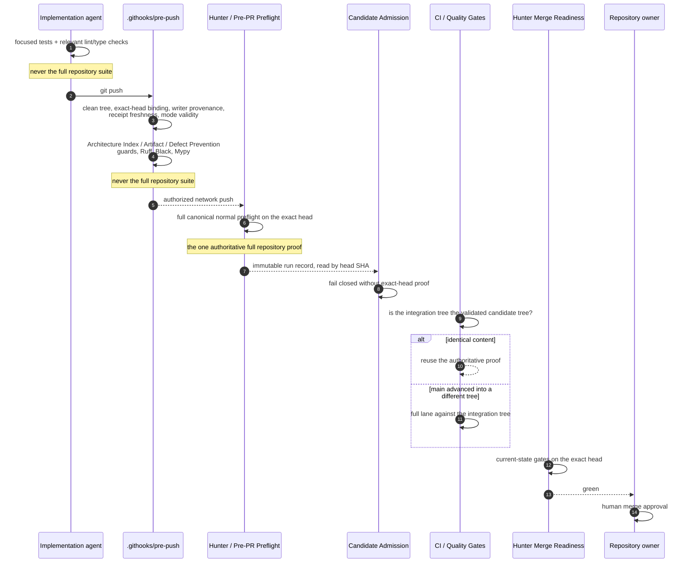

# Validation Stage Contract

Governing Issue: [#415](https://github.com/fafa33/Project-Hunter/issues/415).
Machine-readable authority: `docs/VALIDATION_STAGE_CONTRACT.json`.
Reuse authority: `scripts/hunter_validation_receipt.py`.

Project Hunter used to validate one unchanged candidate with the same full
repository suite up to four times — an agent's manual run, the pre-push hook,
the hosted branch preflight, and pull-request CI. Roughly nine minutes of
Pytest, paid four times, for content that never changed between the runs.

This contract removes the duplicate proof, not the proof. Every stage below
still exists, still fails closed, and still blocks what it blocked before. What
changed is that each stage now owns exactly one thing, and no stage is allowed
to re-establish what another stage has already established for the same
immutable content.

## Sequence

## Ownership

| Stage | Owner | Full repository suite |
| --- | --- | --- |
| `focused-development-verification` | implementation agent | never |
| `pre-push-safety` | `.githooks/pre-push` → `scripts/hunter_pre_push.py` | never |
| `hosted-full-exact-head-proof` | `Hunter / Pre-PR Preflight` | always |
| `candidate-admission` | `scripts/hunter_candidate_admission.py` | never |
| `pull-request-integration-compatibility` | `CI / Quality Gates` | only when the integration tree differs |
| `merge-readiness` | `Hunter Merge Readiness` | never |
| `human-merge-approval` | repository owner | never |

Exactly one stage may declare `always`. That is what makes "the authoritative
full exact-head proof" a single, identifiable thing rather than a description
several boundaries each partially satisfy.

## Why the full suite left pre-push

Pre-push is the earliest boundary, and it keeps everything that belongs there:
every defect whose discovery *after* publication would force a history rewrite
or a force-push. Writer provenance is the clearest case — commits recorded
under the wrong identity are only repairable by rewriting them, so finding that
out after the push is what creates the mess.

A failing test is not in that category. It is repaired by the next commit, on
top of what was already published, with no rewind. Paying nine minutes locally
to learn ten minutes early something that costs nothing to learn late is the
duplication this contract removes. The hosted exact-head preflight is not a
weaker substitute for the local run: it is the evidence trusted candidate
admission has always actually required, produced by a controller no writer on
any channel can mint.

The one exception is a committed `.hunter-preflight-mode` declaring
`tests-first-red`. There, Pytest's RED result *is* the proof being made, so it
runs at the push boundary — and it is a Draft hygiene signal that can never
authorize Ready.

## Why CI may reuse, and when it may not

`CI / Quality Gates` validates the tree GitHub would actually merge. When `main`
has not advanced past the candidate, that integration tree is byte-for-byte the
tree the hosted proof already validated, and re-running the identical suite
establishes nothing. When `main` has advanced into a materially different
integration tree, that is different content, and it gets the full lane.

Reuse is decided by `scripts/hunter_validation_reuse.py` from three things:

1. **Content identity** — Git tree objects. Content addressing decides whether
   two trees are the same content; nothing else is consulted.
2. **The trusted run record** — the successful exact-head `Hunter / Pre-PR
   Preflight` push run, read from the Actions API by immutable head SHA. This is
   the same evidence candidate admission requires. "Latest green" is never
   consulted.
3. **The pinned toolchain** — both runs install from the same pinned files in
   the same tree, so a runner matching the pin matches the other run.

Everything else refuses reuse and runs the full lane: a non-pull-request event,
a `tests-first-red` head, unavailable Git or API evidence, a missing or
unsuccessful run, a run belonging to another head or another workflow, a
toolchain that does not match its pin, or a receipt that does not verify.
Refusing reuse is always safe — it costs time, not proof.

## Proof identity and invalidation

`scripts/hunter_validation_receipt.py` is the only place that decides whether a
proof is a proof of the work in front of it. A receipt binds three identities:

- **content** — the exact Git tree validated;
- **definition** — the gate chain plus the files that define what the full lane
  does (`DEFINITION_PATHS`);
- **toolchain** — the measured versions that executed it.

A receipt is refused, and the full lane runs, when any of these hold:

| Condition | Result |
| --- | --- |
| head or tree changed | refused — content identity mismatch |
| proof belongs to a foreign head | refused — foreign head |
| validation definition or configuration changed | refused — definition identity mismatch |
| toolchain changed | refused — toolchain identity mismatch |
| receipt older than the age bound | refused — stale |
| receipt absent, unreadable, wrong schema, or missing fields | refused — malformed |
| receipt records a non-passing result | refused — not a proof |

A receipt is never a trust anchor. Every identity it carries is recomputed by
the verifier from content the verifier already holds, so a receipt can only
narrow reuse, never widen it.

## What no stage may do

- Run the same full repository suite twice for the same immutable candidate
  identity under an unchanged validation definition.
- Treat a run number, a "latest" label, or a remembered green result as
  exact-head evidence.
- Create an empty commit to manufacture a new validation identity. A push that
  reports `Everything up-to-date` mutates nothing, so it needs no proof and
  triggers no validation; the pre-push boundary exits without running a gate.
- Auto-merge, auto-mark Ready, or merge without human owner approval.
