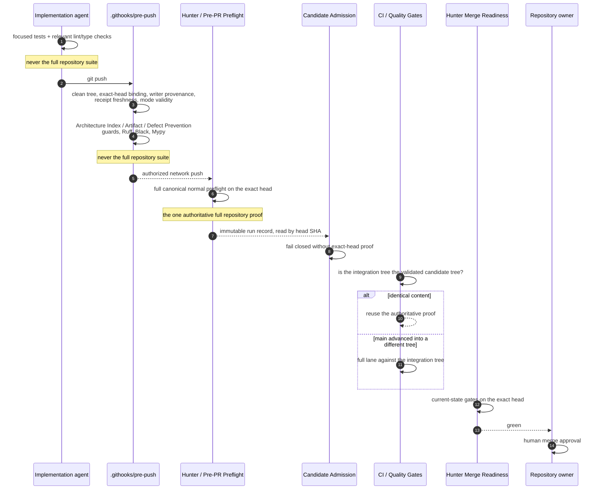

# Validation Stage Contract

Governing Issue: [#415](https://github.com/fafa33/Project-Hunter/issues/415).
Machine-readable authority: `docs/VALIDATION_STAGE_CONTRACT.json`.
Reuse authority: `scripts/hunter_validation_receipt.py`.

Project Hunter used to validate one unchanged candidate with the same full
repository suite up to four times — an agent's manual run, the pre-push hook,
the hosted branch preflight, and pull-request CI. Roughly nine minutes of
Pytest, paid four times, for content that never changed between the runs.

This contract removes the duplicate proof, not the proof. Every stage below
still exists, still fails closed, and still blocks what it blocked before. What
changed is that each stage now owns exactly one thing, and no stage is allowed
to re-establish what another stage has already established for the same
immutable content.

## Sequence

## Ownership

| Stage | Owner | Full repository suite |
| --- | --- | --- |
| `focused-development-verification` | implementation agent | never |
| `pre-push-safety` | `.githooks/pre-push` → `scripts/hunter_pre_push.py` | never |
| `hosted-full-exact-head-proof` | `Hunter / Pre-PR Preflight` | always |
| `candidate-admission` | `scripts/hunter_candidate_admission.py` | never |
| `pull-request-integration-compatibility` | `CI / Quality Gates` | only when the integration tree differs |
| `merge-readiness` | `Hunter Merge Readiness` | never |
| `human-merge-approval` | repository owner | never |

Exactly one stage may declare `always`. That is what makes "the authoritative
full exact-head proof" a single, identifiable thing rather than a description
several boundaries each partially satisfy.

## Why the full suite left pre-push

Pre-push is the earliest boundary, and it keeps everything that belongs there:
every defect whose discovery *after* publication would force a history rewrite
or a force-push. Writer provenance is the clearest case — commits recorded
under the wrong identity are only repairable by rewriting them, so finding that
out after the push is what creates the mess.

A failing test is not in that category. It is repaired by the next commit, on
top of what was already published, with no rewind. Paying nine minutes locally
to learn ten minutes early something that costs nothing to learn late is the
duplication this contract removes. The hosted exact-head preflight is not a
weaker substitute for the local run: it is the evidence trusted candidate
admission has always actually required, produced by a controller no writer on
any channel can mint.

The one exception is a committed `.hunter-preflight-mode` declaring
`tests-first-red`. There, Pytest's RED result *is* the proof being made, so it
runs at the push boundary — and it is a Draft hygiene signal that can never
authorize Ready.

## Why CI may reuse, and when it may not

`CI / Quality Gates` validates the tree GitHub would actually merge. When `main`
has not advanced past the candidate, that integration tree is byte-for-byte the
tree the hosted proof already validated, and re-running the identical suite
establishes nothing. When `main` has advanced into a materially different
integration tree, that is different content, and it gets the full lane.

Reuse is decided by `scripts/hunter_validation_reuse.py` from three things:

1. **Content identity** — Git tree objects. Content addressing decides whether
   two trees are the same content; nothing else is consulted.
2. **The trusted run record** — the successful exact-head `Hunter / Pre-PR
   Preflight` push run, read from the Actions API by immutable head SHA. This is
   the same evidence candidate admission requires. "Latest green" is never
   consulted.
3. **The pinned toolchain** — both runs install from the same pinned files in
   the same tree, so a runner matching the pin matches the other run.

Everything else refuses reuse and runs the full lane: a non-pull-request event,
a `tests-first-red` head, unavailable Git or API evidence, a missing or
unsuccessful run, a run belonging to another head or another workflow, a
toolchain that does not match its pin, or a receipt that does not verify.
Refusing reuse is always safe — it costs time, not proof.

Reuse is therefore opportunistic, and deliberately so. Pushing a branch and
opening or updating a pull request happen seconds apart, so `CI` usually starts
while the branch preflight is still running and correctly refuses to reuse a
proof that does not exist yet. It reuses on a later `synchronize`, on a re-run,
and whenever the hosted proof landed first. That is the right trade: the two
hosted lanes run **concurrently**, so making `CI` wait for a proof it could then
reuse would raise wall-clock time in order to lower it. The wall-clock win comes
from the two *serial* local full runs that no longer happen before the push, and
from the parallel test lane; what `CI` reuse saves is duplicated runner work.

## Proof identity and invalidation

`scripts/hunter_validation_receipt.py` is the only place that decides whether a
proof is a proof of the work in front of it. A receipt binds three identities:

- **content** — the exact Git tree validated;
- **definition** — the gate chain plus the files that define what the full lane
  does (`DEFINITION_PATHS`);
- **toolchain** — the measured versions that executed it.

A receipt is refused, and the full lane runs, when any of these hold:

| Condition | Result |
| --- | --- |
| head or tree changed | refused — content identity mismatch |
| proof belongs to a foreign head | refused — foreign head |
| validation definition or configuration changed | refused — definition identity mismatch |
| toolchain changed | refused — toolchain identity mismatch |
| receipt older than the age bound | refused — stale |
| receipt absent, unreadable, wrong schema, or missing fields | refused — malformed |
| receipt records a non-passing result | refused — not a proof |

A receipt is never a trust anchor. Every identity it carries is recomputed by
the verifier from content the verifier already holds, so a receipt can only
narrow reuse, never widen it.

## Where the parallel lane is declared

The full repository suite runs with `-n auto --dist loadfile`, declared as
`PYTEST_ADDOPTS` by each boundary that runs it — not in the repository's own
`[tool.pytest.ini_options]`.

That placement is load-bearing, not cosmetic. The trusted default-branch
controller validates a candidate by executing *this repository's* gate commands
inside the candidate tree using the **trusted** environment. A candidate that
pinned worker flags in its own pytest configuration would be demanding a plugin
of an environment it does not provision, and would make its own trusted
validation unrunnable. The accelerator therefore belongs to the boundaries that
install it.

Issue [#419](https://github.com/fafa33/Project-Hunter/issues/419) made
`Trusted Candidate Preflight Validation` one of those boundaries. It installs
`pytest-xdist` by name under `requirements/ci-constraints.txt`, verifies the
runner with `hunter_defect_prevention_preflight.py --verify-parallel-runner`,
and only then declares the lane on the gate-chain step. Every one of those comes
from the trusted default-branch checkout at the workspace root; the candidate is
read into `./candidate` and never installed from, so no candidate manifest, pin,
pytest configuration or plugin can change which runner executes its validation,
or whether one exists at all.

Two refusals keep that honest, both in the trusted controller and both before
any gate runs:

| Declared lane | Trusted environment | Result |
| --- | --- | --- |
| canonical `-n auto --dist loadfile` | runner provisioned | the parallel lane runs |
| canonical | runner absent | refused — the job fails, it does not run serially |
| anything else | any | refused — the only surface on which selection could narrow |
| empty | any | the serial lane runs, unchanged |

The last row is not a fallback. Nothing may turn a declared lane into a
different execution under the same proof name; but parallelism is a speed
property and never a proof property, so a boundary that declares nothing simply
runs the same gate chain over the same tests more slowly.

Proof scope is unchanged by construction, not by inspection: the gate commands
in `TRUSTED_CANDIDATE_QUALITY_GATES` are untouched, so the executed command line
is byte-identical to the serial one and the only difference is an environment
variable that carries distribution controls exclusively.

The other end of that surface is the candidate's own pytest configuration, which
the trusted `pytest` gate reads because it runs inside the candidate tree. The
trusted controller now reads it first, from every source pytest reads it from —
`pyproject.toml`, `pytest.ini`, `tox.ini`, `setup.cfg` — and refuses a candidate
that declares a worker option (`-n`, `--numprocesses`, `--dist`) or a selection
option (`-k`, `-m`, `--ignore`, `--deselect`, `--lf`, `-x`, `--maxfail`, …) in
its own `addopts`. The first would demand a runner of an environment the
candidate does not provision; the second would quietly narrow the suite the
trusted proof is supposed to be a proof of. Everything else a project legitimately
puts in `addopts` — reporting, strictness, durations — stays allowed, and the
rule no longer rests only on a test the candidate itself owns.

`loadfile` keeps every test in a file on one worker, so intra-file ordering and
module-scoped state behave exactly as they do serially and only whole files run
concurrently. The one shared-state hazard parallelism exposed was the
session-level repository-cleanliness check in `tests/conftest.py`, which compares
whole-repository snapshots and would read other workers' transient files; it is
now controller-only. No test required a serial lane.

### Measured limits

Hosted, on four workers: 3,710 tests in 250.8s, against the 536.55s the
governing Issue records for 3,628 tests before this change. Locally on 4 vCPU:
416.2s serial, 126.0s parallel.

The lane's floor is set by the slowest single file, because `loadfile` gives
that file to one worker. `tests/test_market_validation.py` holds three of the
ten slowest tests (42.6s, 22.8s and 12.4s locally) and the whole file must run
on one worker; several other CLI-execution tests are 18-28s each. Splitting
those files, or making the CLI fixtures cheaper, is what would move the floor
further — not more workers.

**Trusted Candidate Preflight Validation** was the one hosted job left outside
this lane, running serially because the trusted environment did not yet own the
worker plugin. Issue #419 gave it that ownership, and it now runs the same
declaration. Measured on the same suite, hosted:

| | Serial (PR #418, head `76d16e0`) | Parallel (Issue #419) |
| --- | --- | --- |
| Pytest gate | 529.8s over 3,747 tests | see the PR's own run |
| gate chain step | 566s | |
| job wall-clock | 599s | |

**CI reuse** remains opportunistic, for the concurrency reason above.

## What no stage may do

- Run the same full repository suite twice for the same immutable candidate
  identity under an unchanged validation definition.
- Treat a run number, a "latest" label, or a remembered green result as
  exact-head evidence.
- Create an empty commit to manufacture a new validation identity. A push that
  reports `Everything up-to-date` mutates nothing, so it needs no proof and
  triggers no validation; the pre-push boundary exits without running a gate.
- Auto-merge, auto-mark Ready, or merge without human owner approval.
